# PeptideBuilder

Design a peptide that binds a small molecule by deciding where the side chains should go first, and
working out the backbone afterwards.

The tool places amino-acid side-chain analogues around a ligand, scores each placement with a machine
learning interatomic potential, and then — this is the part that distinguishes it — measures whether a
real peptide backbone can actually reach from one placed side chain to the next before committing to a
sequence. Designs that ask for geometry no backbone can follow are rejected at that stage instead of
being discovered to be wrong after an expensive folding calculation.

The result is a sequence with the right number of spacer residues in the right places, which can then
be co-folded with the ligand, and the fold checked against what was asked for.

---

## Contents

- [The problem this solves](#the-problem-this-solves)
- [End-to-end workflow](#end-to-end-workflow)
- [Installation](#installation)
- [Repository layout](#repository-layout)
- [What each file does](#what-each-file-does)
- [Where output goes](#where-output-goes)
- [Worked example: octinoxate](#worked-example-octinoxate)
- [Second worked example: a different shell around the same ligand](#second-worked-example-a-different-shell-around-the-same-ligand)
- [What the metrics mean](#what-the-metrics-mean)
- [Traps](#traps)
- [Limitations](#limitations)
- [Credits and provenance](#credits-and-provenance)
- [Citation](#citation)
- [Licence](#licence)

---

## The problem this solves

Fragment-based placement is good at finding where a side chain wants to sit. It puts an arginine
against a carbonyl, a tryptophan across an aromatic face, and each placement is individually
favourable. The difficulty is that the placements are found independently, so the resulting set is a
*shell* of side chains surrounding the ligand with no regard for whether one polypeptide chain can
visit all of them.

Earlier versions of this pipeline chained the placed fragments by the distance between their centroids
and inserted `round(d / 3.8) - 1` glycines between consecutive pairs. That estimate is wrong in two
ways. It measures the wrong points — what has to be bridged is the attachment point where the backbone
joins each side chain, not the fragment's centre of mass, and for a large residue like tryptophan those
are several ångströms apart. And it has no notion of direction: two side chains the same distance apart
can be easy or impossible to connect depending on which way their attachment points face.

The consequence was measurable. Of 225 designed side-chain positions across twenty designs, folding
reproduced 8 — about 3.6%. The shells were not being lost by the folding model; they were being
transcribed into sequences that could not hold them.

This version measures reachability directly. For every pair of placed side chains it grows an ideal
trans peptide backbone out of one attachment point and tries to land it on the other, with bond lengths,
bond angles and planar peptide bonds all held at their proper values, varying only the rotatable
dihedrals. What comes back is a number in ångströms: how far the connection misses by. A miss under a
couple of tenths of an ångström is absorbable by the small flexibility real backbones have. A miss of
several ångströms is not.

Three results follow from that measurement, and they shape the whole workflow.

**Two independently placed side chains essentially cannot be adjacent residues.** With zero spacers
between them the connection succeeded in 0 of 810 attempts, and still only 2% at a deliberately
generous 1.0 Å tolerance. Pinning a residue's CA and CB leaves just two rotatable dihedrals against
four conditions needed to place the next residue's CA where its pose demands, so the system is
over-determined. Two fragments placed independently around a ligand will not satisfy it by luck.

**Reachability depends on approach angle as much as on distance.** At two spacers, a partner sitting
behind its own fragment — within 30° of that residue's CA→CB direction — can be reached out to 7.5 Å,
while one approaching from the side reaches 11.1 Å. Half again the distance for the same linker cost.
The backbone leaves CA pointing away from CB, so a partner behind it requires the chain to double back.

**The spacer requirement is a budget over the whole path, not a test on each step.** For a path through
*m* steps the free dihedrals number `1 + m + 2·Σk` against `4m` closure conditions, so a path is
generically closable when

```
Σk ≥ (3m − 1) / 2
```

Surplus freedom in one segment pays for a shortfall in the next, which is why the condition is global.
This reproduces every closure rate measured, and it explains the older behaviour: a ten-fragment design
needs about thirteen spacers, the centroid formula supplied two, and adding one glycine per gap
(`--linker-slack 1`) took the total to eleven — which is why that setting improved the fold and why
adding more made it worse.

---

## End-to-end workflow

```
peptide_builder.py run     place side-chain analogues around the ligand, score each with UMA
        │
        ├─ poses/*.xyz, energies.csv
        │
condense.py sweep          grow a real backbone between every pair of placed poses, at 1–4 spacers,
        │                  and record how far each connection misses
        ├─ condense_<shell>.csv
        │
assign.py --save           choose the order through the side chains and the spacers each step needs,
        │                  subject to the measured reachability and the global budget
        ├─ design.json  (path, spacer counts, sequence, budget check)
        │
fill_linkers.py            optional: replace the glycine spacers with residues ESM2 finds probable
        │
boltz_hints.py --run       co-fold each sequence with Boltz-2, supplying the designed shell as
        │                  contact constraints, plus an unconstrained control
        ├─ boltz/boltz_results_*/…/*_model_0.cif
        │
check_fold.py              is the ligand bound, how much of it is enclosed and wrapped, and were
        │                  the requested contacts honoured
        ├─ boltz/fold_check.csv
        │
binding_energy.py          interaction energy for each folded complex, and the bound-state geometry
        │                  the strain step needs
        ├─ boltz/binding_*.csv, boltz/structures/*_ligand_bound.xyz
        │
ligand_reference.py        the ligand's lowest conformer, as the one reference every strain is
        │                  measured against. Computed once per ligand and reused by every shell
        ├─ ligand_reference.json
        │
strain_global.py           ligand strain per fold: E(bound) − E(reference), a single point on the
        │                  bound ligand exactly as the complex relaxation left it
        ├─ boltz/strain_*.csv
        │
make_figures.py            flat filenames, a manifest joining structures to their numbers, and a
                           PyMOL script that loads everything superposed on the ligand
```

Two optional branches sit alongside this. `condense_chain.py` builds the entire path as one covalent
chain rather than folding a sequence, which verifies that the chosen spacer counts really are sufficient
for the whole chain instead of only pairwise; it is expensive and off by default. `overlay.py`,
`compare_folds.py` and `random_control.py` provide comparisons against the designed shell, against each
other, and against random sequences of matched length.

A single command runs steps 3 through 8:

```bash
python code/design_test.py runs/octinoxate \
    --poses "arginine:3,lysine:5,aspartic:21,..." \
    --pairs-csv condense_shell12.csv --variants 2
```

---

## Installation

One environment runs everything except the folding, and Boltz-2 is optional and discoverable rather
than assumed at a fixed path.

### This repository

```bash
python -m venv .venv
source .venv/bin/activate
pip install -r requirements.txt
```

That gives `fairchem-core`, `ase`, `numpy`, `torch`, `rdkit`, `py3Dmol`, `pdbfixer` and
`transformers`. `pdbfixer` pulls `openmm`, which it is built on. Python 3.12 is what this has been
run on.

If the environment was made with `uv`, note that it has no `pip` in it, so install with
`uv pip install --python .venv/bin/python -r requirements.txt` — `.venv/bin/python -m pip` fails with
"No module named pip".

`transformers` currently resolves `huggingface-hub` below 2.0. That is safe here: `fairchem-core`
declares `huggingface-hub>=0.27.1` with no upper bound and uses exactly one function from it,
`hf_hub_download`. A UMA single point gives the same energy either side of the change.

The UMA potential is downloaded on first use from Hugging Face and needs a token with access to the
Meta FAIR-Chem repository:

```bash
huggingface-cli login
```

The default checkpoint is `uma-s-1p2p1`. Pass `--model` to change it.

### Boltz-2, the one external dependency

Boltz-2 does the co-folding. It is heavy and GPU-bound, so it may live in its own environment rather
than this one — but nothing here assumes where. `code/boltz_env.py` resolves how to run it, first
match winning:

1. `--boltz-cmd`, or `$PEPTIDEBUILDER_BOLTZ_CMD` — a complete command, used as given
2. `--boltz-venv`, or `$PEPTIDEBUILDER_BOLTZ_VENV` — a virtualenv holding Boltz
3. `boltz` importable in this environment — the plain `pip install boltz` case
4. `boltz` on `$PATH`
5. an MPS wrapper beside the venv, if that layout happens to exist

If none match, the error lists these options rather than failing obscurely.

**No Boltz at all?** `code/boltz_offline.py export` writes every input into one folder with the
command to run, you fold them anywhere — a GPU box, Colab, a cluster queue — and `import` puts the
structures back where the scoring scripts look. That route is also the practical way to use a GPU for
scoring, which is where the time actually goes.

### Hardware

Everything here runs on CPU. FAIRChem does not support Apple's MPS backend — it accepts only `cpu` or
`cuda` — so on an Apple Silicon machine the potential runs on the CPU cores while Boltz-2 uses the GPU
through its own wrapper.

That asymmetry dominates the runtime. On a six-core Apple Silicon laptop, co-folding a 33-residue
peptide with its ligand takes two to three minutes, while scoring that same complex takes 30 to 70
minutes depending on size. If a CUDA device is available, `binding_energy.py` picks
it up automatically and the scoring bottleneck largely disappears.

Memory matters more than core count. A scoring process holds 0.5 to 2.5 GB depending on what it is
doing, and running two concurrently on a 16 GB machine will push it into swap. Run them serially.

---

## Repository layout

```
peptidebuilder/
├── code/                        all scripts; see the table below
├── runs/                        pipeline output, one directory per ligand
│   └── octinoxate/              the worked example below
├── requirements.txt
├── LICENSE
└── README.md
```

## What each file does

### The design pipeline

| file | purpose |
|---|---|
| `peptide_builder.py` | ligand and fragment definitions, pose placement, UMA scoring, pose selection, sequence assembly, and the command line (`run`, `combine`, `list`) |
| `attach_geom.py` | finds each fragment's capping carbon — the atom marking where CB sits — and the positions a CA can be grafted onto it. Also audits the fragment library |
| `condense.py` | grows an ideal trans backbone between two placed poses and measures the closure error. `sweep` does this for every ordered pair at a range of spacer counts |
| `condense_analyze.py` | turns a sweep into lookup tables: what closes, at what distance, at what approach angle |
| `assign.py` | exact Held–Karp search for the best order through the placed poses, subject to reachability, reporting the global spacer budget |
| `fill_linkers.py` | replaces glycine spacers with residues ESM2 finds probable, sampling rather than taking the argmax |

### Folding and scoring

| file | purpose |
|---|---|
| `boltz_hints.py` | writes a Boltz-2 input with the designed shell as contact constraints, and co-folds it |
| `boltz_check.py` | the simpler path: co-folds sequences straight from `sequences.csv` |
| `check_fold.py` | per fold: is the ligand bound, how enclosed and how wrapped is it, were the contacts honoured |
| `binding_energy.py` | interaction energy, ligand and peptide strain, cavity desolvation. Writes every relaxed structure it produces |
| `uma_binding.py` | reads Boltz CIFs and adds hydrogens — `parse_cif`, `protonate_peptide`, `protonate_ligand`, `peptide_charge` — used by everything above. Its own command line predates `binding_energy.py` and computes the interaction term alone |
| `solvate.py` | wraps a molecule in explicit waters, for desolvation energies |

### Analysis and comparison

| file | purpose |
|---|---|
| `check_design.py` | walks an existing design's own ordering and reports which steps are physically connectable |
| `compare_folds.py` | pairwise structural comparison, superposed on the ligand and on the peptide |
| `overlay.py` | superposes a fold on the designed shell and counts reproduced side-chain positions |
| `random_control.py` | null model: random sequences of matched length |
| `ligand_reference.py` | finds the ligand's lowest conformer once — 20 ETKDG embeddings, MMFF-ranked, the five best relaxed with UMA — as the single reference every strain is measured against |
| `strain_global.py` | ligand strain for every fold against that reference. A single point on the bound ligand as the complex relaxation left it — `structures/<name>_ligand_bound.xyz`, or the step-0 energy of that fold's free-ligand block in the scoring log, which is the same state and lets folds scored before geometry saving be corrected without re-running |
| `correlate.py` | joins every results CSV on structure name and correlates the properties against each other. `--group` reports each subset separately, because these correlations invert between binding mechanisms |
| `make_figures.py` | flat filenames, a manifest, and a PyMOL loading script |

### The alternative route

| file | purpose |
|---|---|
| `condense_chain.py` | builds a whole path as one covalent peptide onto the placed poses, rather than folding a sequence. Verifies that spacer counts suffice for the entire chain |
| `condense_strain.py` | full-atom build and UMA relaxation of a condensed pair, giving the strain of holding two side chains at their designed positions |
| `design_test.py` | driver chaining ordering, substitution, folding, checking and scoring |

---

## Where output goes

Everything for one ligand lives under `runs/<ligand>/`.

```
runs/octinoxate/
├── poses/                       one .xyz per accepted pose: ligand + one fragment
├── energies.csv                 every pose's interaction energy, and which were selected
├── ligand.xyz                   the ligand alone
├── combined.xyz                 ligand + all selected fragments: the designed shell
├── sequences/                   one .xyz per design, ligand + its placed fragments
├── sequences.csv                every design's sequence, start residue, fragment count, total IE
├── ligand_reference.json        the ligand's lowest conformer and the energy every strain uses
├── condense_<shell>.csv         reachability sweep: closure per pair, spacer count, CA choice
├── design.json                  chosen path, spacer counts, sequence, budget check
├── condense/                    condensed structures from the chain route
├── uma_logs/                    logs of every run where UMA ran: BFGS step counts, timings,
│                                convergence -- the only record of how an energy was arrived at
├── logs/                        logs of runs with no UMA in them: geometry sweeps, Boltz driving
├── boltz/
│   ├── *.yaml, *.log            Boltz inputs and logs
│   ├── boltz_results_*/         folded complexes, as .cif
│   ├── structures/              every geometry a relaxation produced
│   ├── fold_check.csv           enclosure, wrapping, contacts, hints honoured
│   ├── binding_*.csv            interaction energy per complex
│   ├── strain_*.csv             ligand strain per complex, against the shared reference
│   └── partial_*.json           per-term results, saved as computed
└── figures/
    ├── *.cif                    every fold under a readable name
    ├── designed_shell.xyz       the arrangement that was asked for
    ├── manifest.csv             every structure joined to its numbers
    └── load_folds.pml           PyMOL script: loads all, superposed on the ligand
```

Logs are split by which engine ran, and both are kept rather than ignored. A run that invoked UMA
goes in `runs/<ligand>/uma_logs/`: it holds each relaxation's step count, timing and convergence,
which is the only record of how an energy was arrived at, and regenerating one means re-running the
hours that produced it. A run with no UMA in it — a geometry sweep, a Boltz fold, an analysis pass —
goes in `runs/<ligand>/logs/`. Redirect a run's output to whichever applies, since the scripts print
to stdout and do not choose a path themselves:

```bash
python code/binding_energy.py runs/octinoxate … > runs/octinoxate/uma_logs/score_x.log 2>&1
python code/condense.py sweep runs/octinoxate … > runs/octinoxate/logs/condense_x.log 2>&1
```

Boltz is the one exception: it writes its own per-fold log beside its structures, at
`boltz/<name>.log`.

Three conveniences worth knowing. `partial_*.json` holds each energy term the moment it is computed,
so interrupting a long scoring run does not discard what it has already paid for. `structures/` holds
the hydrogen-relaxed complex, the bound ligand and the relaxed free ligand for every complex scored —
these cost 45 to 60 minutes each to produce, so they are written rather than derived once and thrown
away. And `figures/` exists because the folded structures are otherwise buried at
`boltz/boltz_results_<name>/predictions/<name>/<name>_model_0.cif`, which is tedious to load twelve of.

---

## Worked example: octinoxate

Octinoxate — 2-ethylhexyl 4-methoxycinnamate — is a UV filter and the ligand this has been developed
against. The fragment library was screened against it, giving 165 accepted poses across ten side-chain
types.

Pose selection is greedy and order-dependent, so rotating which fragment picks first produces a family
of different shells. Ten starting fragments at one and two copies each gives twenty shells, from eight
to thirteen fragments, drawing on 48 distinct poses. The richest holds twelve fragments with a total
fragment interaction energy of −113.12 kcal/mol.

Sweeping that shell found **all 132 ordered pairs connectable** at some spacer count, and the ordering
search returned a path through all twelve poses:

```
RGGDGGKGGGGLGGGGKGIGEGWGGDGSGGEGS      33 residues, 21 spacers against a budget of 16
```

Two ESM2-substituted variants were generated from it, replacing the glycine spacers with probable
residues while leaving the designed positions untouched:

```
esm1   RLVDALKNKTPLSAAEKSILEDWLADKSKSESS
esm2   RKKDAKKRIRDLESIQKLILEKWGVDSSSNEDS
```

Each of the three sequences was co-folded four ways: unconstrained, and with the four, eight and twelve
tightest designed contacts supplied as constraints. Twelve structures in total.

### Results

| structure | enclosed | wrapped | engaged | centroid sep | interaction | ligand strain | sum | hints |
|---|---|---|---|---|---|---|---|---|
| `orig_control` | 0.495 | 0.75 | 15/20 | 20.9 Å | −15.83 | 14.66 | −1.17 | — |
| `orig_f4` | 0.595 | 0.85 | 17/20 | 7.1 Å | −26.32 | 11.64 | −14.68 | 3/4 |
| `orig_f8` | 0.515 | 0.65 | 13/20 | 8.4 Å | −22.30 | 42.06 | +19.76 | 1/8 |
| **`orig_f12`** | **0.96** | **1.00** | 20/20 | 4.2 Å | **−45.86** | 12.80 | **−33.07** | 0/12 |
| `esm1_control` | 0.455 | 0.60 | 12/20 | 8.4 Å | −12.22 | 7.20 | −5.02 | — |
| `esm1_f4` | 0.605 | 0.65 | 13/20 | 6.6 Å | −20.89 | 27.16 | **+6.27** | 0/4 |
| `esm1_f8` | 0.75 | 0.90 | 18/20 | 4.1 Å | −29.10 | 36.91 | **+7.81** | 1/8 |
| `esm1_f12` | 0.76 | 0.80 | 16/20 | 3.4 Å | −17.11 | 11.26 | −5.85 | 1/12 |
| `esm2_control` | 0.53 | 0.40 | 8/20 | 7.7 Å | −20.27 | 19.14 | −1.14 | — |
| `esm2_f4` | 0.46 | 0.50 | 10/20 | 11.0 Å | −39.90 | 25.91 | −13.99 | 0/4 |
| `esm2_f8` | 0.625 | 0.75 | 15/20 | 10.4 Å | −29.66 | 15.61 | −14.05 | 0/8 |
| `esm2_f12` | 0.905 | 1.00 | 20/20 | 7.1 Å | −21.14 | 9.86 | −11.28 | 0/12 |

Energies in kcal/mol. All three sequences are 33 residues.
\* `orig_f8`'s free-ligand relaxation did not converge within its step budget when this was first
scored. That no longer affects the number: ligand strain is now measured against a single reference
conformer rather than a per-structure relaxation, so no per-row convergence caveat applies. See
[what the metrics mean](#what-the-metrics-mean).

### What the example shows

**Forcing the full set of contacts produces the design that was wanted.** `orig_f12` encloses 96% of
the directions out of the ligand, contacts every one of its heavy atoms, binds at −45.86 kcal/mol, and
distorts the ligand *less* than the unconstrained fold of the same sequence. It is the only structure
in the set where the ligand is genuinely inside a shell rather than pressed against a surface.

**The constraints work, but not by being satisfied.** `orig_f12` honoured none of its twelve requested
contacts, and `esm1_f8` honoured one of eight. Judged on whether the requested residue landed against
the requested ligand atom, the experiment looks like a failure. Judged on whether the ligand ended up
enclosed, it is the most effective intervention available. Every f12 fold is the most enclosed member
of its own set.

**Partial constraint sets damage the ligand.** The four- and eight-contact folds repeatedly gain
interaction energy by bending the ligand rather than by surrounding it: 42.06, 36.91 and 27.16 kcal/mol
of ligand strain, against 9.86 to 12.80 for every twelve-contact fold. **Three of them end up net
unfavourable** — `orig_f8` at +19.76, `esm1_f8` at +7.81 and `esm1_f4` at +6.27. A peptide can satisfy
a few contacts by pulling the ligand toward whichever residues are nearby, but satisfying twelve at
once requires surrounding it, and a ligand can only be surrounded in a conformation it can actually
adopt.

**The ESM2 substitution locks the fold.** All four esm1 structures are the same shape to within 0.3–0.8 Å
CA RMSD, whether they were given zero, four, eight or twelve constraints. Backbone dihedrals explain it:
the glycine design is **0% helical**, while both substituted sequences are **77–81% helical** and their
helical content barely changes under constraint. ESM2 fills the linkers with alanine, leucine, lysine
and glutamate, and the rigid helix that results cannot be reshaped. Forcing twelve contacts gains the
glycine design 30 kcal/mol of interaction energy and the esm1 sequence 4.9.

**No common binding mode exists across the twelve.** Superposed on the ligand, the folds differ by a
median 18.1 Å CA RMSD. Each one wraps the ligand its own way.

**Geometry predicts energy only within a binding mechanism.** Ranking each sequence's four folds by
enclosure and again by interaction energy gives the identical order for the glycine design, one
swap for esm1, and a near-reversal for esm2. The reason is visible in the contacts. `orig_f12` binds
through 47 contacts, none of them charged, dominated by backbone carbonyl oxygens approaching the
ligand's ester carbons — 2.44 and 2.57 Å at `GLY14`, in the plane of the carbonyl (O···C=O 70°, not
the ~107° of an n→π* approach), so a dipolar contact that needs the whole wrap to accumulate.
`esm2_f4` reaches −39.90 kcal/mol from **eight** contacts, five of them charged: an N-terminal
arginine canted 30° against the methoxyphenyl ring at 5.1 Å with a glutamate carboxylate at the far
end. A terminal side chain reaching in from outside does not need to enclose anything, so enclosure
stops predicting anything. Forcing more contacts then makes `esm2` monotonically *worse* — −39.90 at
0.50 wrapped, −29.66 at 0.75, −21.14 at 1.00 — because the wrap is incompatible with the
arrangement that was doing the binding.

Two cautions follow. Charged-residue binding is real signal and worth having, but a solvent-exposed
guanidinium pays no desolvation penalty in a gas-phase interaction energy, so it is the mode most
likely to weaken in water; `orig_f12`'s buried, chargeless contact set is the one expected to
survive, and it is the strongest here anyway. And a single geometric criterion is not a sufficient
objective: wrapping and enclosure identify the best structure in this set, but they do so because
the best structure happens to bind by the mechanism they measure.

### Figures

All twelve structures, peptide in green, ligand in red. Each row is one sequence and each column one
rung of the constraint ladder, so reading left to right shows what forcing more contacts does to that
sequence. Figures are `wrapped` / `interaction` in kcal/mol.

**The glycine design.** Wrapping and binding strengthen together, ending in the best structure in the
set.

| unconstrained | 4 contacts | 8 contacts | 12 contacts |
|---|---|---|---|
| 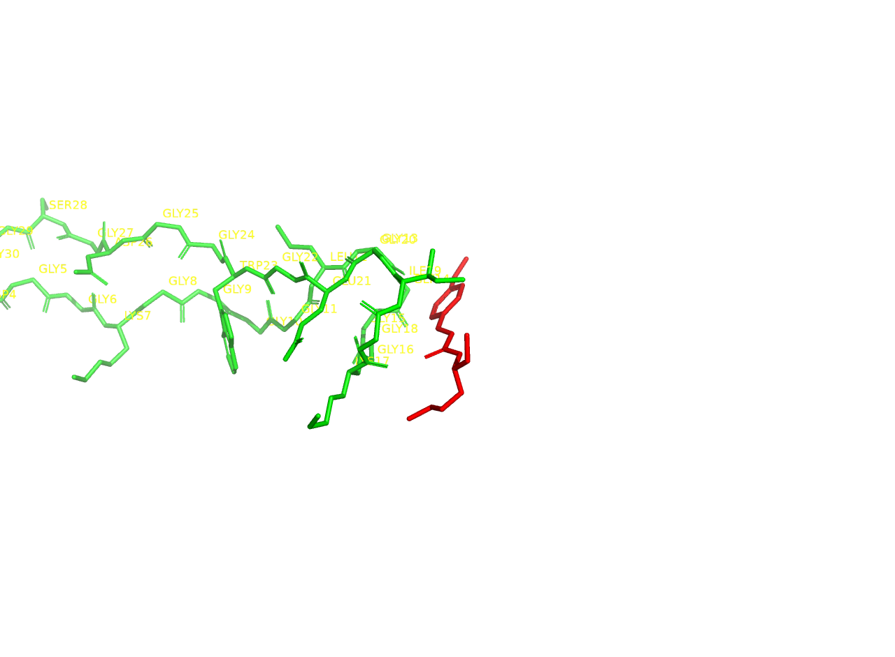 | 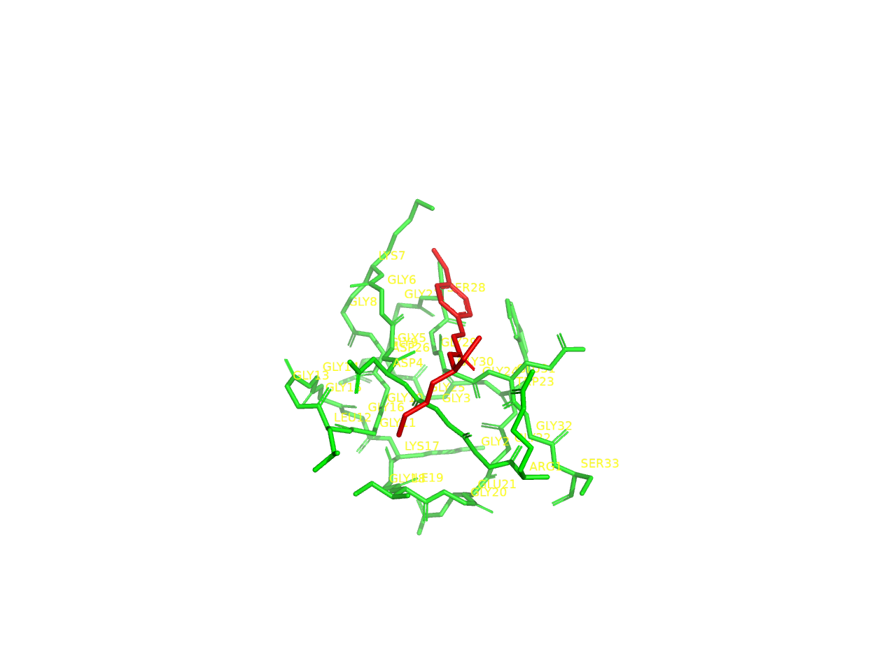 | 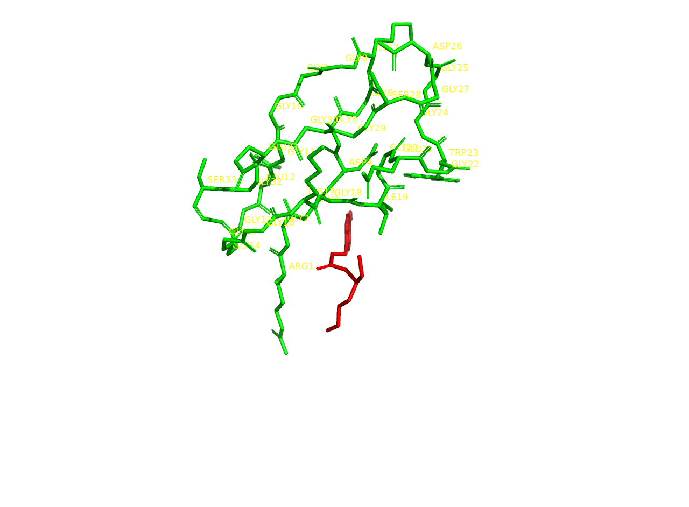 | 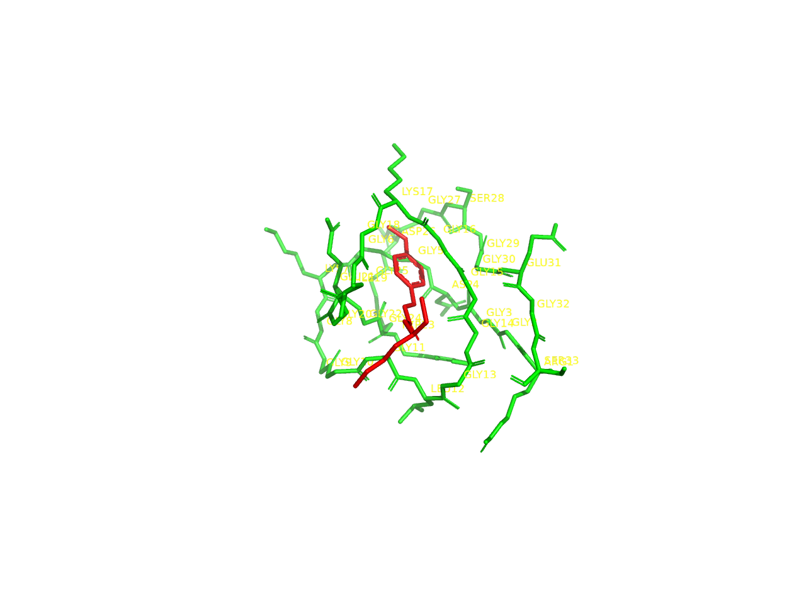 |
| 0.75 / −15.83 | 0.85 / −26.32 | 0.65 / −22.30 | **1.00 / −45.86** |
| ligand against the outside, centroids 20.9 Å apart | | ligand bent to buy contacts: 42.06 kcal/mol of strain, net unfavourable | every ligand atom contacted, 47 pairs, none charged |

**The first ESM2 variant.** The helix barely changes shape across the whole ladder.

| unconstrained | 4 contacts | 8 contacts | 12 contacts |
|---|---|---|---|
| 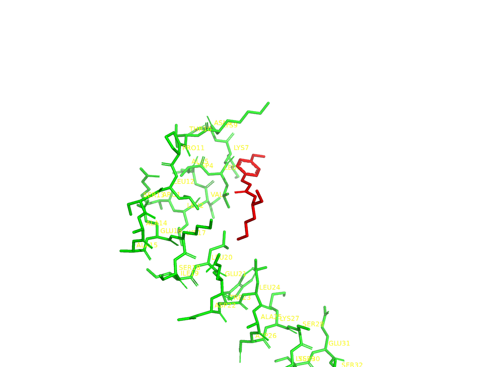 | 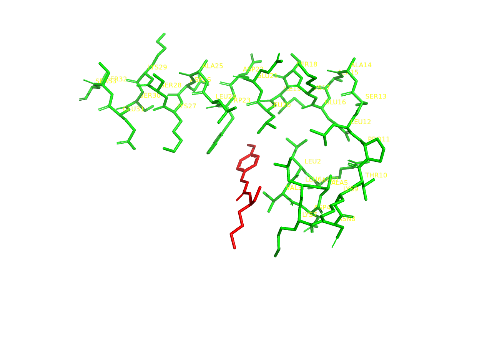 | 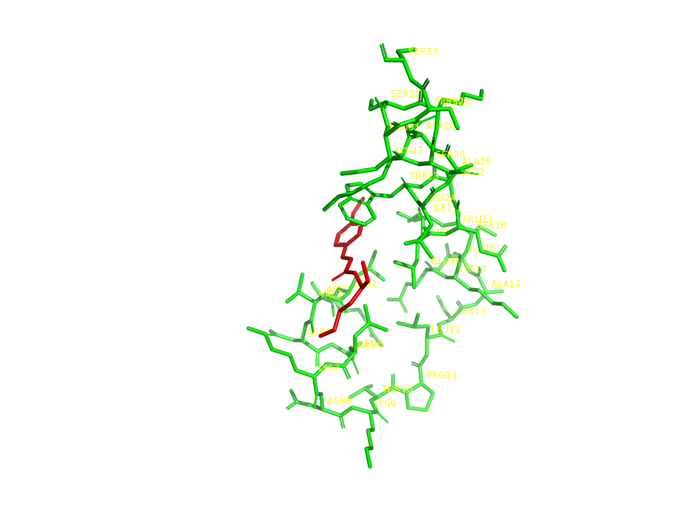 | 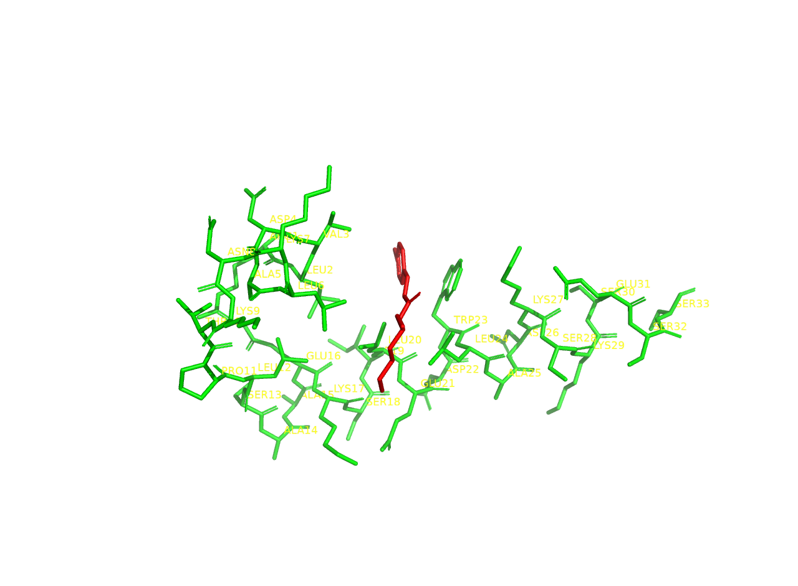 |
| 0.60 / −12.22 | 0.65 / −20.89 | 0.90 / −29.10 | 0.80 / −17.11 |
| | | | 77–81% helical throughout, 0.3–0.8 Å CA RMSD between all four |

**The second ESM2 variant.** The counter-example: binding is strongest where wrapping is nearly
weakest, and gets worse as the wrap tightens.

| unconstrained | 4 contacts | 8 contacts | 12 contacts |
|---|---|---|---|
| 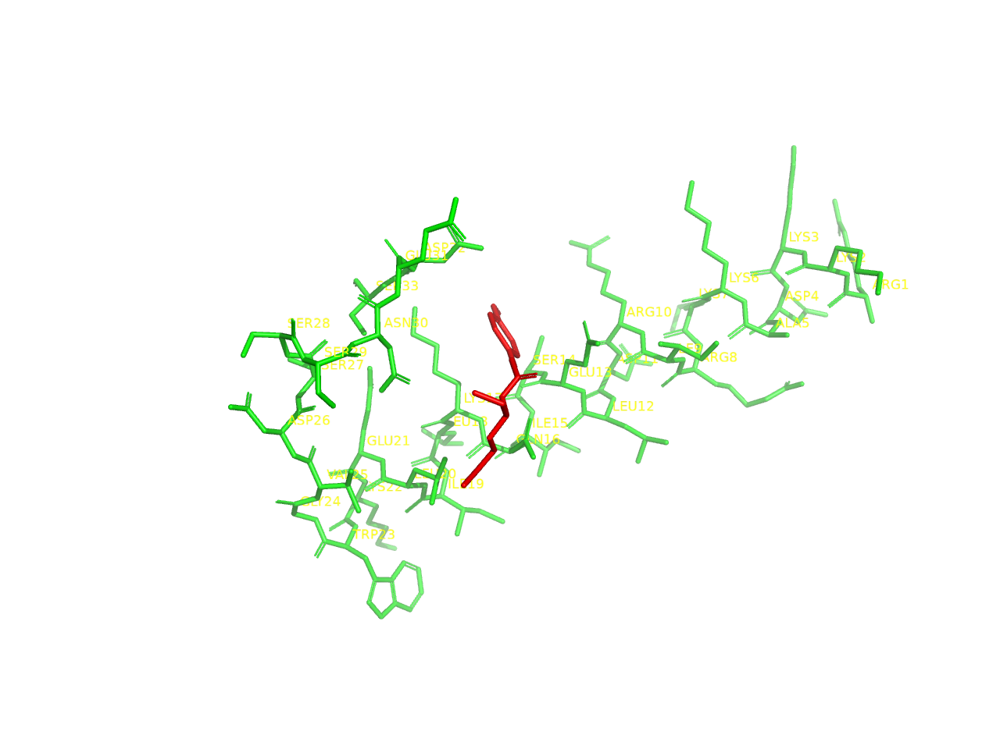 | 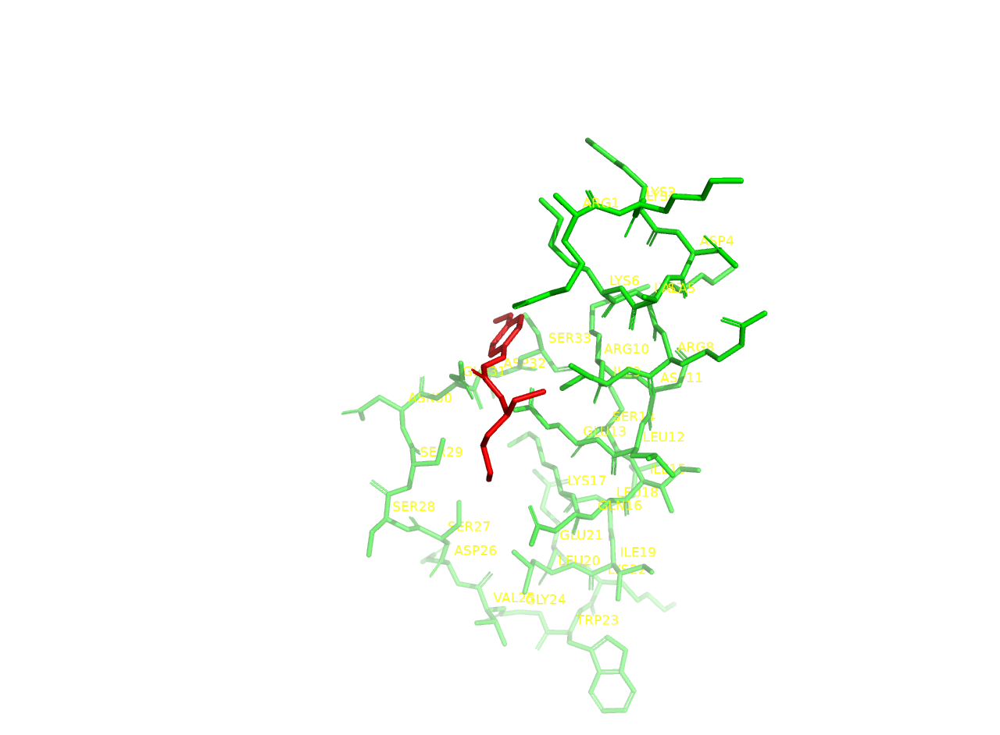 | 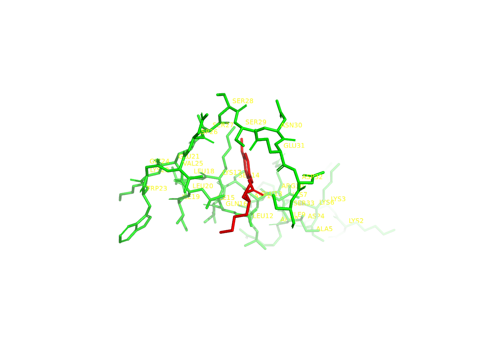 | 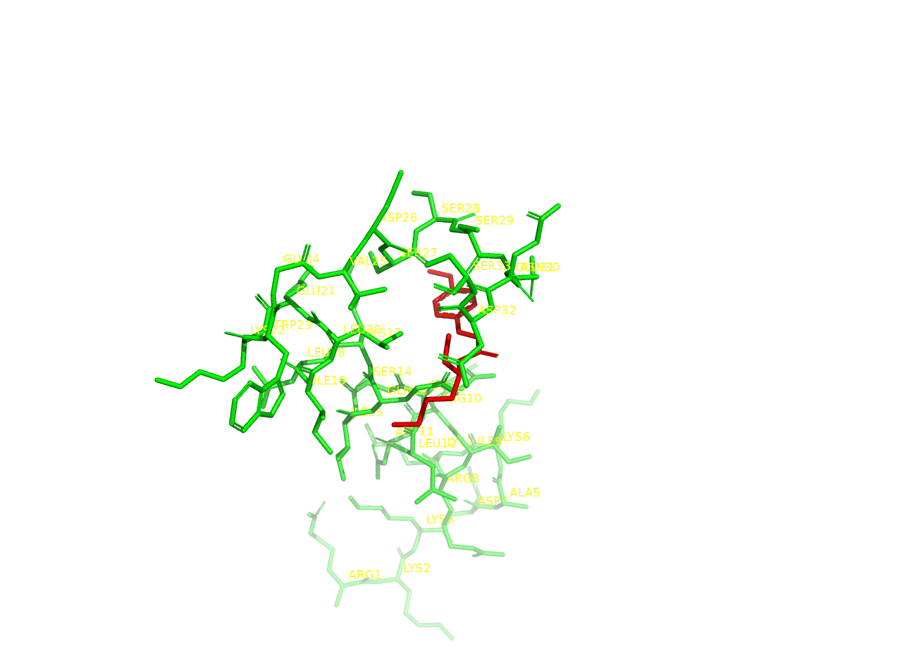 |
| 0.40 / −20.27 | **0.50 / −39.90** | 0.75 / −29.66 | 1.00 / −21.14 |
| | `ARG1` on the ring, 8 contacts, ligand largely outside | | fully wrapped and half the binding energy of `orig_f12` |

The pair worth looking at hardest is `orig_control` against `orig_f12` — same sequence, same ligand,
the only difference being twelve forced contacts, and the ligand goes from lying against the outside
of the peptide to sitting inside it.

`load_folds.pml` loads all twelve superposed on the ligand, with the designed shell in marine.
`style.pml` applies the representation used here to anything already loaded — sticks, black
background, green peptide, red ligand, residue labels on CA. Three further scripts —
`close_contact.pml`, `contact_orig_esm1.pml`, `contact_orig_f8.pml` — focus on individual short
contacts with their distances labelled.

---

## Second worked example: a different shell around the same ligand

Every number above comes from one designed arrangement. Pose selection is greedy and order-dependent,
so rotating which fragment picks first produces a family of shells, and the obvious question is
whether any of it generalises. This is the second-richest shell, at −109.15 kcal/mol against the
first's −113.12, sharing only five of its twelve poses:

```
phenylalanine:2, arginine:3, lysine:10, aspartic:21, glutamic:15, isoleucine:8,
leucine:12, serine:32, tryptophan:5, glutamic:10, leucine:13, serine:2
```

Its sweep found **all 132 ordered pairs connectable**, as the first shell's did, and the ordering
search returned a path through all twelve poses. The design is independently identical to the first on
every structural count:

| | shell 1 | shell 2 |
|---|---|---|
| sequence | `RGGDGGKGGGGLGGGGKGIGEGWGGDGSGGEGS` | `RGEGGEGGKGGFGGDGGIGLGGSGWGGGGLGGS` |
| residues | 33 | 33 |
| spacers used, against a budget of 16 | 21 | 21 |
| poses in the path | 12 / 12 | 12 / 12 |
| worst closure | 0.196 Å | 0.120 Å |
| total fragment interaction energy | −113.12 | −109.15 |

Two shells sharing five poses, ordered by independent exact searches, arriving at the same length and
the same overshoot against the same budget. The overshoot is therefore a property of twelve-fragment
shells around this ligand rather than an accident of one arrangement.

Two ESM2 linker variants were generated as before, and each of the three sequences co-folded four ways.

```
esm1   RSELAEAAKRGFLTDGGIDLVSSGWLTLRLAPS      net charge  0
esm2   RGERKEKSKLIFIIDSKIFLSFSIWRFLILLRS      net charge +5
```

### Results

| structure | enclosed | wrapped | engaged | centroid sep | interaction | ligand strain | sum | hints | designed positions |
|---|---|---|---|---|---|---|---|---|---|
| **`s2_orig_control`** | 0.60 | **1.00** | 20/20 | 7.7 Å | −25.18 | 9.23 | **−15.95** | — | 0/12 |
| `s2_orig_f4` | 0.625 | 0.85 | 17/20 | 2.9 Å | −17.48 | 15.87 | −1.61 | 0/4 | 0/12 |
| `s2_orig_f8` | 0.43 | 0.85 | 17/20 | 9.6 Å | −11.07 | 36.80 | **+25.73** | 1/8 | 0/12 |
| `s2_orig_f12` | 0.70 | 0.85 | 17/20 | 7.2 Å | −17.56 | 16.07 | −1.49 | 1/12 | 0/12 |
| `s2_esm1_control` | 0.375 | 0.55 | 11/20 | 11.2 Å | −9.70 | 11.64 | **+1.93** | — | 0/12 |
| `s2_esm1_f4` | 0.64 | 0.80 | 16/20 | 6.8 Å | −29.55 | 21.43 | −8.12 | 1/4 | 0/12 |
| `s2_esm1_f8` | 0.67 | 0.80 | 16/20 | 5.5 Å | −19.91 | 33.74 | **+13.83** | 1/8 | 0/12 |
| **`s2_esm1_f12`** | 0.675 | 0.90 | 18/20 | 5.9 Å | **−42.39** | 23.37 | **−19.03** | **3/12** | **1/12** |
| `s2_esm2_control` | 0.51 | 0.85 | 17/20 | 6.7 Å | *−74.89* | 9.05 | *−65.84* | — | 0/12 |
| `s2_esm2_f4` | 0.50 | 0.55 | 11/20 | 16.0 Å | −7.53 | 29.32 | **+21.80** | 0/4 | 0/12 |
| **`s2_esm2_f8`** | **0.86** | **0.95** | 19/20 | 9.5 Å | −28.29 | 23.30 | −4.99 | 0/8 | 0/12 |
| `s2_esm2_f12` | 0.61 | 0.75 | 15/20 | 5.9 Å | *−72.72* | 12.78 | *−59.94* | 2/12 | 0/12 |

Energies in kcal/mol; all three sequences are 33 residues. **The `esm2` energies are italicised
because they are artifacts, not measurements** — see below.

### What replicates, and what does not

**The eight-contact fold is usually the damaged one, with a consistent exception.** `s2_orig_f8` and
`s2_esm1_f8` carry the highest ligand strain of their ladders, at 36.80 and 33.74 kcal/mol, and both
end net unfavourable at +25.73 and +13.83. Across the six ladders in both shells, f8 is the
highest-strain rung in **four** — both `orig` and both `esm1` — at 33.7 to 42.1 kcal/mol.

**The two exceptions are both `esm2`, in both shells**, where f4 carries the higher strain instead:
25.91 against f8's 15.61 in shell 1, and 29.32 against 23.30 in shell 2. That is the same sequence
family that breaks the enclosure ladder and whose energies are charge artifacts, so it is the branch
that behaves differently on every measure rather than a random exception.

A peptide can satisfy a few contacts by pulling the ligand toward whichever residues are nearby; eight
is apparently enough to demand serious distortion and too few to require the wrap that would relieve
it — except where the substitution has already locked the fold into a shape that four contacts fight
harder than eight.

**Forced contacts are a rescue mechanism, not an improvement.** This is the sharpest disagreement
between the two shells, and it resolves rather than contradicts the first example:

| glycine design | control | twelve forced contacts | effect |
|---|---|---|---|
| shell 1 | −1.17 | **−33.07** | forcing gains 32 kcal/mol |
| shell 2 | **−15.95** | −1.49 | forcing loses 14 kcal/mol |

Shell 1's unconstrained control left the ligand pressed against the outside — 0.75 wrapped, centroid
20.9 Å — so the constraints had everything to gain. Shell 2's control already contacted all twenty
ligand heavy atoms at 7.7 Å against a radius of gyration of 13.3 Å, so they could only disturb it,
and the geometry says so: wrapping fell from 1.00 to 0.85. **Forcing the full contact set produces
the designed arrangement when the unconstrained fold has failed, and degrades it when the
unconstrained fold has already succeeded.** Read the control's wrapping first to know which case you
are in.

**A shell can succeed at the objective without realising the design.** `s2_orig_control` wraps every
ligand heavy atom while reproducing none of the twelve designed side-chain positions. The first shell
could not separate these, because its control failed at both at once.

**Designed positions are still essentially never reproduced: 1 of 144** across all twelve folds, at
ligand superposition RMSD 0.06–0.85 Å, so the comparison is sound. But the distances say something the
count hides. Forcing contacts moves side chains markedly closer to where the design asked for them —
the median distance to a designed position falls from 12–14.5 Å unconstrained to 7.6–9.8 Å forced, in
all three ladders — and the median distance to the nearest side chain **of any type** falls to 3.0–4.9
Å, reaching 3.02 Å for `s2_esm2_f8`. Something is arriving at the designed position; it is the wrong
residue. That relocates the failure from reachability, which the sweep shows is satisfiable for every
pair, to the sequence assembly that decides which residue lands where.

**The claim that every twelve-contact fold is the most enclosed of its set does not survive.** It
holds for `orig` at 0.70 and barely for `esm1` at 0.675 against f8's 0.67, but `esm2`'s best-enclosed
fold is **f8 at 0.86**, with f12 down at 0.61. `s2_esm2_f8` is the best-enclosed structure of the
whole set — 0.95 wrapped, 19 of 20 atoms engaged, 31 contacts — and it scores poorly. Enclosure and
energy disagree again, and this time enclosure is right about the structure and wrong about the
number.

### The charge artifact, quantified

The linker fill took the design from net charge −1 to **+5**, and `s2_esm2_control` posts −74.89
kcal/mol, nominally the strongest binding anywhere in this project. It should not be read as binding
at all. Across `esm2`'s four folds the interaction energy correlates **+0.93 with the distance between
the ligand and peptide centroids** and only **+0.18 with enclosure**, with the wrong sign:

| `esm2` fold | centroid sep | interaction | enclosed | wrapped | contacts |
|---|---|---|---|---|---|
| f12 | 5.9 Å | −72.72 | 0.61 | 0.75 | 17 |
| control | 6.7 Å | −74.89 | 0.51 | 0.85 | 18 |
| f8 | 9.5 Å | −28.29 | **0.86** | **0.95** | **31** |
| f4 | 16.0 Å | −7.53 | 0.50 | 0.55 | 20 |

The best-wrapped structure in the set scores 46 kcal/mol worse than a control that wraps less and
encloses far less, purely because the control's centroid sits 2.8 Å closer. That is long-range
electrostatics on a highly charged peptide, not an interface.

The control for this reading is the glycine design at net charge −1, where the same relationship is
absent: its f4 and f12 folds give −17.48 and −17.56 kcal/mol despite centroid separations of 2.9 and
7.2 Å. Grouped by sequence, the correlation between interaction energy and centroid separation runs
**+0.23** at charge −1, **+0.70** at charge 0 and **+0.93** at charge +5, while the correlation with
enclosure runs −0.56, −0.76 and +0.18. Pooling all twelve reports −0.14 for enclosure and +0.42 for
separation, hiding both.

So the distance-dominated energy is a property of the charged variant rather than of the scoring
method, which means the `orig` and `esm1` numbers can be read as chemistry and `esm2`'s cannot.
**Constrain the residue set when filling linkers, and report net charge beside any interaction
energy.** `correlate.py --group` computes these.

### Two binding modes, and what actually predicts them

Inspecting the twelve renders by eye splits them into two mechanisms, and neither the enclosure nor
the wrapping column reliably tells them apart.

**Encapsulation** — the ligand inside the peptide: `s2_esm1_f4`, `s2_esm1_f8`, `s2_esm1_f12` and
`s2_esm2_f8`.

**A groove on an elongated structure** — the ligand held against a surface channel:
`s2_orig_control`, `s2_orig_f4` and `s2_esm2_f12`.

**Radius of gyration separates them cleanly and the purpose-built metric does not.** The four
encapsulating folds span Rg 9.3–9.8 Å; the three groove binders span 11.8–14.9 Å. Nothing falls in
between. Enclosure separates the same two groups by 0.015 — 0.625 against 0.64 — which is far too
narrow to act on, and **wrapping inverts the verdict outright**: the highest wrapped value in the whole
set, 1.00, belongs to `s2_orig_control`, a groove binder. Wrapping counts ligand atoms in contact, and
a groove can contact all of them. When judging whether a design achieved encapsulation, read
`peptide_rg` first and treat wrapping as a contact census rather than a verdict.

**Helicity explains how each mode arises, and it is not simply "helical means elongated".** The groove
binders span 3% to 100% helical, so there are two unrelated routes to an extended structure:

| sequence | helical | Rg | what it is |
|---|---|---|---|
| `orig` (glycine design) | 3–6% | 7.7–13.3 Å | never helical; extended because a 64%-glycine chain has no fold |
| `esm1` | **42% in all four folds** | 9.3–10.3 Å | locked, and the locked shape is compact |
| `esm2` | 87–100% | 9.8–15.0 Å | a helical rod, except where the helix broke |

`s2_esm2_f12` is a groove binder because it is a rigid 100% helix at Rg 14.9 Å and the ligand can only
lie along it. `s2_orig_control` is a groove binder for the opposite reason — 3% helical, extended
because nothing folds it. And the one `esm2` fold that encapsulates, `s2_esm2_f8`, is the one where the
helix **broke**: 87% helical at Rg 9.8 Å, against 97–100% and ~15 Å for its three siblings.
Encapsulation by a substituted sequence required disrupting the structure the substitution created.

This is the same lock-in the first shell showed, where all four `esm1` structures held the same shape
regardless of constraint. Here `esm1` is locked at 42% helicity across all four folds and that
conformation happens to be compact, which is why every forced `esm1` fold encapsulates. The lock is
not itself good or bad; it decides the mode before any constraint is applied, and whether that helps
is luck.

**The glycine design's extended folds look like β sheets and are not.** `s2_orig_control` is **81%
β-basin**, the most extended backbone in the set, which is why it reads as pleated on inspection. But it
carries only **6 non-local backbone hydrogen bonds**, where a sheet needs a ladder of them between
paired strands. It is an extended, unpaired chain — the expected outcome for a sequence that is 64%
glycine, glycine being both a poor β-former and the residue with the most backbone freedom to give
away. `s2_orig_f4` is the same at 36% β and 6 non-local bonds.

The exception is informative: `s2_orig_f12` has the **most non-local hydrogen bonds of any fold in the
set**, 11, at the most compact Rg of 7.7 Å. Forcing twelve contacts is the only intervention that gave
the glycine design any tertiary structure at all, even though it cost binding energy. The `esm2` folds
sit at the opposite extreme — 0% β and zero non-local bonds, with 34 to 43 helical ones, a helix bonded
only to itself.

`check_fold.py` reports `helical_fraction`, `beta_fraction`, `helical_hbonds` and `nonlocal_hbonds`, so
all of this is measured rather than eyeballed. On the first shell's structures the helicity gives 81%
for `esm1_f12` and 6% for `orig_f12`, reproducing the figures quoted in that example.

### Figures

All twelve structures, peptide in green, ligand in red, laid out as before: one row per sequence, one
column per rung of the constraint ladder. Captions are `wrapped` / `interaction` in kcal/mol.

**The glycine design.** The unconstrained fold is the best of the four, and forcing contacts makes it
worse — the reverse of the first shell.

| unconstrained | 4 contacts | 8 contacts | 12 contacts |
|---|---|---|---|
| 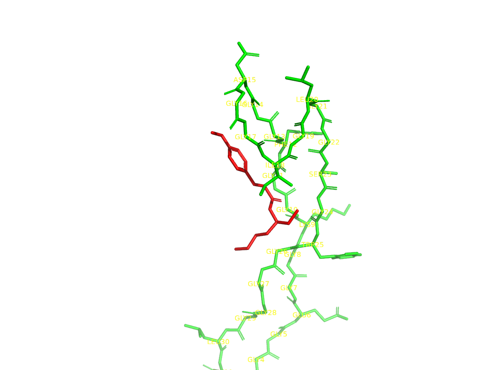 | 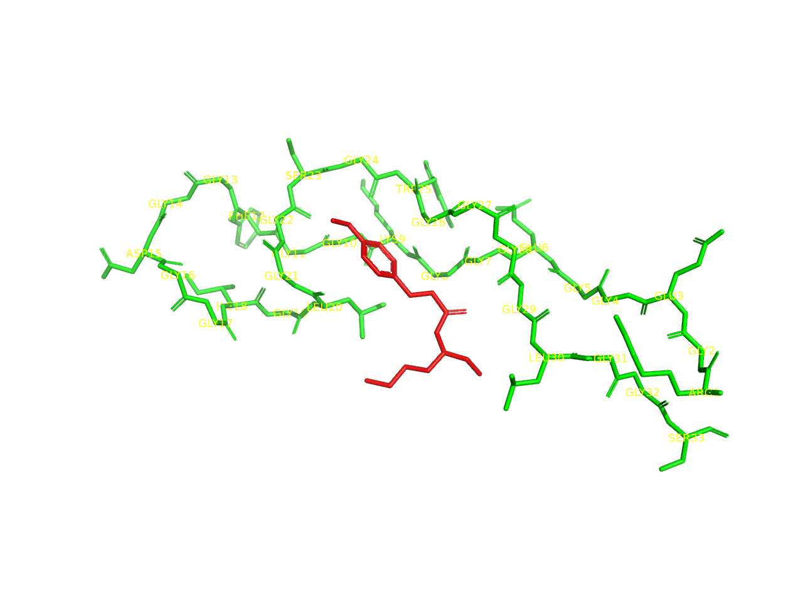 | 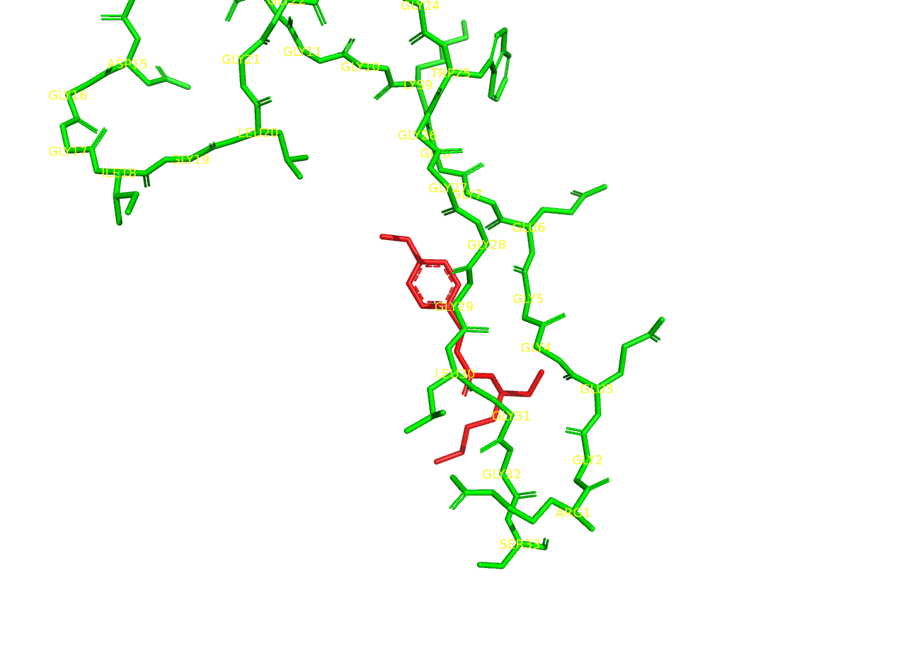 | 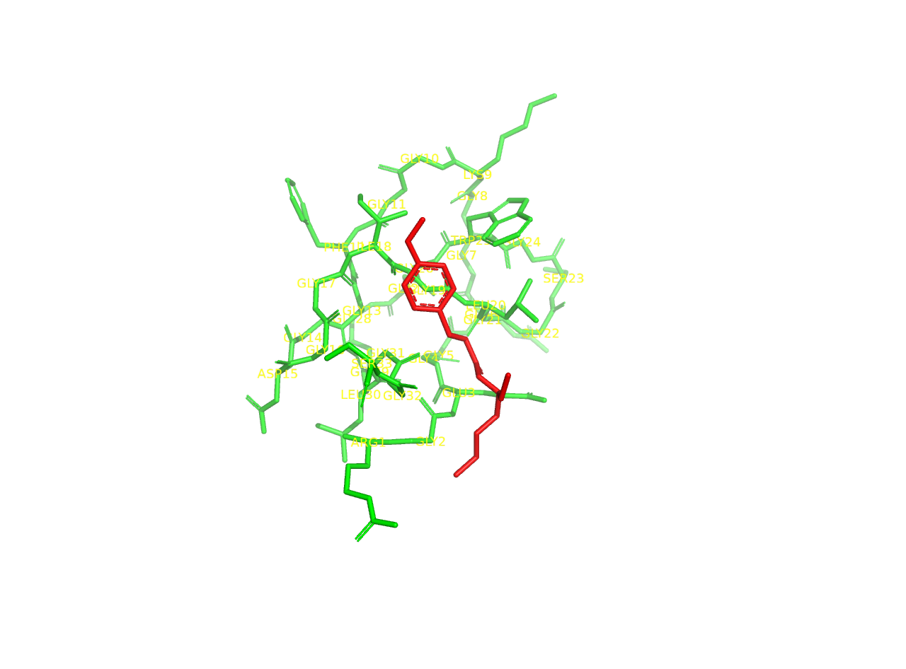 |
| **1.00 / −25.18** | 0.85 / −17.48 | 0.85 / −11.07 | 0.85 / −17.56 |
| **groove**, Rg 13.3 Å, 3% helical — every ligand atom contacted, none of it enclosed | **groove**, Rg 11.8 Å | 36.80 kcal/mol of ligand strain, net unfavourable | most compact of all at Rg 7.7 Å, 36 contacts, still worse than the control |

**The first ESM2 variant.** The only ladder where geometry and energy agree throughout, and the only
fold in 144 to reproduce a designed position.

| unconstrained | 4 contacts | 8 contacts | 12 contacts |
|---|---|---|---|
| 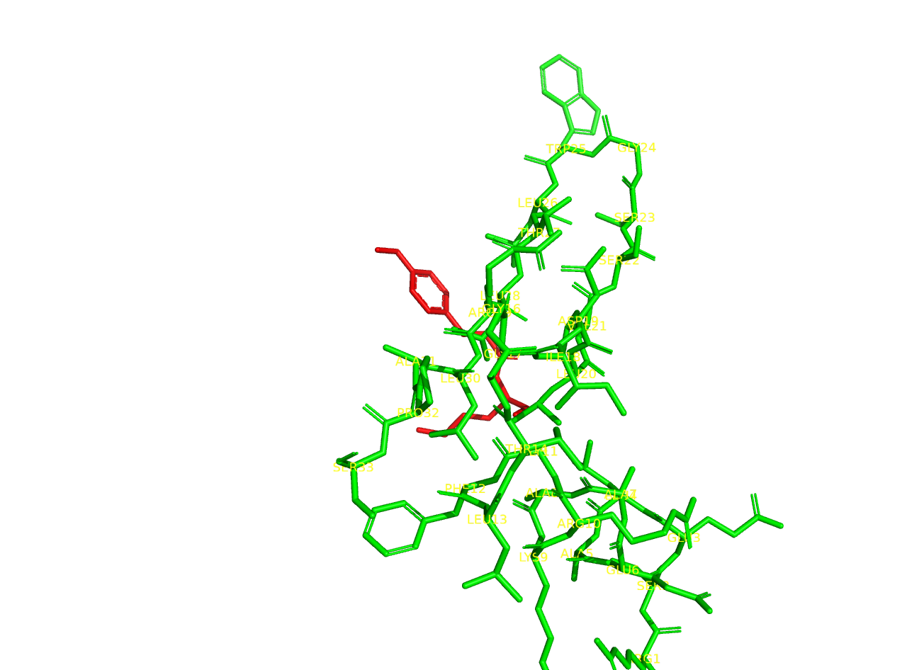 | 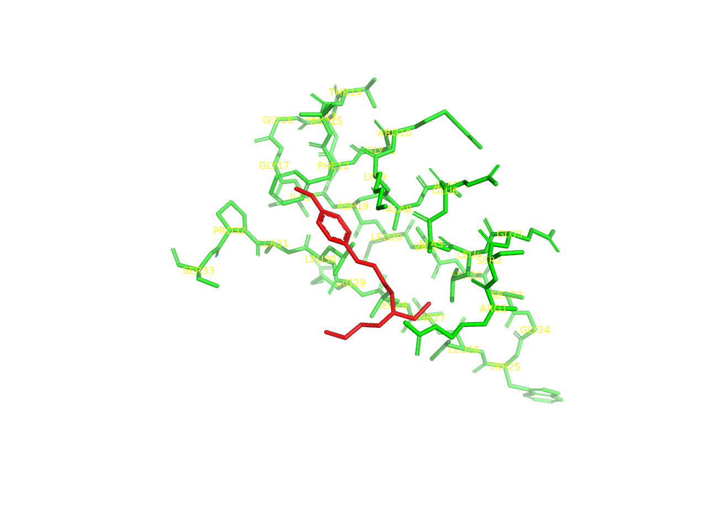 | 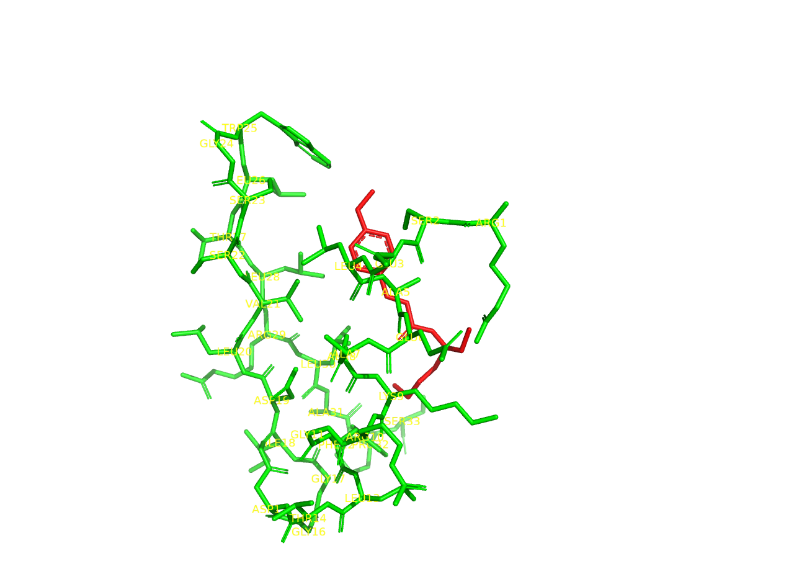 | 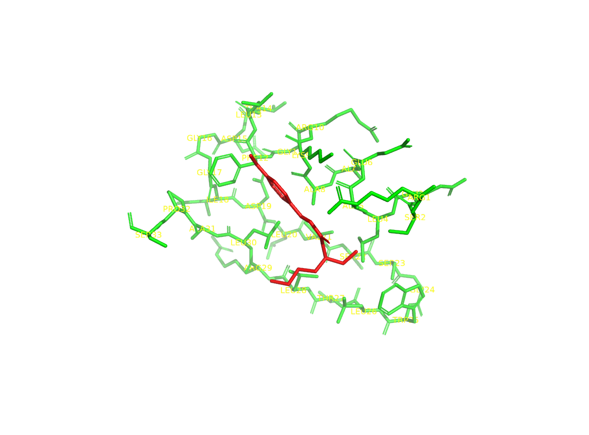 |
| 0.55 / −9.70 | 0.80 / −29.55 | 0.80 / −19.91 | **0.90 / −42.39** |
| 42% helical, as all four are | **encapsulates**, Rg 9.6 Å | **encapsulates**, but 33.74 kcal/mol of strain, net unfavourable | **encapsulates**, Rg 9.3 Å — 3/12 hints honoured and the only fold in 144 to reproduce a designed position |

**The second ESM2 variant.** Net charge +5. The energies track how close the ligand sits, not how
well it is held, so read the geometry columns and ignore the numbers.

| unconstrained | 4 contacts | 8 contacts | 12 contacts |
|---|---|---|---|
| 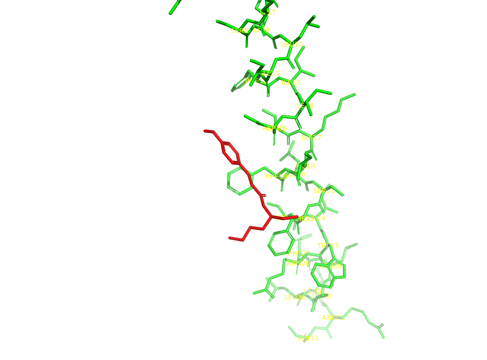 | 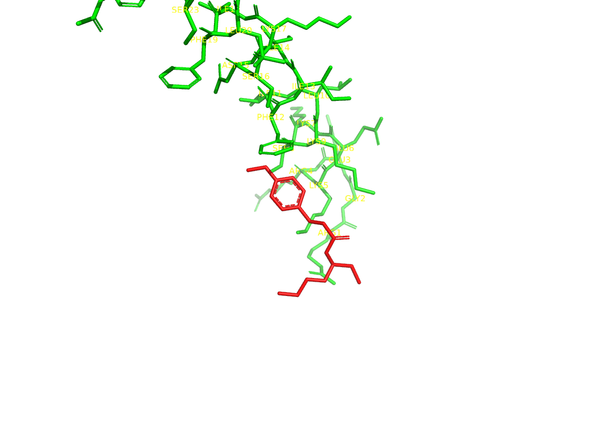 | 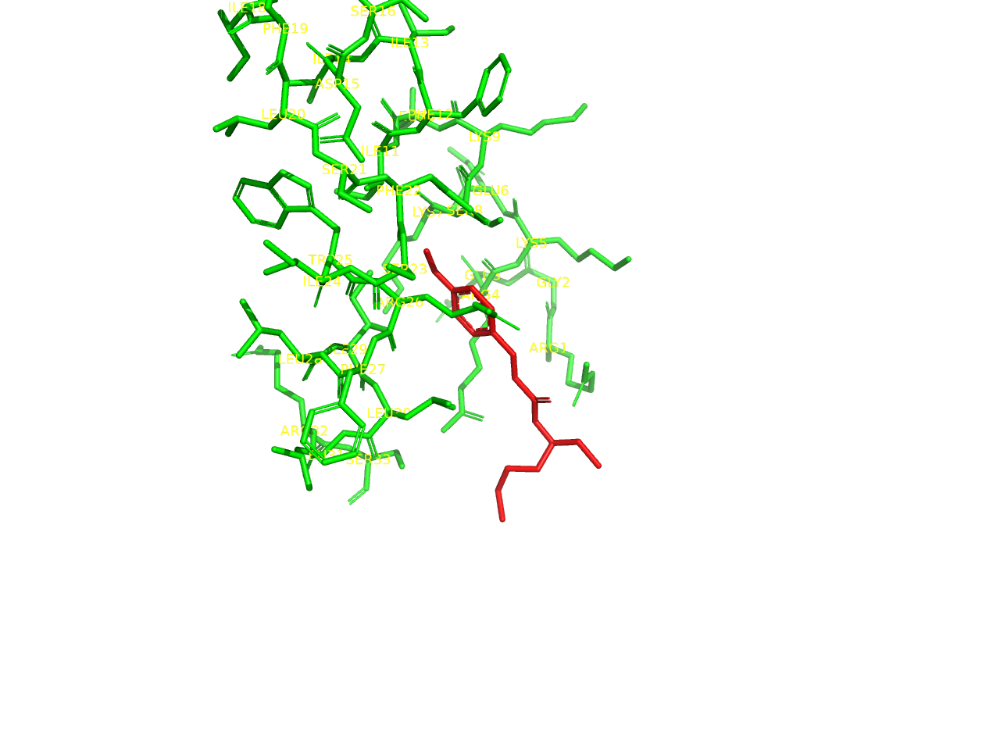 | 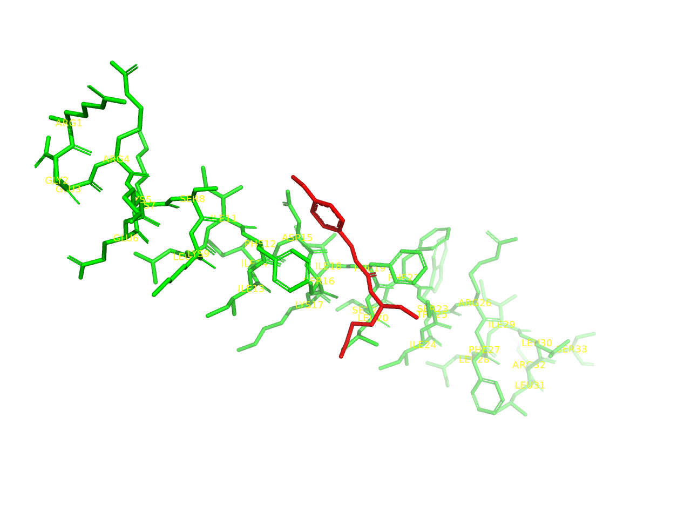 |
| 0.85 / *−74.89* | 0.55 / −7.53 | **0.95 / −28.29** | 0.75 / *−72.72* |
| 100% helical rod, Rg 15.0 Å | ligand thrown 16.0 Å from the centroid | **encapsulates** — the one fold whose helix broke, 87% at Rg 9.8 Å; best geometry in the set, mediocre score | **groove** along a 100% helix at Rg 14.9 Å; fully forced, and the score barely moves from the control |

`load_folds.pml` in `figures_shell2/` loads all twelve superposed on the ligand with the designed
shell in marine, and `style.pml` beside it applies the representation used here.

---

## What the metrics mean

Two of these are easy to confuse, and the fact that they disagree is the point.

**`enclosed`** — the fraction of directions out of the ligand's centre that run into peptide. Two
hundred directions are sampled, each treated as a ray with a 3 Å tolerance out to 12 Å. This asks
whether the ligand sits in a shell or against a face.

**`wrapped`** — the fraction of the ligand's heavy atoms with a peptide heavy atom within 4.5 Å. This
asks how much of the ligand is in contact.

They disagree usefully. `orig_control` contacts three quarters of the ligand's atoms while enclosing
less than half of the directions out of it, because the ligand is stuck to one face. Reporting wrapping
alone over-rates that structure considerably.

**`centroid sep`** — distance between the ligand's centroid and the peptide's. Compare it to the
peptide's radius of gyration: `orig_control`'s 20.9 Å against an Rg of 13.7 Å says the ligand is not
inside the peptide at all.

**`peptide_rg`** — the peptide's radius of gyration. Reported because it turned out to be the best
single discriminator of the design objective: across the second worked example's twelve folds, every
structure that visibly encapsulates the ligand has Rg 9.3–9.8 Å and every one that holds it in a
surface groove has 11.8–14.9 Å, with nothing in between, while `enclosed` separates the same two groups
by 0.015 and `wrapped` gets them backwards.

**`helical_fraction`** and **`beta_fraction`** — the fraction of residues whose backbone φ/ψ fall in
the α-helical and extended-β basins, using generous windows (helix φ −63±35, ψ −43±35) because Boltz's
geometry is unrefined and a tight window reports zero for folds that are plainly helical. Together
they explain binding mode: a substituted sequence often comes back as a rigid helix that can only grip
the ligand along its surface, and encapsulating then requires the helix to break.

**`helical_hbonds`** and **`nonlocal_hbonds`** — backbone N···O contacts under 3.3 Å, split by
sequence separation: 3 to 5 residues apart, which is the i,i+4 bond a helix makes with itself, against
more than 5 apart, which is where strand pairing would appear. **The split is the point.** A high
`beta_fraction` means an extended backbone, not a sheet, and only the non-local count distinguishes
them — the glycine design's unconstrained fold reaches 81% β with just 6 non-local bonds, so it is
extended and unpaired rather than pleated into a sheet. Counting all separations together hides this
and ranks a pure helix highest, since 40-odd i,i+4 bonds swamp everything while pairing nothing.

**`interaction`** — `E(complex) − E(peptide) − E(ligand)`, all three at the complex geometry, so it is a
rigid interaction energy containing no strain. Hydrogens are relaxed first with heavy atoms fixed,
which leaves Boltz's predicted geometry untouched while removing the arbitrariness of where pdbfixer
placed them.

**`ligand strain`** — `E(ligand at its geometry in the complex) − E_ref`, the conformational price the
ligand pays, where **`E_ref` is one shared reference: the ligand's own lowest conformer, computed once
per ligand** by `ligand_reference.py` and reused for every structure and every shell. It is a property
of the ligand and the potential, not of any fold, so it is computed on first use and then simply read;
`strain_global.py` refuses to run if the stored reference's SMILES or model does not match the run's,
since a reference from a different molecule would silently corrupt every strain rather than fail.

That reference matters more than it sounds. Earlier this term relaxed each complex's own bound pose to
get its free-ligand energy, which measured every structure against a *different* local minimum —
whichever basin that relaxation happened to fall into. The consequences were large:

* At the default `fmax 0.1` the free-ligand relaxation stops well short of a minimum. Tightening to
  0.01 moved individual strains by **+1.5 to +7.7 kcal/mol**, and the sweep only converged by 0.02
  (6.96 → 8.08 → 8.56 → 8.61 for one structure at 0.10, 0.05, 0.02, 0.01).
* With a loose step cap the ligand cannot travel; with a generous one it changes conformer. The
  largest shifts came with up to **1.0 Å of heavy-atom drift** — a rotor flipping, not a relaxation.
* The bound-state hydrogens were relaxed inside the complex, starting from a `pdbfixer` protonation
  that is **not deterministic**. Two scorings of one structure differed by 3.6 kcal/mol from that
  alone, while the heavy atoms stayed bit-identical.

A single reference removes all three: differences between structures now reflect only their bound
geometries. `strain_global.py` computes the term for every fold as one single point on the bound ligand
**exactly as the complex relaxation left it** — `structures/<name>_ligand_bound.xyz`, or equivalently
the step-0 energy of that fold's free-ligand block in the scoring log, which is the same state and so
lets folds scored before geometry saving existed be corrected without re-running anything.

**The bound state must not be re-relaxed, in whole or in part.** Strain is the energy released going
from the bound state to the free one, and the bound state is the ligand as it exists in the complex,
hydrogens included. Re-placing those hydrogens on the isolated ligand inserts an intermediate state —
bound, then bound-heavy-atoms-with-free-molecule-hydrogens, then the global minimum — and reports only
the second leg, discarding the first. It was tried, and it lowered all 24 strains by 0.2 to 6.1
kcal/mol. The hydrogen reorganisation is part of what the relaxation releases, and it is not
double-counted against the interaction energy, which is evaluated at one fixed geometry and says nothing
about the path to the free state.

**A negative strain is a failed reference, not a finding.** It means a bound pose sits below the
supposed global minimum, so the conformer search missed it; re-run with more embeddings.

Interaction energy is unaffected by any of this, which is why it was reliable throughout: it compares
the complex against its own parts at one fixed geometry, so hydrogen-placement error largely cancels.
Strain compares a bound state against a separately relaxed one, and nothing cancels.

**`hints`** — requested contacts satisfied, of those requested. Worth reporting and worth not trusting
as a measure of success: it is uncorrelated with everything else in the table.

`correlate.py` computes the relationships between all of these, joining the geometry, energy and
overlay CSVs on structure name and reporting Pearson and Spearman with n beside each coefficient:

```bash
python code/correlate.py runs/octinoxate --group '(esm1|esm2|orig)'
```

Use `--group`. These correlations invert between subsets, so a figure pooled over folds that bind by
different mechanisms is close to meaningless — across one set of four folds, interaction energy
correlated +0.93 with the ligand-to-peptide centroid separation and +0.18 with enclosure, while a
second set of four from the same run gave −0.80 for enclosure. Pooling the eight reports −0.21 and
hides both.

---

## Traps

These cost time to find. They are recorded here so they cost no one else any.

**A Boltz contact constraint with `force: false` is discarded, not softened.** The featurizer skips it
outright, so a "hinted" fold with unforced constraints is an unconstrained fold. Set `force: true`.

**`force: true` alone is conditioning, not enforcement.** The constraint enters the pair
representation and the model may decline it. The guidance that acts on the structure during sampling is
gated behind `--use_potentials`, which is off by default. Both are needed.

**Boltz 2.2.1's affinity head fails against RDKit 2026.03.6.** It calls
`AllChem.Descriptors.MolWt`, and `AllChem` no longer exposes `Descriptors`, so requesting affinity
raises at parse time. `boltz_hints.py` omits the affinity block by default. Little is lost — that head
spans only 1.65 kcal/mol across 37 sequences and gave a confident score to a complex with the ligand
6.6 Å away.

**Boltz writes heavy atoms only.** Hydrogens must be added before any energy calculation, which is what
pdbfixer is for.

**pdbfixer's hydrogen placement is not deterministic.** The same structure scored twice gave −14.47 and
−13.31 kcal/mol, a 1.2 kcal/mol spread from hydrogen positions alone. Relaxing hydrogens with heavy
atoms fixed brings reproducibility to 0.08 kcal/mol. This is the default and should stay on.

**Peptide strain is meaningless in vacuum.** A relaxed peptide collapses into a compact
hydrogen-bonded ball, so `E(bound) − E(relaxed)` measures collapse rather than strain: 237.8 kcal/mol
on a 33-residue peptide, and not converged. It is available behind `--terms strain_peptide` and
disabled by default.

**Explicit-water cavity desolvation is not affordable on CPU.** A peptide plus a cavity water shell is
around 420 atoms and its relaxation was still descending 1.6 kcal/mol per step at step 102 of 200.
Truncating gives a number set by the step budget rather than by the physics. For same-length designs it
should largely cancel anyway, varying only with the distribution of polar residues.

**A positive interaction energy means the structure is broken, not weakly bound.** Check for heavy-atom
contacts under 2.6 Å. Not every short contact is a defect, though — inspect the geometry before
concluding. Of three sub-2.6 Å contacts found here, one was an n→π\* interaction approaching a carbonyl
70° out of plane, one a CH···O hydrogen bond 17° off the C–H vector, and only the third — a backbone
carbonyl oxygen 2.55 Å from an ether oxygen, with no donor available to either — was genuinely
unphysical.

**Ligand strain needs a shared reference, and the defaults do not give one.** Relaxing each complex's
own bound pose measures every structure against a different local minimum. At `fmax 0.1` the relaxation
stops 1.5–7.7 kcal/mol short; raise the step cap and the ligand changes conformer instead (up to 1.0 Å
of heavy-atom drift). Compute one reference conformer per run with `ligand_reference.py` and use
`strain_global.py`. Interaction energy is immune, because it compares the complex with its own parts at
one geometry and the hydrogen-placement error cancels.

**`pdbfixer` is non-deterministic on some platforms.** Three protonations of one CIF on the same
machine gave hydrogen positions differing by up to 2.3 Å, RMSD 0.78 Å, with heavy atoms untouched. On a
Linux container the same call was stable to 0.01 kcal/mol across runs. This is why strain must not
depend on hydrogens optimised inside the complex.

**Interaction energy grows with system size** (Spearman −0.52 against peptide length) and does not track
contact area. Compare designs of matched length, or normalise.

**FAIRChem refuses the UMA 1.0 checkpoint** on version 2.22 and above, directing you to
`fairchem-core<=2.21.0`. Use `uma-s-1p2p1`.

**The fragment library holds analogues, not residues.** Each entry is a side-chain fragment capped
where the backbone would attach, so the isoleucine entry is n-butane and the leucine entry is
isobutane. Neither carries its namesake's branch. Two entries were found to be outright wrong and have
been repaired: tyrosine was a C₇H₇ radical — 59 electrons at neutral charge, declared as a singlet —
carrying a detached water and no phenol oxygen, and glutamic was acetate, the same molecule as
aspartic. They are now p-cresol and propionate, and all ten entries are chemically distinct.
`attach_geom.py` checks electron parity so a radical declared as a closed shell is caught rather than
assumed.

---

## Limitations

**One ligand.** Every number here comes from octinoxate. Whether the spacer thresholds, the enclosure
relationship or the constraint behaviour transfer to other ligands is untested.

**Two shells.** Twenty shells were enumerated and two have been swept and folded in full, giving
twenty-four structures. That is enough to show that several single-shell conclusions did not
generalise — the effect of forcing contacts reverses between them — but not enough to establish the
ones that did. The remaining eighteen are untested.

**The twenty shells are less independent than they sound.** Only 18 of the 20 are distinct, and nine
of those are strict subsets of another: each single-copy shell is the first pass of its two-copy
counterpart, and the `lysine` and `aspartic` walks converge on identical selections. The family offers
nine independent arrangements plus nested subsets.

**Shell selection is biased toward charge by the same artifact that distorts the energies.** Greedy
selection ranks shells by total fragment interaction energy, and that energy strongly favours charged
fragments: across all 165 poses, charged side-chain analogues average −10.79 kcal/mol against −4.71
for aromatics and −2.94 for neutral aliphatics, on a gas-phase potential with no desolvation term.
Across the twenty shells, interaction energy per fragment correlates −0.56 with charged fraction and
+0.63 with aromatic fraction. Both shells tested here are therefore among the most charge-dominated in
the family — the first is 58% charged with a single aromatic among twelve fragments — which is
backwards for a ligand that is a methoxyphenyl chromophore on a branched alkyl chain. Whether a
less charged, more aromatic shell folds better despite scoring worse is untested, and is the next
thing to try.

**No experimental validation.** Nothing here has been synthesised or measured. The energies come from a
machine learning potential in the gas phase, with no solvent, no entropy and no desolvation.

**The enclosure–energy relationship is not established across sequences.** Within the glycine design
enclosure ordered the interaction energy perfectly across four structures. Across the three sequences it
did not: forcing twelve contacts raised enclosure substantially in all three but raised the interaction
energy by 30 kcal/mol, 4.9 and 0.9 respectively.

**Small numbers.** Four structures per sequence. Rank correlations on four points mean little, however
large the energy range.

**The reachability criterion is a necessary condition, not a sufficient one.** It counts degrees of
freedom against constraints and adds a steric term. A path that satisfies it may still fail for
reasons the count does not capture, and one three-fragment path that met its budget closed while
another did not.

---

## Credits and provenance

**The original repository is [lucia-71/peptidebuilder](https://github.com/lucia-71/peptidebuilder)**, and
the peptide design idea in it is the work of a masters student, developed under supervision. That
version contributed the amino-acid fragment library, pose selection, sequence assembly, the linker
estimate and the command-line pipeline — the whole peptide-specific conception — and the majority of
the repository's founding commits.

The fragment placement and scoring engine beneath it comes from
**[CafChemFragGrow](https://github.com/MauricioCafiero/CafChem)**, driven by
`notebooks/FragGrow_CafChem.ipynb` in that repository. `define_fragments`, `get_frag_coordinates`,
`get_binding_site_dims`, `grow_fragments`, `calc_frag_energy` and the viewers descend from it. That
version works with generic chemical fragments — water, cyclopropyl, acetylene, methanol, phenyl — and
the amino-acid library was written for this project.

The explicit-water machinery in `solvate.py` is adapted from the `solvation` class in
**[UMADock](https://github.com/MauricioCafiero/UMADock)**, modified here: the water count scales with
solute size rather than being fixed, the rejection distance is a settable 2.4 Å rather than 1.7, the
test covers all three atoms of a candidate water rather than only its oxygen, and the seed is settable.

External tools:

- **[FAIRChem UMA](https://github.com/FAIR-Chem/fairchem)** (Meta) — the interatomic potential behind
  every energy here
- **[Boltz-2](https://github.com/jwohlwend/boltz)** — co-folding, and the contact constraints the design
  is handed to it through
- **[ESM2](https://github.com/facebookresearch/esm)** (Meta) — linker substitution, via the
  `facebook/esm2_t12_35M_UR50D` checkpoint
- **[ASE](https://wiki.fysik.dtu.dk/ase/)** — geometry optimisation and structure handling
- **[RDKit](https://www.rdkit.org/)** — SMILES handling, conformer generation, bond perception
- **[pdbfixer](https://github.com/openmm/pdbfixer)** and **[OpenMM](https://openmm.org/)** — adding
  hydrogens to folded structures
- **[py3Dmol](https://github.com/3dmol/3Dmol.js)** — in-notebook visualisation

---

## Citation

If you use this work, please cite this repository and the original
[lucia-71/peptidebuilder](https://github.com/lucia-71/peptidebuilder), along with the UMA, Boltz-2 and
ESM2 papers for the models it depends on.

---

## Licence

MIT. See [LICENSE](LICENSE).
