# Results

Everything this pipeline has actually measured, for the built-in `octinoxate` ligand. The README
describes what the code does and how to run it; this file is the record of what came out.

For the short version — the current pipeline, every peptide in both projects, the comparison that
matters and what is still open — read [PROJECT.md](PROJECT.md) first. This file is the long-form
evidence behind it, ordered as the work was done.

One caveat governs the whole document, and it is worth reading before any number in it. The ligand is
**C17H24O3, one CH2 short of real octinoxate** (2-ethylhexyl 4-methoxycinnamate, C18H26O3) -- its SMILES,
perceived from the stored geometry, is `CCCC[C@H](CC)OC(=O)/C=C/c1ccc(OC)cc1`, with the ester oxygen
directly on the chain CH. Every result here is for that analogue, and none of it is known to transfer to
a second ligand, because no second ligand has been run.

The three worked examples come first, in the order they were done, each one a response to what the last
one showed. Then dynamics, which is where the static scores stop being trustworthy and the MM/GBSA free
energies take over. Then redocking and rescoring, which test the pose rather than the sequence.
The two sections at the end are the ones to read first if you only read one thing: what the pipelines
deliver, measured as MM/GBSA free energy and ligand retention, and -- kept deliberately separate because
it is methodology rather than a result about the designs -- which starting pose is worth simulating.

## The table to read first: MM/GBSA by starting pose

Every peptide taken through dynamics, with MM/GBSA ΔG (and ligand retention, residence within 10 A
over 20 ns) for each of the three starting poses it can be run from: the **co-folded** pose the folding
model produced, the **top-AutoDock** pose (Vina's rank-1), and the **top-GNINA** pose (best
`CNNaffinity`, pose number given). All values are 20 ns, kcal/mol. A blank cell is a pose not yet
simulated; the convergence windows behind each number are in the dynamics sections below.

| peptide | source | co-folded ΔG (ret.) | top-AutoDock p1 ΔG (ret.) | top-GNINA ΔG (ret., pose) | CNNscore-top ΔG (ret.) |
|---|---|---|---|---|---|
| `s3_orig_f12` | peptidebuilder | **−24.33** (100.0%) | −20.79 (98.7%) | −13.23 (70.5%, p9) | |
| `s3_esm2_f4` | peptidebuilder | −21.08 (99.6%) | −22.42 (99.9%) \* | −19.55 (59.6%, p6) \* | |
| `bg33_4` | boltzgen | −19.66 (100.0%) | −14.81 (59.3%) | −16.53 (97.2%, p6) | |
| `s2_esm2_control` | peptidebuilder | −16.25 (59.6%) | −15.49 (0.0%) † | −17.09 (50.3%, p6) | |
| `shuffle_control` | pb (null) | −15.13 (75.9%) | −16.15 (57.8%) | −11.15 (46.4%, p9) | −8.40 (22.4%) ‡ |
| `shuffle_control_esm0` | pb (null) | −14.32 (80.2%) | −15.50 (76.1%) | **−14.76 (90.5%, p9)** | |
| `orig_f12` | peptidebuilder | −13.71 (77.3%) | −22.11 (100.0%) | −17.17 (83.3%, p5) | |
| `bg33_3` | boltzgen | −11.86 (41.0%) | −10.84 (25.7%) | −13.09 (77.6%, p6) | |
| `bg33_1` | boltzgen | −11.31 (14.5%) | | **−12.55 (42.5%, p2)** | |
| `bg33_2` | boltzgen | −8.02 (50.9%) | | −10.44 (57.2%, p4) | |

\* `s3_esm2_f4`'s docked legs and `s2_esm2_control`'s Vina-p1 leg lost their starting pose during
equilibration (ligand drift 11.0–15.1 A for `s3_esm2_f4`, 12.6 A for `s2_esm2_control` p1), so those
cells measure where the start wandered to over 20 ns, not the docked pose as placed. See
[what these cells actually compare](#what-these-cells-actually-compare-starting-points-not-pose-geometries).

† `s2_esm2_control` top-AutoDock drifted 12.6 A to 0.0% residence; the number is retained for
completeness but says nothing about the pose Vina chose.

‡ The CNNscore-top leg exists only for `shuffle_control` (pose 7, the one structure where the two GNINA
heads disagree) and it is the worst cell in the table: −8.40 at 22.4% residence beats or matches nothing,
and it loses to the same structure's affinity-top p9 on both metrics (see the CNNscore section).

**How to read it.** The co-folded column is the primary deliverable (which peptides bind); the two
docked columns are the pose-selection question (given a peptide, which start is worth the GPU). Two
patterns are already visible and both are developed below. Where the co-folded pose holds the ligand
well (`s3_orig_f12`, `bg33_4` at 100%), co-folding is the best start and the docked poses are worse.
Where it holds poorly (`orig_f12` at 77.3%, released to the surface at 6 ns), a docked start can be far
better — `orig_f12`'s top-AutoDock pose reaches **−22.11 at 100% retention** against the co-folded
−13.71.

### Window convergence, every leg

The series behind each headline number. The 5/10/15 ns columns are leading slices of the same 20 ns
trajectory (`run_windows_live.sh` computed them as the run passed each mark); the 20 ns column is the
headline value. Blank rows are legs not run. Two shapes repeat, and the body sections argue
over them: docked poses often start
over-packed and decay (`s3_orig_f12` Vina p1: −27.00 → −20.79), while seven legs are still moving at
20 ns — `s3_orig_f12_dock1` (+0.97 over the last 5 ns), `bg33_4_dock1` (+1.40), `orig_f12` GNINA p5
(+3.47), `shuffle_control`'s co-folded leg (+2.12), `shuffle_control`'s GNINA p9 (+3.58), `bg33_2`'s
co-folded leg (+2.32) and `bg33_2`'s GNINA p4 (+1.91) — so
their endpoints are upper bounds on how
unfavourable the pose is rather than converged values.

| peptide | pose | 5 ns | 10 ns | 15 ns | 20 ns |
|---|---|---|---|---|---|
| `s3_orig_f12` | co-folded | −23.31 | −25.16 | −25.02 | **−24.33** |
| | Vina p1 | −27.00 | −24.04 | −21.76 | −20.79 |
| | GNINA p9 | −17.69 | −15.18 | −12.97 | −13.23 |
| `s3_esm2_f4` | co-folded | −18.99 | −20.66 | −20.80 | −21.08 |
| | Vina p1 | −23.41 | −22.67 | −22.74 | −22.42 |
| | GNINA p6 | −14.71 | −17.50 | −18.79 | −19.55 |
| `bg33_4` | co-folded | −19.18 | −18.89 | −19.43 | −19.66 |
| | Vina p1 | −17.12 | −17.95 | −16.21 | −14.81 |
| | GNINA p6 | −16.72 | −16.90 | −16.36 | −16.53 |
| `s2_esm2_control` | co-folded | −14.60 | −15.82 | −16.33 | −16.25 |
| | Vina p1 | −13.76 | −14.78 | −14.99 | −15.49 |
| | GNINA p6 | −16.83 | −16.78 | −17.12 | −17.09 |
| `shuffle_control` (null) | co-folded | −21.78 | −19.06 | −17.25 | −15.13 |
| | Vina p1 | −24.06 | −23.13 | −18.73 | −16.15 |
| | GNINA p9 | −20.27 | −16.39 | −14.73 | −11.15 |
| | CNNscore p7 | −12.49 | −9.56 | −8.99 | −8.40 |
| `shuffle_control_esm0` (null) | co-folded | −11.76 | −12.18 | −14.10 | −14.32 |
| | Vina p1 | −18.68 | −17.58 | −16.43 | −15.50 |
| | GNINA p9 | −15.05 | −14.56 | −14.66 | −14.76 |
| `orig_f12` | co-folded | −21.52 | −16.86 | −14.61 | −13.71 |
| | Vina p1 | −24.04 | −23.25 | −22.20 | −22.11 |
| | GNINA p5 | −24.58 | −23.44 | −20.64 | −17.17 |
| `bg33_3` | co-folded | −12.46 | −11.33 | −11.50 | −11.86 |
| | Vina p1 | −12.64 | −11.66 | −11.43 | −10.84 |
| | GNINA p6 | −14.44 | −14.55 | −13.64 | −13.09 |
| `bg33_2` | co-folded | −11.18 | −11.32 | −10.70 | −8.02 |
| | GNINA p4 | −4.39 | −6.23 | −8.53 | −10.44 |
| `bg33_1` | co-folded | −7.11 | −10.02 | −11.30 | −11.31 |
| | GNINA p2 | −10.29 | −11.58 | −11.79 | −12.55 |

### Residue-pair contacts, every leg

What the construction delivers over a trajectory, from `pair_contacts.py`: the design's non-glycine
positions as slots, and how many pairs of slots the fold brings onto the ligand — total realised,
of which the adjacent pairs (which chain connectivity gives for free) and the non-adjacent ones
(which it must earn). peptidebuilder designs have 12 slots, so the denominator band is [11, 66];
the BoltzGen designs have 11, so [10, 55], and their cells are not pooled with the others.

| peptide | pose | pairs realised | adjacent | non-adjacent |
|---|---|---|---|---|
| `s3_orig_f12` | co-folded | **53/66** | 10/11 | **43/55** |
| | Vina p1 | 41/66 | 6/11 | 35/55 |
| | GNINA p9 | 24/66 | 3/11 | 21/55 |
| `s3_esm2_f4` | co-folded | 32/66 | 6/11 | 26/55 |
| | Vina p1 | 32/66 | 6/11 | 26/55 |
| | GNINA p6 | 17/66 | 3/11 | 14/55 |
| `bg33_4` | co-folded | **14/55** | 1/10 | **13/45** |
| | Vina p1 | 9/55 | 2/10 | 7/45 |
| | GNINA p6 | 5/55 | 0/10 | 5/45 |
| `s2_esm2_control` | co-folded | 10/66 | 3/11 | 7/55 |
| | Vina p1 | 5/66 | 2/11 | 3/55 |
| | GNINA p6 | 10/66 | 3/11 | 7/55 |
| `shuffle_control` (null) | co-folded | 18/66 | 5/11 | 13/55 |
| | Vina p1 | 23/66 | 6/11 | 17/55 |
| | GNINA p9 | 18/66 | 5/11 | 13/55 |
| | CNNscore p7 | 31/66 | 5/11 | 26/55 |
| `shuffle_control_esm0` (null) | co-folded | 12/66 | 4/11 | 8/55 |
| | Vina p1 | 9/66 | 4/11 | 5/55 |
| | GNINA p9 | 13/66 | 4/11 | 9/55 |
| `orig_f12` | co-folded | 22/66 | 4/11 | 18/55 |
| | Vina p1 | 32/66 | 6/11 | 26/55 |
| | GNINA p5 | 30/66 | 6/11 | 24/55 |
| `bg33_3` | co-folded | 3/55 | 1/10 | 2/45 |
| | Vina p1 | 13/55 | 5/10 | 8/45 |
| | GNINA p6 | 3/55 | 1/10 | 2/45 |

### Residence and release, every leg

Residence within 10 Å of the peptide centroid over the 20 ns run, with the release record behind it,
from `md_contacts.py` at the common 10 ps sampling (a 1 ps run cannot be compared with a 10 ps one
directly: `orig_f12` shows 8 released frames of 20,000 when finely sampled and 0 at this spacing).
The `late` column is the share of released frames in the second half of the run -- 1.0 means every
release was late, progressive loss rather than thermal flicker. In the six co-folded legs it is the
signature that separated the designs from the nulls (see [does the design beat a shuffle of
itself?](#does-the-design-beat-a-shuffle-of-itself)); across the docked legs it no longer sorts
cleanly -- `orig_f12`'s GNINA p5 leg releases 21 times for 1.34 ns in total, longest episode 560 ps,
all of it late -- so read the column against that section's caveats rather than as a classifier.

| peptide | pose | residence ≤10 Å | released frames | episodes | longest episode | releases late |
|---|---|---|---|---|---|---|
| `s3_orig_f12` | co-folded | **100.0%** | 0 | 0 | — | — |
| | Vina p1 | **98.7%** | 0 | 0 | — | — |
| | GNINA p9 | 70.5% | 5 | 4 | 20 ps | 100% |
| `s3_esm2_f4` | co-folded | **99.6%** | 0 | 0 | — | — |
| | Vina p1 | **99.9%** | 0 | 0 | — | — |
| | GNINA p6 | 59.6% | 1 | 1 | 10 ps | 0% |
| `bg33_4` | co-folded | **100.0%** | 0 | 0 | — | — |
| | Vina p1 | 59.3% | 6 | 4 | 30 ps | 100% |
| | GNINA p6 | **97.2%** | 0 | 0 | — | — |
| `s2_esm2_control` | co-folded | 59.6% | 1 | 1 | 10 ps | 0% |
| | Vina p1 | **0.0%** | 5 | 5 | 10 ps | 0% |
| | GNINA p6 | 50.3% | 0 | 0 | — | — |
| `shuffle_control` (null) | co-folded | 75.9% | 13 | 5 | 70 ps | 100% |
| | Vina p1 | 57.8% | 59 | 19 | 200 ps | 100% |
| | GNINA p9 | 46.4% | 533 | 10 | 4450 ps | 99% |
| | CNNscore p7 | 22.4% | 242 | 24 | 1060 ps | 43% |
| `shuffle_control_esm0` (null) | co-folded | 80.2% | 9 | 5 | 40 ps | 100% |
| | Vina p1 | 76.1% | 6 | 6 | 10 ps | 100% |
| | GNINA p9 | 90.5% | 6 | 8 | 20 ps | 0% |
| `orig_f12` | co-folded | 77.3% | 0 \* | 0 | — | — |
| | Vina p1 | **100.0%** | 0 | 0 | — | — |
| | GNINA p5 | 83.3% | 134 | 21 | 560 ps | 100% |
| `bg33_3` | co-folded | 41.0% | 20 | 18 | 20 ps | 25% |
| | Vina p1 | 25.7% | 6 | 6 | 10 ps | 67% |
| | GNINA p6 | 77.6% | 25 | 7 | 160 ps | 96% |
| `bg33_2` | co-folded | 50.9% | 611 | 9 | 6030 ps | 99% |
| | GNINA p4 | 57.2% | 452 | 2 | 4290 ps | 0% |
| `bg33_1` | co-folded | 14.5% | 19 | 16 | 30 ps | 0% |
| | GNINA p2 | 42.5% | 14 | 11 | 30 ps | 57% |

\* 8 release frames of 20,000 at 1 ps sampling, all isolated single frames.

The four legs the two-scorer matrix's racc campaign added (`bg33_1`/`bg33_2` co-folded and GNINA
docked) were not run through `pair_contacts.py`, so they have no rows in the pairs table above -- the
slot denominators are defined against that script's output. Their plain contact counts are in
`runs/octinoxate/md/md_contacts_racc_docked.csv` and `md_contacts_racc_cofold.csv`.

### Peptide structural stability, every leg

Whether each run held the peptide fold together. Two figures, both already computed for every leg:
the C-alpha RMSD to the starting frame that `omd analyze` writes to `rmsd.csv` (final value and max
over the run, in Å), and the peptide radius of gyration that `md_contacts.py` profiles per decile,
first window against last. RMSD drift of a few Å with flat Rg is internal reshuffling around an
intact fold; climbing Rg is loosening. Leg-to-leg maxima partly measure sampling — Modal legs save
every 10 ps against 1 ps locally — so read `max` as an upper-bound figure.

| peptide | pose | Cα RMSD final | Cα RMSD max | Rg start → end (Å) |
|---|---|---|---|---|
| `s3_orig_f12` | co-folded | 6.5 | 10.0 | 9.2 → 9.2 |
| | Vina p1 | 4.8 | 6.1 | 9.1 → 9.3 |
| | GNINA p9 | 5.3 | 6.2 | 9.1 → 8.9 |
| `s3_esm2_f4` | co-folded | 2.8 | 3.6 | 10.6 → 10.8 |
| | Vina p1 | 1.5 | 3.8 | 10.5 → 10.7 |
| | GNINA p6 | 2.4 | 3.8 | 10.4 → 10.7 |
| `bg33_4` | co-folded | 3.3 | 5.5 | 9.5 → 9.6 |
| | Vina p1 | 2.4 | 4.1 | 9.6 → 9.8 |
| | GNINA p6 | 2.7 | 3.2 | 9.6 → 9.5 |
| `s2_esm2_control` | co-folded | 1.3 | 4.1 | 15.3 → 15.5 |
| | Vina p1 | 5.6 | 7.1 | 15.3 → 14.4 |
| | GNINA p6 | 1.6 | 7.8 | 15.3 → 15.1 |
| `shuffle_control` (null) | co-folded | 8.4 | 9.1 | 8.5 → 10.0 |
| | Vina p1 | 6.5 | 9.6 | 8.7 → 8.5 |
| | GNINA p9 | 5.3 | 6.1 | 8.5 → 8.6 |
| | CNNscore p7 | 4.0 | 5.3 | 8.8 → 8.6 |
| `shuffle_control_esm0` (null) | co-folded | 2.3 | 5.6 | 15.5 → 15.8 |
| | Vina p1 | 2.2 | 4.7 | 15.5 → 15.6 |
| | GNINA p9 | 2.4 | 6.8 | 15.7 → 15.2 |
| `orig_f12` | co-folded | 8.9 | 9.4 | 8.7 → 10.0 |
| | Vina p1 | 5.1 | 5.7 | 8.9 → 8.4 |
| | GNINA p5 | 3.7 | 4.9 | 8.8 → 8.6 |
| `bg33_3` | co-folded | 0.6 | 1.8 | 8.7 → 8.7 |
| | Vina p1 | 0.8 | 1.9 | 8.7 → 8.6 |
| | GNINA p6 | 1.0 | 1.5 | 8.6 → 8.7 |
| `bg33_2` | co-folded | 3.7 | 5.4 | 15.0 → 14.3 |
| | GNINA p4 | 9.5 | 12.5 | 15.0 → 10.0 |
| `bg33_1` | co-folded | 5.2 | 7.7 | 14.8 → 14.9 |
| | GNINA p2 | 8.8 | 8.9 | 14.7 → 12.4 |

No leg unravels: every fold keeps its contact network and no Rg climbs — the peptide always stays the
peptide — but the two racc GNINA-docked extended designs do the opposite of loosening, they compact:
`bg33_1`'s docked start closes 14.7 → 12.4 A and `bg33_2`'s 15.0 → 10.0 A (the largest Rg change in
the table, Cα RMSD 9.5 A — the docked pose pulls the rod into a different fold). The one loosening
worth noting is not a docked pose: the two co-folded
compact globules (`orig_f12`, `shuffle_control`) open by 1.3–1.5 A over their runs, while the docked
starting points of the same peptides sit tighter and flatter (Rg change ≤ 0.5 A, final RMSD 3.7–6.5
A). `bg33_3` barely moves at all in every starting pose (≤ 1.0 A final RMSD), which makes it the
most rigid of these folds and is consistent with its weak, open binding (41.0% best residence). The
two extended nulls are the same story at opposite geometry: the `*esm2*`/`esm0` variants start at
~15.3 A Rg and hold it flat in every pose (Rg change ≤ 0.6 A, final RMSD ≤ 2.6 A) — they are rods
that never folded, not globules that opened. The bg33_1/bg33_2 docked legs are the exception that
proves the difference: starting from a pose the fold was not made around, the extended rod folds up
around the bound ligand.

## Contents

- [The table to read first: MM/GBSA by starting pose](#the-table-to-read-first-mmgbsa-by-starting-pose)
- [Window convergence, every leg](#window-convergence-every-leg)
- [Residue-pair contacts, every leg](#residue-pair-contacts-every-leg)
- [Residence and release, every leg](#residence-and-release-every-leg)
- [Peptide structural stability, every leg](#peptide-structural-stability-every-leg)

- [Worked example: octinoxate](#worked-example-octinoxate)
- [Second worked example: a different shell around the same ligand](#second-worked-example-a-different-shell-around-the-same-ligand)
- [Third worked example: testing the selection criterion itself](#third-worked-example-testing-the-selection-criterion-itself)
- [What happens after this pipeline: dynamics and MM/GBSA](#what-happens-after-this-pipeline-dynamics-and-mmgbsa)
- [An independent check on the pose: redocking](#an-independent-check-on-the-pose-redocking)
- [What the pipelines deliver: MM/GBSA and retention](#what-the-pipelines-deliver-mmgbsa-and-retention)
- [A separate and narrower question: which starting pose to simulate](#a-separate-and-narrower-question-which-starting-pose-to-simulate)

---

## Worked example: octinoxate

Octinoxate — 2-ethylhexyl 4-methoxycinnamate — is a UV filter and the ligand this has been developed
against. The fragment library was screened against it, giving 165 accepted poses across ten side-chain
types.

Pose selection is greedy and order-dependent, so rotating which fragment picks first produces a family
of different shells. Ten starting fragments at one and two copies each gives twenty shells, from eight
to thirteen fragments, drawing on 48 distinct poses. The richest holds twelve fragments with a total
fragment interaction energy of −113.12 kcal/mol.

Sweeping that shell found **all 132 ordered pairs connectable** at some spacer count, and the ordering
search returned a path through all twelve poses:

```
RGGDGGKGGGGLGGGGKGIGEGWGGDGSGGEGS      33 residues, 21 spacers against a budget of 16
```

Two ESM2-substituted variants were generated from it, replacing the glycine spacers with probable
residues while leaving the designed positions untouched:

```
esm1   RLVDALKNKTPLSAAEKSILEDWLADKSKSESS
esm2   RKKDAKKRIRDLESIQKLILEKWGVDSSSNEDS
```

Each of the three sequences was co-folded four ways: unconstrained, and with the four, eight and twelve
tightest designed contacts supplied as constraints. Twelve structures in total.

### Results

| structure | enclosed | wrapped | engaged | centroid sep | interaction | ligand strain | sum | hints |
|---|---|---|---|---|---|---|---|---|
| `orig_control` | 0.495 | 0.75 | 15/20 | 20.9 Å | −15.83 | 14.66 | −1.17 | — |
| `orig_f4` | 0.595 | 0.85 | 17/20 | 7.1 Å | −26.32 | 11.64 | −14.68 | 3/4 |
| `orig_f8` | 0.515 | 0.65 | 13/20 | 8.4 Å | −22.30 | 42.06 | +19.76 | 1/8 |
| **`orig_f12`** | **0.96** | **1.00** | 20/20 | 4.2 Å | **−45.86** | 12.80 | **−33.07** | 0/12 |
| `esm1_control` | 0.455 | 0.60 | 12/20 | 8.4 Å | −12.22 | 7.20 | −5.02 | — |
| `esm1_f4` | 0.605 | 0.65 | 13/20 | 6.6 Å | −20.89 | 27.16 | **+6.27** | 0/4 |
| `esm1_f8` | 0.75 | 0.90 | 18/20 | 4.1 Å | −29.10 | 36.91 | **+7.81** | 1/8 |
| `esm1_f12` | 0.76 | 0.80 | 16/20 | 3.4 Å | −17.11 | 11.26 | −5.85 | 1/12 |
| `esm2_control` | 0.53 | 0.40 | 8/20 | 7.7 Å | −20.27 | 19.14 | −1.14 | — |
| `esm2_f4` | 0.46 | 0.50 | 10/20 | 11.0 Å | −39.90 | 25.91 | −13.99 | 0/4 |
| `esm2_f8` | 0.625 | 0.75 | 15/20 | 10.4 Å | −29.66 | 15.61 | −14.05 | 0/8 |
| `esm2_f12` | 0.905 | 1.00 | 20/20 | 7.1 Å | −21.14 | 9.86 | −11.28 | 0/12 |

Energies in kcal/mol. All three sequences are 33 residues.
\* `orig_f8`'s free-ligand relaxation did not converge within its step budget when this was first
scored. That no longer affects the number: ligand strain is now measured against a single reference
conformer rather than a per-structure relaxation, so no per-row convergence caveat applies. See
[what the metrics mean](#what-the-metrics-mean).

### What the example shows

**Forcing the full set of contacts produces the design that was wanted.** `orig_f12` encloses 96% of
the directions out of the ligand, contacts every one of its heavy atoms, binds at −45.86 kcal/mol, and
distorts the ligand *less* than the unconstrained fold of the same sequence. It is the only structure
in the set where the ligand is genuinely inside a shell rather than pressed against a surface.

**The constraints work, but not by being satisfied.** `orig_f12` honoured none of its twelve requested
contacts, and `esm1_f8` honoured one of eight. Judged on whether the requested residue landed against
the requested ligand atom, the experiment looks like a failure. Judged on whether the ligand ended up
enclosed, it is the most effective intervention available. Every f12 fold is the most enclosed member
of its own set.

**Partial constraint sets damage the ligand.** The four- and eight-contact folds repeatedly gain
interaction energy by bending the ligand rather than by surrounding it: 42.06, 36.91 and 27.16 kcal/mol
of ligand strain, against 9.86 to 12.80 for every twelve-contact fold. **Three of them end up net
unfavourable** — `orig_f8` at +19.76, `esm1_f8` at +7.81 and `esm1_f4` at +6.27. A peptide can satisfy
a few contacts by pulling the ligand toward whichever residues are nearby, but satisfying twelve at
once requires surrounding it, and a ligand can only be surrounded in a conformation it can actually
adopt.

**The ESM2 substitution locks the fold.** All four esm1 structures are the same shape to within 0.3–0.8 Å
CA RMSD, whether they were given zero, four, eight or twelve constraints. Backbone dihedrals explain it:
the glycine design is **0% helical**, while both substituted sequences are **77–81% helical** and their
helical content barely changes under constraint. ESM2 fills the linkers with alanine, leucine, lysine
and glutamate, and the rigid helix that results cannot be reshaped. Forcing twelve contacts gains the
glycine design 30 kcal/mol of interaction energy and the esm1 sequence 4.9.

**No common binding mode exists across the twelve.** Superposed on the ligand, the folds differ by a
median 18.1 Å CA RMSD. Each one wraps the ligand its own way.

**Geometry predicts energy only within a binding mechanism.** Ranking each sequence's four folds by
enclosure and again by interaction energy gives the identical order for the glycine design, one
swap for esm1, and a near-reversal for esm2. The reason is visible in the contacts. `orig_f12` binds
through 47 contacts, none of them charged, dominated by backbone carbonyl oxygens approaching the
ligand's ester carbons — 2.44 and 2.57 Å at `GLY14`, in the plane of the carbonyl (O···C=O 70°, not
the ~107° of an n→π* approach), so a dipolar contact that needs the whole wrap to accumulate.
`esm2_f4` reaches −39.90 kcal/mol from **eight** contacts, five of them charged: an N-terminal
arginine canted 30° against the methoxyphenyl ring at 5.1 Å with a glutamate carboxylate at the far
end. A terminal side chain reaching in from outside does not need to enclose anything, so enclosure
stops predicting anything. Forcing more contacts then makes `esm2` monotonically *worse* — −39.90 at
0.50 wrapped, −29.66 at 0.75, −21.14 at 1.00 — because the wrap is incompatible with the
arrangement that was doing the binding.

Two cautions follow. Charged-residue binding is real signal and worth having, but a solvent-exposed
guanidinium pays no desolvation penalty in a gas-phase interaction energy, so it is the mode most
likely to weaken in water; `orig_f12`'s buried, chargeless contact set is the one expected to
survive, and it is the strongest here anyway. And a single geometric criterion is not a sufficient
objective: wrapping and enclosure identify the best structure in this set, but they do so because
the best structure happens to bind by the mechanism they measure.

### Figures

All twelve structures, peptide in green, ligand in red. Each row is one sequence and each column one
rung of the constraint ladder, so reading left to right shows what forcing more contacts does to that
sequence. Figures are `wrapped` / `interaction` in kcal/mol.

**The glycine design.** Wrapping and binding strengthen together, ending in the best structure in the
set.

| unconstrained | 4 contacts | 8 contacts | 12 contacts |
|---|---|---|---|
| 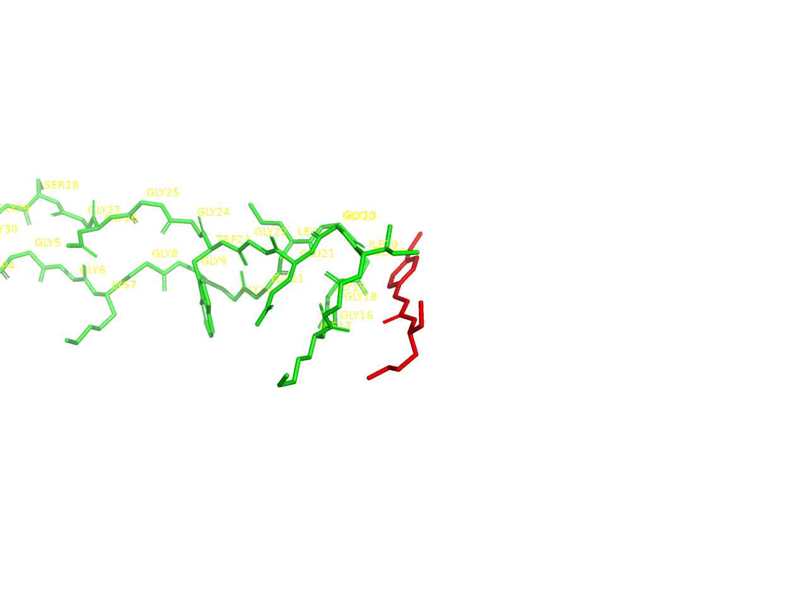 | 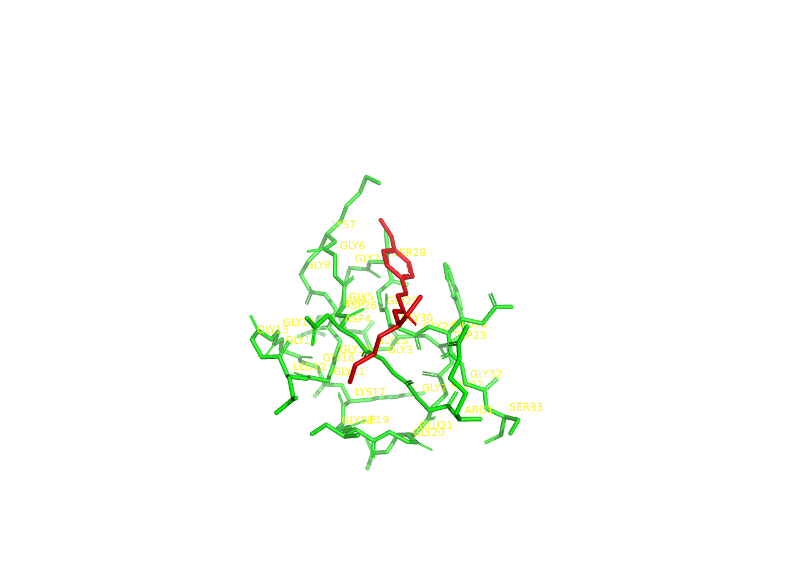 | 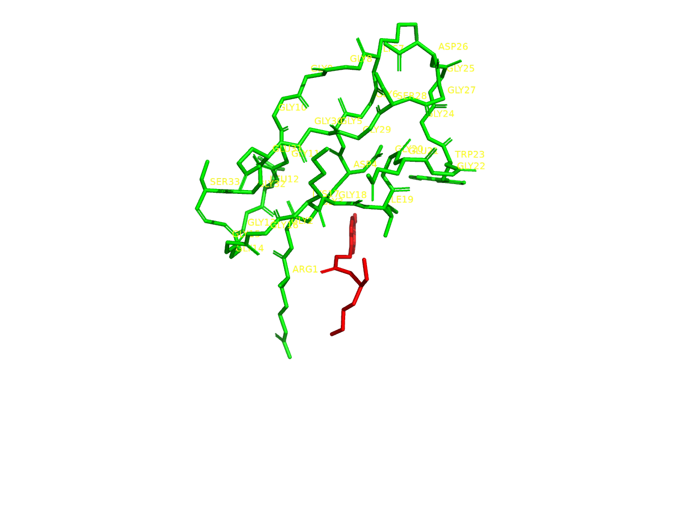 | 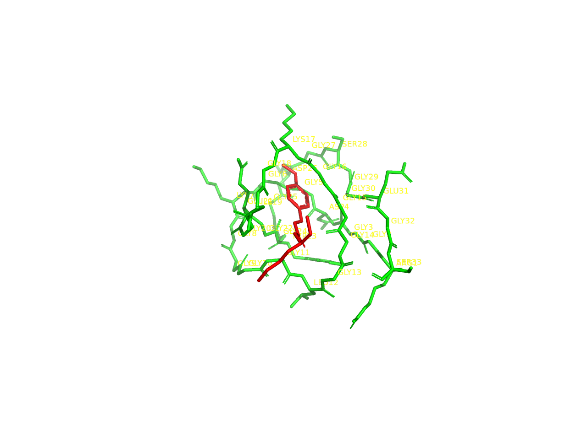 |
| 0.75 / −15.83 | 0.85 / −26.32 | 0.65 / −22.30 | **1.00 / −45.86** |
| ligand against the outside, centroids 20.9 Å apart | | ligand bent to buy contacts: 42.06 kcal/mol of strain, net unfavourable | every ligand atom contacted, 47 pairs, none charged |

**The first ESM2 variant.** The helix barely changes shape across the whole ladder.

| unconstrained | 4 contacts | 8 contacts | 12 contacts |
|---|---|---|---|
| 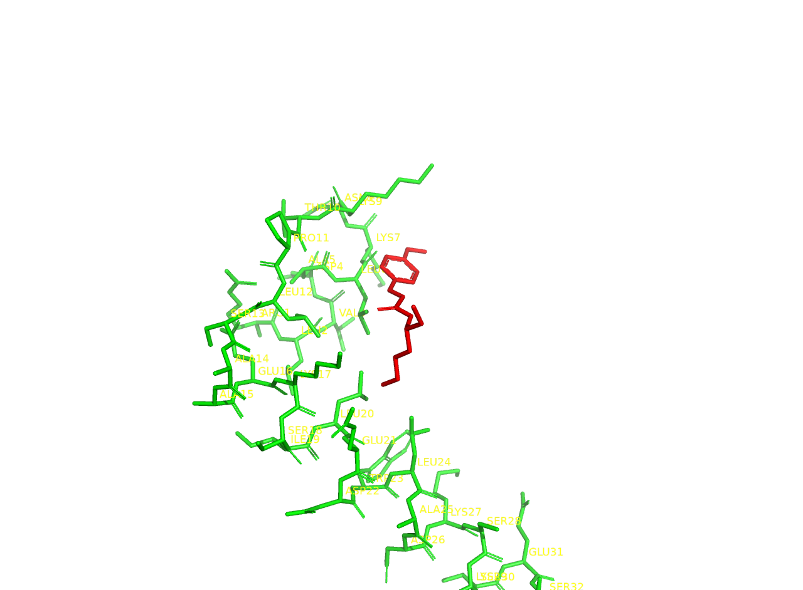 | 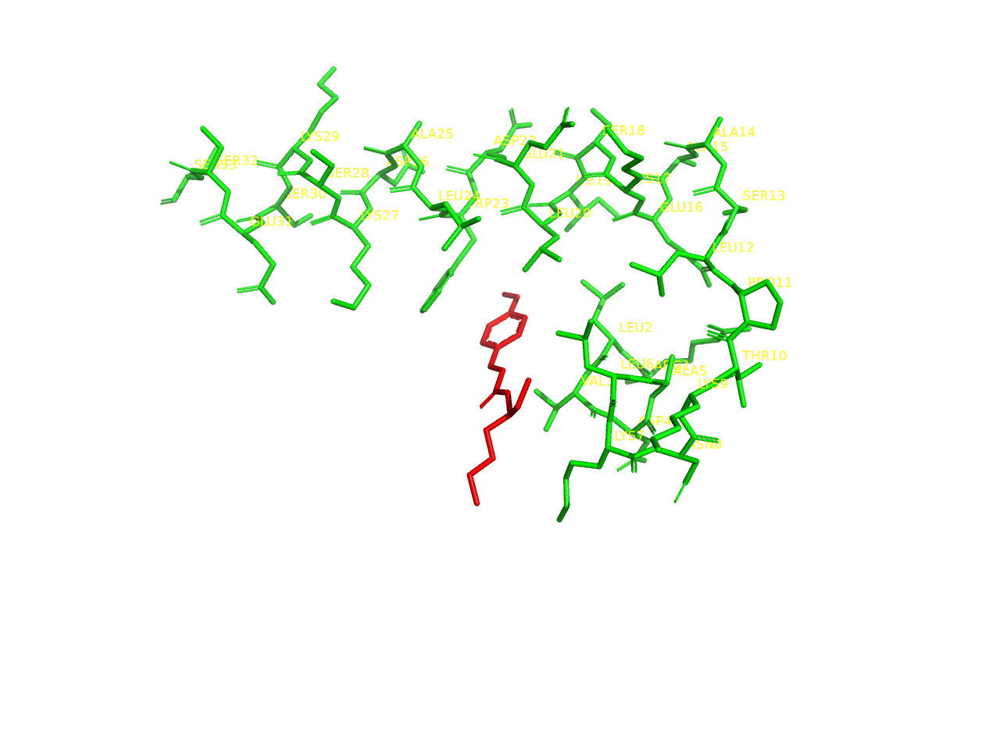 | 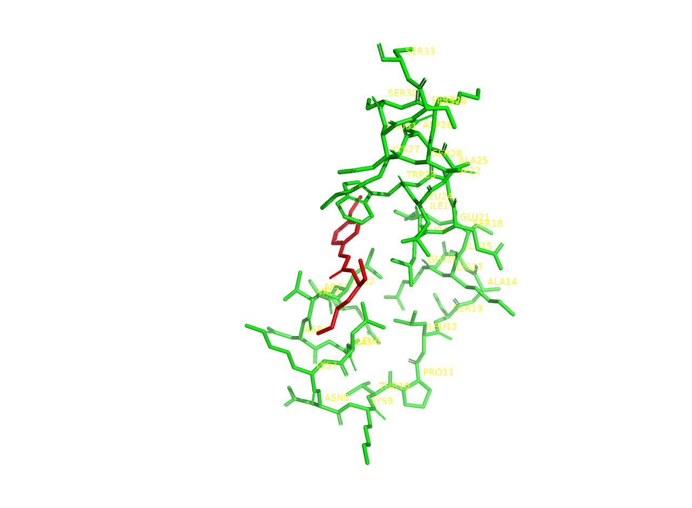 | 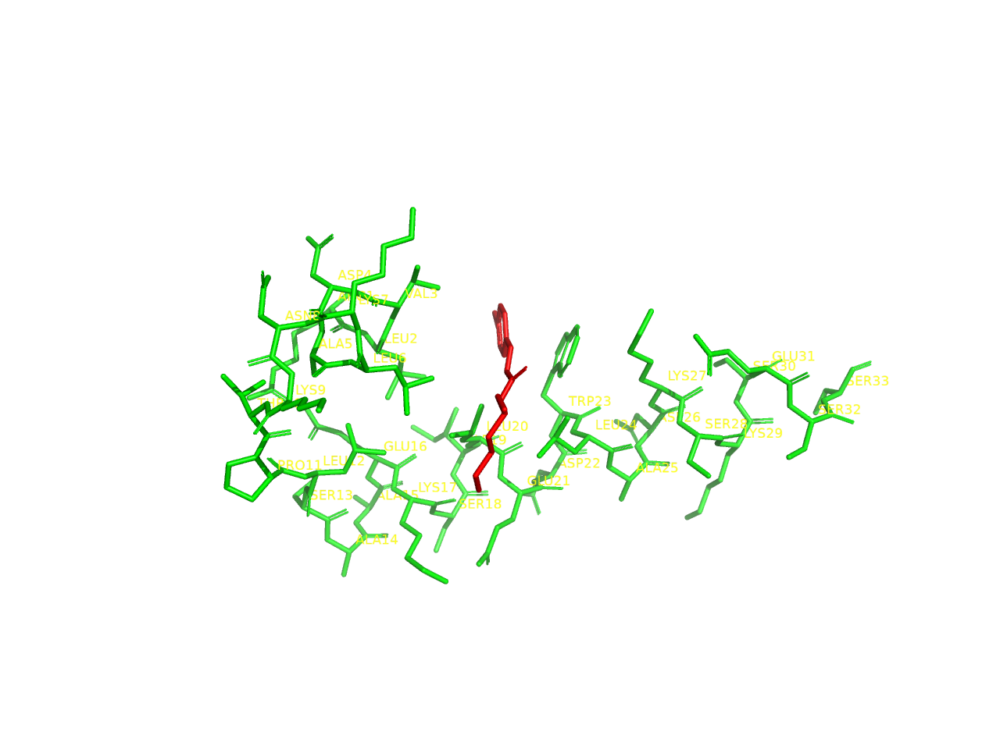 |
| 0.60 / −12.22 | 0.65 / −20.89 | 0.90 / −29.10 | 0.80 / −17.11 |
| | | | 77–81% helical throughout, 0.3–0.8 Å CA RMSD between all four |

**The second ESM2 variant.** The counter-example: binding is strongest where wrapping is nearly
weakest, and gets worse as the wrap tightens.

| unconstrained | 4 contacts | 8 contacts | 12 contacts |
|---|---|---|---|
| 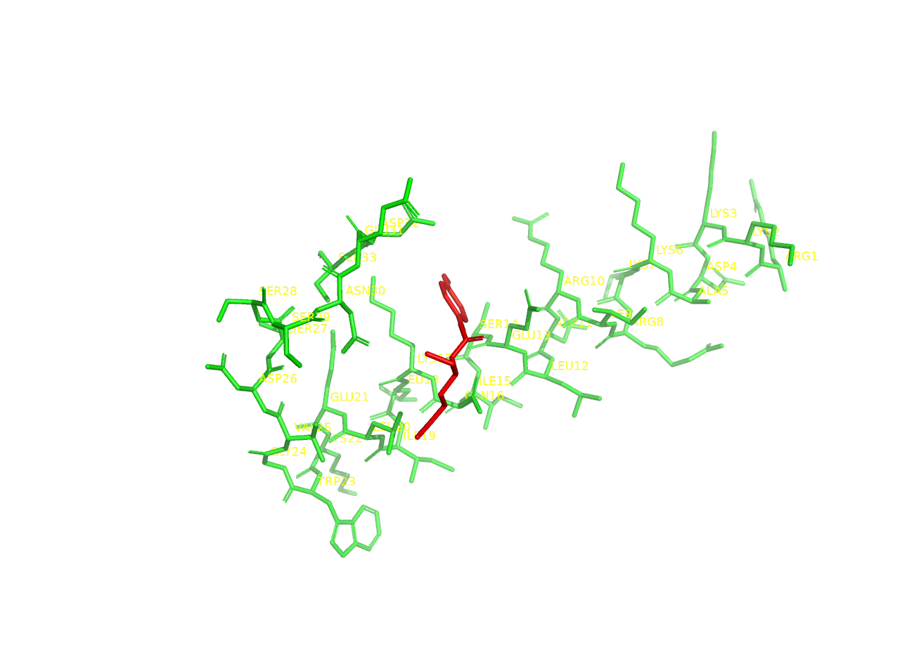 | 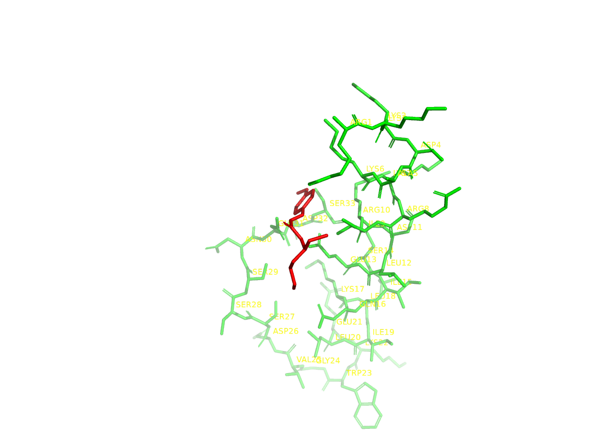 | 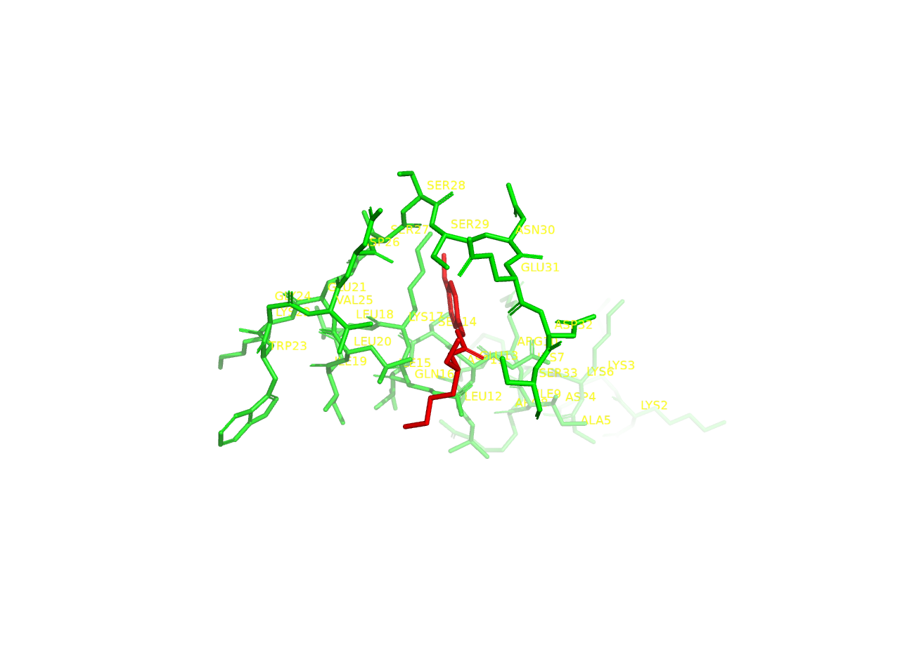 | 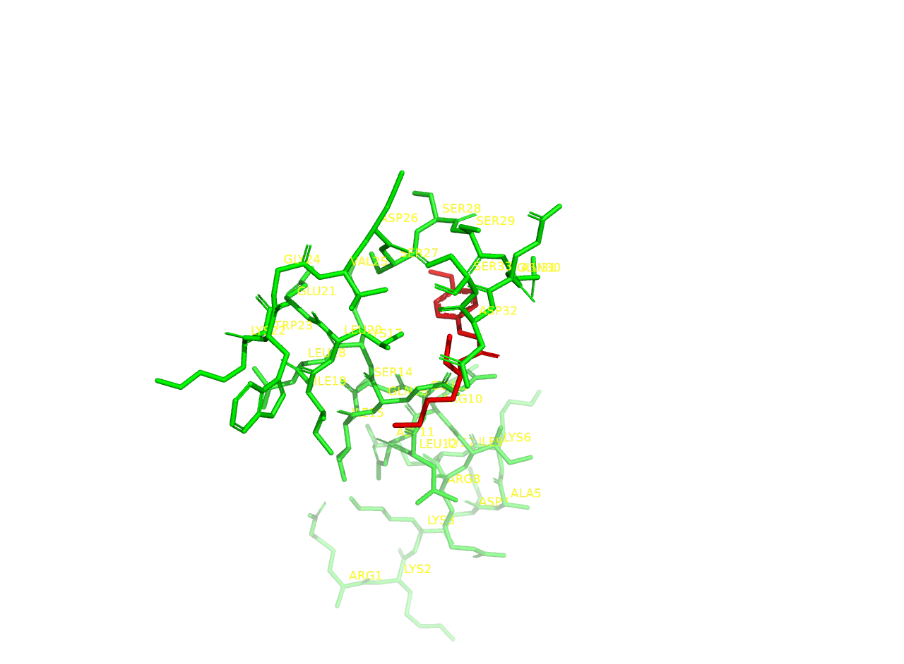 |
| 0.40 / −20.27 | **0.50 / −39.90** | 0.75 / −29.66 | 1.00 / −21.14 |
| | `ARG1` on the ring, 8 contacts, ligand largely outside | | fully wrapped and half the binding energy of `orig_f12` |

The pair worth looking at hardest is `orig_control` against `orig_f12` — same sequence, same ligand,
the only difference being twelve forced contacts, and the ligand goes from lying against the outside
of the peptide to sitting inside it.

`load_folds.pml` loads all twelve superposed on the ligand, with the designed shell in marine.
`style.pml` applies the representation used here to anything already loaded — sticks, black
background, green peptide, red ligand, residue labels on CA. Three further scripts —
`close_contact.pml`, `contact_orig_esm1.pml`, `contact_orig_f8.pml` — focus on individual short
contacts with their distances labelled.

---

## Second worked example: a different shell around the same ligand

Every number above comes from one designed arrangement. Pose selection is greedy and order-dependent,
so rotating which fragment picks first produces a family of shells, and the obvious question is
whether any of it generalises. This is the second-richest shell, at −109.15 kcal/mol against the
first's −113.12, sharing only five of its twelve poses:

```
phenylalanine:2, arginine:3, lysine:10, aspartic:21, glutamic:15, isoleucine:8,
leucine:12, serine:32, tryptophan:5, glutamic:10, leucine:13, serine:2
```

Its sweep found **all 132 ordered pairs connectable**, as the first shell's did, and the ordering
search returned a path through all twelve poses. The design is independently identical to the first on
every structural count:

| | shell 1 | shell 2 |
|---|---|---|
| sequence | `RGGDGGKGGGGLGGGGKGIGEGWGGDGSGGEGS` | `RGEGGEGGKGGFGGDGGIGLGGSGWGGGGLGGS` |
| residues | 33 | 33 |
| spacers used, against a budget of 16 | 21 | 21 |
| poses in the path | 12 / 12 | 12 / 12 |
| worst closure | 0.196 Å | 0.120 Å |
| total fragment interaction energy | −113.12 | −109.15 |

Two shells sharing five poses, ordered by independent exact searches, arriving at the same length and
the same overshoot against the same budget. The overshoot is therefore a property of twelve-fragment
shells around this ligand rather than an accident of one arrangement.

Two ESM2 linker variants were generated as before, and each of the three sequences co-folded four ways.

```
esm1   RSELAEAAKRGFLTDGGIDLVSSGWLTLRLAPS      net charge  0
esm2   RGERKEKSKLIFIIDSKIFLSFSIWRFLILLRS      net charge +5
```

### Results

| structure | enclosed | wrapped | engaged | centroid sep | interaction | ligand strain | sum | hints | designed positions |
|---|---|---|---|---|---|---|---|---|---|
| **`s2_orig_control`** | 0.60 | **1.00** | 20/20 | 7.7 Å | −25.18 | 9.23 | **−15.95** | — | 0/12 |
| `s2_orig_f4` | 0.625 | 0.85 | 17/20 | 2.9 Å | −17.48 | 15.87 | −1.61 | 0/4 | 0/12 |
| `s2_orig_f8` | 0.43 | 0.85 | 17/20 | 9.6 Å | −11.07 | 36.80 | **+25.73** | 1/8 | 0/12 |
| `s2_orig_f12` | 0.70 | 0.85 | 17/20 | 7.2 Å | −17.56 | 16.07 | −1.49 | 1/12 | 0/12 |
| `s2_esm1_control` | 0.375 | 0.55 | 11/20 | 11.2 Å | −9.70 | 11.64 | **+1.93** | — | 0/12 |
| `s2_esm1_f4` | 0.64 | 0.80 | 16/20 | 6.8 Å | −29.55 | 21.43 | −8.12 | 1/4 | 0/12 |
| `s2_esm1_f8` | 0.67 | 0.80 | 16/20 | 5.5 Å | −19.91 | 33.74 | **+13.83** | 1/8 | 0/12 |
| **`s2_esm1_f12`** | 0.675 | 0.90 | 18/20 | 5.9 Å | **−42.39** | 23.37 | **−19.03** | **3/12** | **1/12** |
| `s2_esm2_control` | 0.51 | 0.85 | 17/20 | 6.7 Å | *−74.89* | 9.05 | *−65.84* | — | 0/12 |
| `s2_esm2_f4` | 0.50 | 0.55 | 11/20 | 16.0 Å | −7.53 | 29.32 | **+21.80** | 0/4 | 0/12 |
| **`s2_esm2_f8`** | **0.86** | **0.95** | 19/20 | 9.5 Å | −28.29 | 23.30 | −4.99 | 0/8 | 0/12 |
| `s2_esm2_f12` | 0.61 | 0.75 | 15/20 | 5.9 Å | *−72.72* | 12.78 | *−59.94* | 2/12 | 0/12 |

Energies in kcal/mol; all three sequences are 33 residues. **The `esm2` energies are italicised
because they are artifacts, not measurements** — see below.

### What replicates, and what does not

**The eight-contact fold is usually the damaged one, with a consistent exception.** `s2_orig_f8` and
`s2_esm1_f8` carry the highest ligand strain of their ladders, at 36.80 and 33.74 kcal/mol, and both
end net unfavourable at +25.73 and +13.83. Across the six ladders in both shells, f8 is the
highest-strain rung in **four** — both `orig` and both `esm1` — at 33.7 to 42.1 kcal/mol.

**The two exceptions are both `esm2`, in both shells**, where f4 carries the higher strain instead:
25.91 against f8's 15.61 in shell 1, and 29.32 against 23.30 in shell 2. That is the same sequence
family that breaks the enclosure ladder and whose energies are charge artifacts, so it is the branch
that behaves differently on every measure rather than a random exception.

**Shell 3 replicates both halves of this**, which makes it the most reproducible energetic result here:
f8 is again the highest-strain rung for `orig` (55.77) and for `esm1` (61.67) — the two worst strains in
the project — and `esm2` is again the exception, with f4 at 15.16 just above f8's 14.70. Nine ladders
across three shells, and the rule and its exception hold in all nine.

A peptide can satisfy a few contacts by pulling the ligand toward whichever residues are nearby; eight
is apparently enough to demand serious distortion and too few to require the wrap that would relieve
it — except where the substitution has already locked the fold into a shape that four contacts fight
harder than eight.

**Forced contacts are a rescue mechanism, not an improvement.** This is the sharpest disagreement
between the shells, and it resolves rather than contradicts the first example:

| glycine design | control | twelve forced contacts | effect |
|---|---|---|---|
| shell 1 | −1.17 | **−33.07** | forcing gains 32 kcal/mol |
| shell 2 | **−15.95** | −1.49 | forcing loses 14 kcal/mol |
| shell 3 | +15.03 | +18.92 | forcing costs 4 kcal/mol; neither is favourable |

Shell 1's unconstrained control left the ligand pressed against the outside — 0.75 wrapped, centroid
20.9 Å — so the constraints had everything to gain. Shell 2's control already contacted all twenty
ligand heavy atoms at 7.7 Å against a radius of gyration of 13.3 Å, so they could only disturb it,
and the geometry says so: wrapping fell from 1.00 to 0.85. **Forcing the full contact set produces
the designed arrangement when the unconstrained fold has failed, and degrades it when the
unconstrained fold has already succeeded.** Read the control's wrapping first to know which case you
are in.

Shell 3 is the third case, and the one the rule does not cover: its control wraps 0.80 with the ligand
9.5 Å out, neither failed nor succeeded, and forcing moves the energy barely at all — from +15.03 to
+18.92, both unfavourable. What forcing *does* achieve there is entirely geometric: enclosure goes from
0.735 to 0.965 and engagement from 16/20 to 20/20, at 30 kcal/mol of extra ligand strain that the energy
then charges for. **So the rule holds for the energy and breaks for the geometry** — forcing reliably
improves the cavity and unreliably improves the score, which is the same disagreement that runs through
the whole of shell 3.

**A shell can succeed at the objective without realising the design.** `s2_orig_control` wraps every
ligand heavy atom while reproducing none of the twelve designed side-chain positions. The first shell
could not separate these, because its control failed at both at once.

**Designed positions are still essentially never reproduced: 1 of 144** across all twelve folds, at
ligand superposition RMSD 0.06–0.85 Å, so the comparison is sound. But the distances say something the
count hides. Forcing contacts moves side chains markedly closer to where the design asked for them —
the median distance to a designed position falls from 12–14.5 Å unconstrained to 7.6–9.8 Å forced, in
all three ladders — and the median distance to the nearest side chain **of any type** falls to 3.0–4.9
Å, reaching 3.02 Å for `s2_esm2_f8`. Something is arriving at the designed position; it is the wrong
residue. That relocates the failure from reachability, which the sweep shows is satisfiable for every
pair, to the sequence assembly that decides which residue lands where.

**The claim that every twelve-contact fold is the most enclosed of its set does not survive.** It
holds for `orig` at 0.70 and barely for `esm1` at 0.675 against f8's 0.67, but `esm2`'s best-enclosed
fold is **f8 at 0.86**, with f12 down at 0.61. `s2_esm2_f8` is the best-enclosed structure of the
whole set — 0.95 wrapped, 19 of 20 atoms engaged, 31 contacts — and it scores poorly. Enclosure and
energy disagree again, and this time enclosure is right about the structure and wrong about the
number.

### The charge artifact, quantified

The linker fill took the design from net charge −1 to **+5**, and `s2_esm2_control` posts −74.89
kcal/mol, nominally the strongest binding anywhere in this project. It should not be read as binding
at all. Across `esm2`'s four folds the interaction energy correlates **+0.93 with the distance between
the ligand and peptide centroids** and only **+0.18 with enclosure**, with the wrong sign:

| `esm2` fold | centroid sep | interaction | enclosed | wrapped | contacts |
|---|---|---|---|---|---|
| f12 | 5.9 Å | −72.72 | 0.61 | 0.75 | 17 |
| control | 6.7 Å | −74.89 | 0.51 | 0.85 | 18 |
| f8 | 9.5 Å | −28.29 | **0.86** | **0.95** | **31** |
| f4 | 16.0 Å | −7.53 | 0.50 | 0.55 | 20 |

The best-wrapped structure in the set scores 46 kcal/mol worse than a control that wraps less and
encloses far less, purely because the control's centroid sits 2.8 Å closer. That is long-range
electrostatics on a highly charged peptide, not an interface.

The control for this reading is the glycine design at net charge −1, where the same relationship is
absent: its f4 and f12 folds give −17.48 and −17.56 kcal/mol despite centroid separations of 2.9 and
7.2 Å. Grouped by sequence, the correlation between interaction energy and centroid separation runs
**+0.23** at charge −1, **+0.70** at charge 0 and **+0.93** at charge +5, while the correlation with
enclosure runs −0.56, −0.76 and +0.18. Pooling all twelve reports −0.14 for enclosure and +0.42 for
separation, hiding both.

So the distance-dominated energy is a property of the charged variant rather than of the scoring
method, which means the `orig` and `esm1` numbers can be read as chemistry and `esm2`'s cannot.
**Constrain the residue set when filling linkers, and report net charge beside any interaction
energy.** `correlate.py --group` computes these.

### Two binding modes, and what actually predicts them

Inspecting the twelve renders by eye splits them into two mechanisms, and neither the enclosure nor
the wrapping column reliably tells them apart.

**Encapsulation** — the ligand inside the peptide: `s2_esm1_f4`, `s2_esm1_f8`, `s2_esm1_f12` and
`s2_esm2_f8`.

**A groove on an elongated structure** — the ligand held against a surface channel:
`s2_orig_control`, `s2_orig_f4` and `s2_esm2_f12`.

**Radius of gyration separates them cleanly and the purpose-built metric does not.** The four
encapsulating folds span Rg 9.3–9.8 Å; the three groove binders span 11.8–14.9 Å. Nothing falls in
between. Enclosure separates the same two groups by 0.015 — 0.625 against 0.64 — which is far too
narrow to act on, and **wrapping inverts the verdict outright**: the highest wrapped value in the whole
set, 1.00, belongs to `s2_orig_control`, a groove binder. Wrapping counts ligand atoms in contact, and
a groove can contact all of them. When judging whether a design achieved encapsulation, read
`peptide_rg` first and treat wrapping as a contact census rather than a verdict.

**Helicity explains how each mode arises, and it is not simply "helical means elongated".** The groove
binders span 3% to 100% helical, so there are two unrelated routes to an extended structure:

| sequence | helical | Rg | what it is |
|---|---|---|---|
| `orig` (glycine design) | 3–6% | 7.7–13.3 Å | never helical; extended because a 64%-glycine chain has no fold |
| `esm1` | **42% in all four folds** | 9.3–10.3 Å | locked, and the locked shape is compact |
| `esm2` | 87–100% | 9.8–15.0 Å | a helical rod, except where the helix broke |

`s2_esm2_f12` is a groove binder because it is a rigid 100% helix at Rg 14.9 Å and the ligand can only
lie along it. `s2_orig_control` is a groove binder for the opposite reason — 3% helical, extended
because nothing folds it. And the one `esm2` fold that encapsulates, `s2_esm2_f8`, is the one where the
helix **broke**: 87% helical at Rg 9.8 Å, against 97–100% and ~15 Å for its three siblings.
Encapsulation by a substituted sequence required disrupting the structure the substitution created.

This is the same lock-in the first shell showed, where all four `esm1` structures held the same shape
regardless of constraint. Here `esm1` is locked at 42% helicity across all four folds and that
conformation happens to be compact, which is why every forced `esm1` fold encapsulates. The lock is
not itself good or bad; it decides the mode before any constraint is applied, and whether that helps
is luck.

**The glycine design's extended folds look like β sheets and are not.** `s2_orig_control` is **81%
β-basin**, the most extended backbone in the set, which is why it reads as pleated on inspection. But it
carries only **6 non-local backbone hydrogen bonds**, where a sheet needs a ladder of them between
paired strands. It is an extended, unpaired chain — the expected outcome for a sequence that is 64%
glycine, glycine being both a poor β-former and the residue with the most backbone freedom to give
away. `s2_orig_f4` is the same at 36% β and 6 non-local bonds.

The exception is informative: `s2_orig_f12` has the **most non-local hydrogen bonds of any fold in the
set**, 11, at the most compact Rg of 7.7 Å. Forcing twelve contacts is the only intervention that gave
the glycine design any tertiary structure at all, even though it cost binding energy. The `esm2` folds
sit at the opposite extreme — 0% β and zero non-local bonds, with 34 to 43 helical ones, a helix bonded
only to itself.

`check_fold.py` reports `helical_fraction`, `beta_fraction`, `helical_hbonds` and `nonlocal_hbonds`, so
all of this is measured rather than eyeballed. On the first shell's structures the helicity gives 81%
for `esm1_f12` and 6% for `orig_f12`, reproducing the figures quoted in that example.

### Figures

All twelve structures, peptide in green, ligand in red, laid out as before: one row per sequence, one
column per rung of the constraint ladder. Captions are `wrapped` / `interaction` in kcal/mol.

**The glycine design.** The unconstrained fold is the best of the four, and forcing contacts makes it
worse — the reverse of the first shell.

| unconstrained | 4 contacts | 8 contacts | 12 contacts |
|---|---|---|---|
| 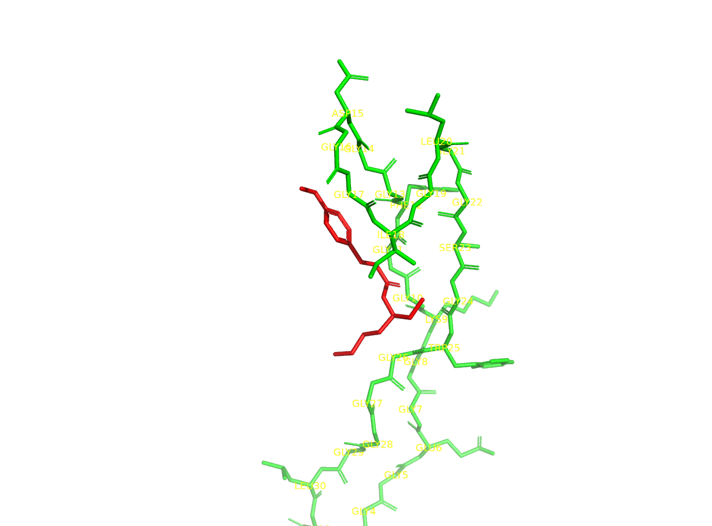 | 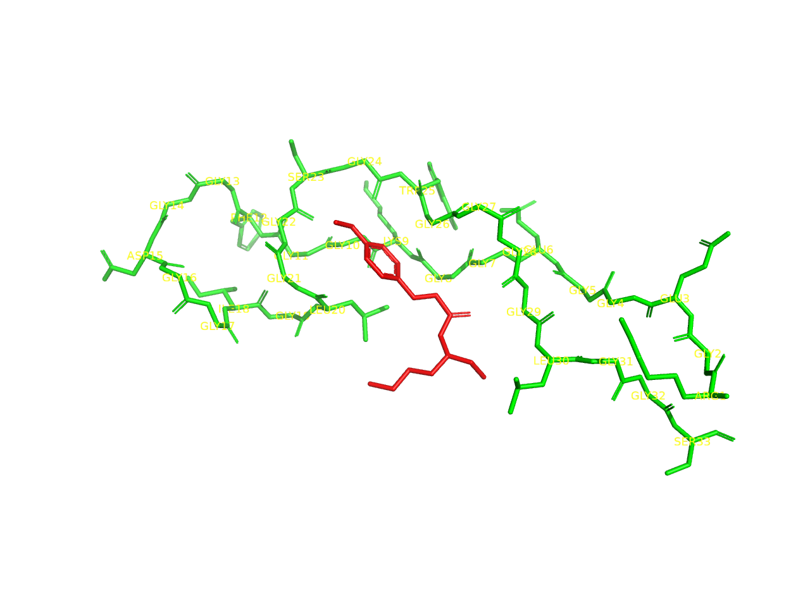 | 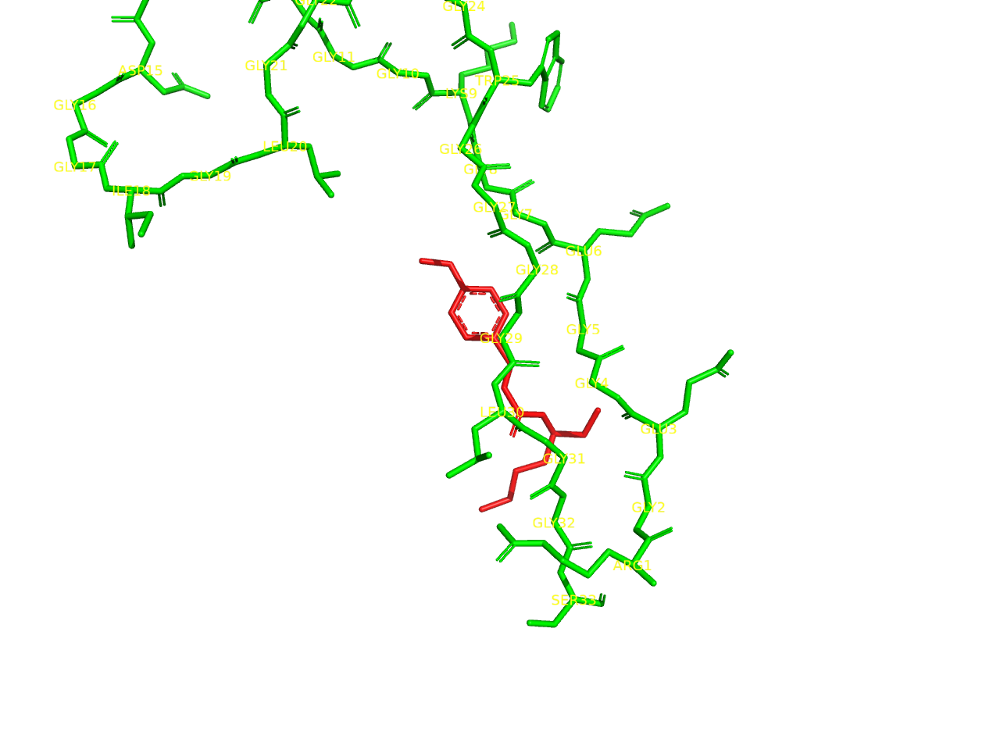 | 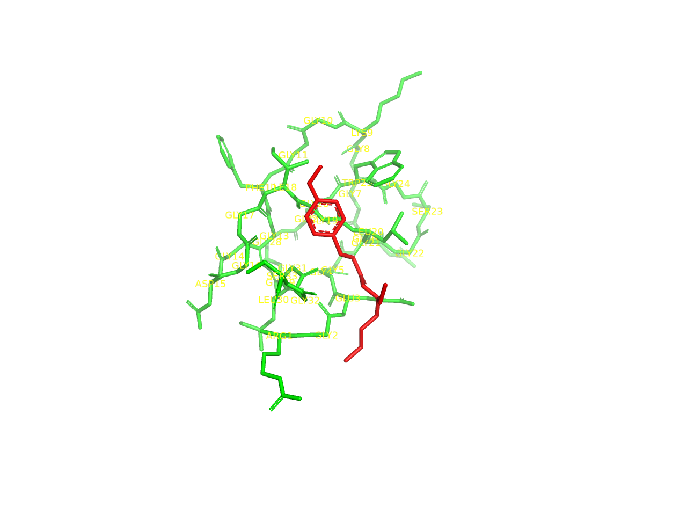 |
| **1.00 / −25.18** | 0.85 / −17.48 | 0.85 / −11.07 | 0.85 / −17.56 |
| **groove**, Rg 13.3 Å, 3% helical — every ligand atom contacted, none of it enclosed | **groove**, Rg 11.8 Å | 36.80 kcal/mol of ligand strain, net unfavourable | most compact of all at Rg 7.7 Å, 36 contacts, still worse than the control |

**The first ESM2 variant.** The only ladder where geometry and energy agree throughout, and the only
fold in 144 to reproduce a designed position.

| unconstrained | 4 contacts | 8 contacts | 12 contacts |
|---|---|---|---|
| 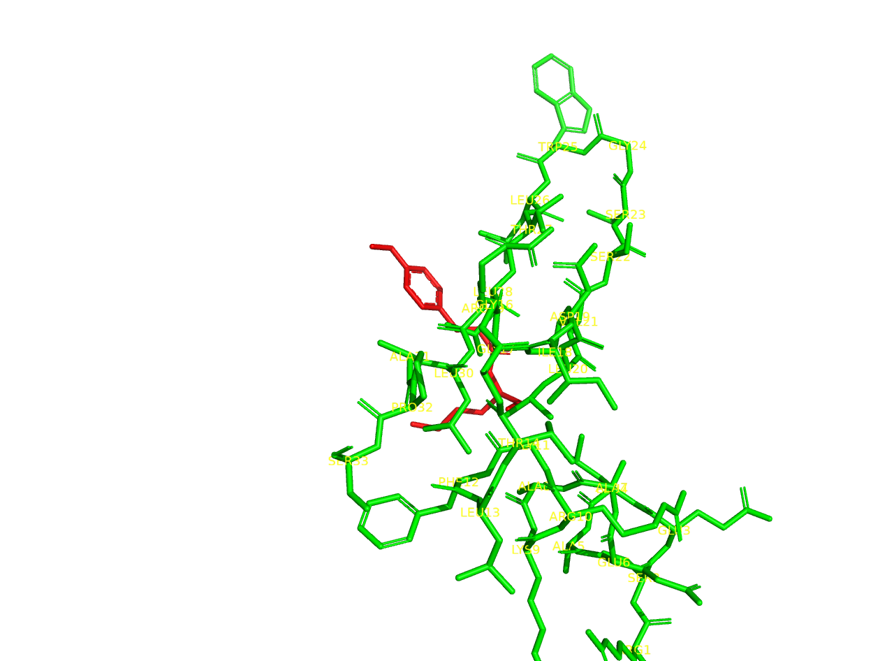 | 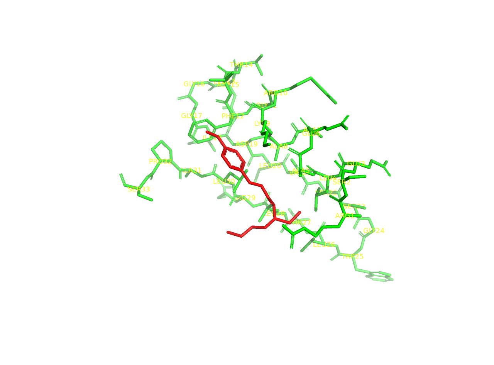 | 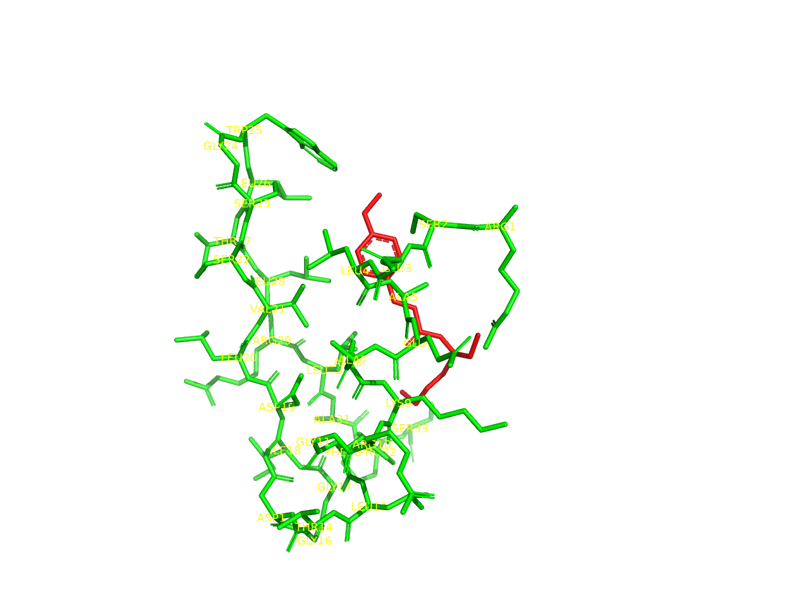 | 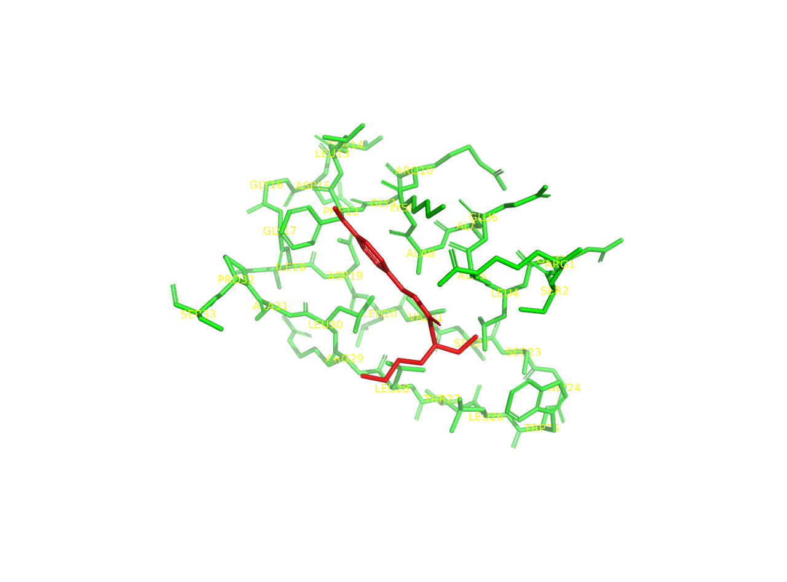 |
| 0.55 / −9.70 | 0.80 / −29.55 | 0.80 / −19.91 | **0.90 / −42.39** |
| 42% helical, as all four are | **encapsulates**, Rg 9.6 Å | **encapsulates**, but 33.74 kcal/mol of strain, net unfavourable | **encapsulates**, Rg 9.3 Å — 3/12 hints honoured and the only fold in 144 to reproduce a designed position |

**The second ESM2 variant.** Net charge +5. The energies track how close the ligand sits, not how
well it is held, so read the geometry columns and ignore the numbers.

| unconstrained | 4 contacts | 8 contacts | 12 contacts |
|---|---|---|---|
| 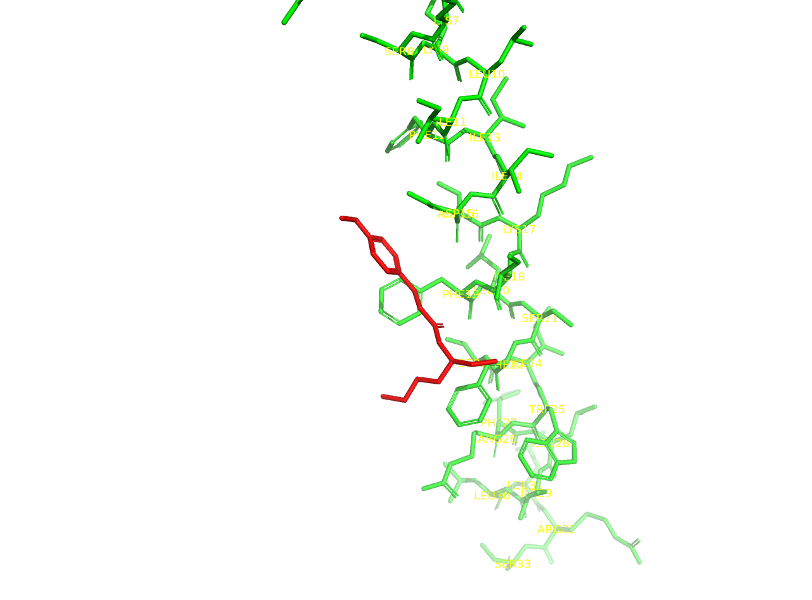 | 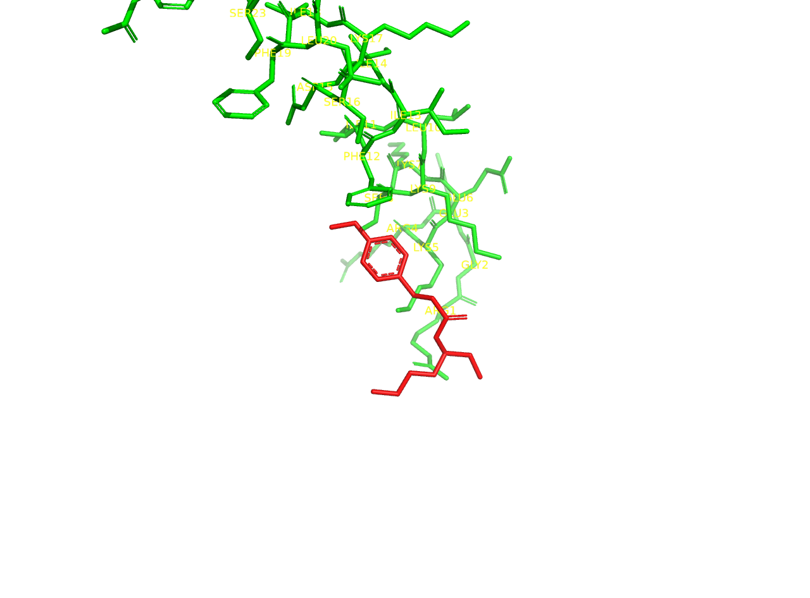 | 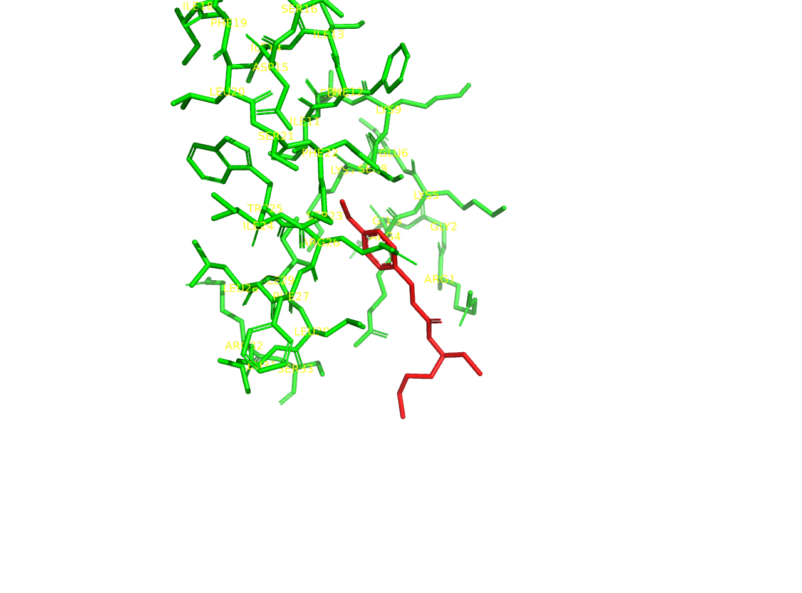 | 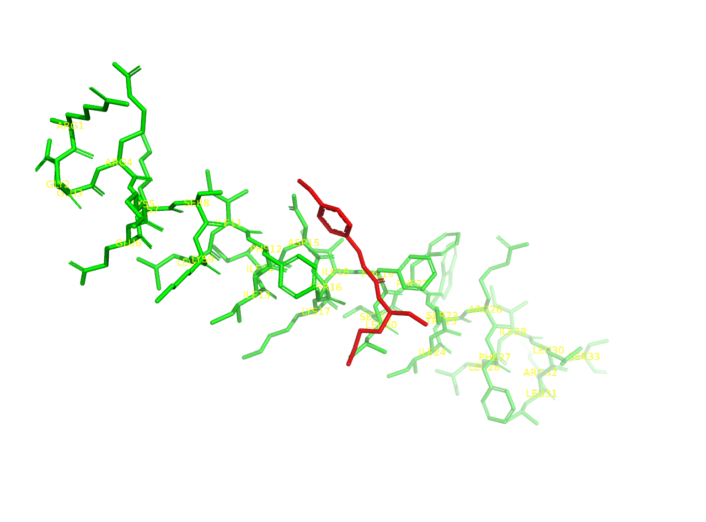 |
| 0.85 / *−74.89* | 0.55 / −7.53 | **0.95 / −28.29** | 0.75 / *−72.72* |
| 100% helical rod, Rg 15.0 Å | ligand thrown 16.0 Å from the centroid | **encapsulates** — the one fold whose helix broke, 87% at Rg 9.8 Å; best geometry in the set, mediocre score | **groove** along a 100% helix at Rg 14.9 Å; fully forced, and the score barely moves from the control |

`load_folds.pml` in `figures_shell2/` loads all twelve superposed on the ligand with the designed
shell in marine, and `style.pml` beside it applies the representation used here.

---

## Third worked example: testing the selection criterion itself

The first two shells were chosen the same way — by total fragment interaction energy, −113.12 and
−109.15 kcal/mol, the two richest arrangements the sweep found. They also turned out to be the two most
charged, and that is not a coincidence: across all fragment poses, charged ones average **−10.79
kcal/mol against −4.71 aromatic and −2.94 aliphatic**, and across 36 folds the interaction energy
correlates **−0.56** with charged-residue fraction. The criterion that picks shells is substantially
measuring charge.

Which makes one experiment obvious. Take a shell that is much *weaker* on that criterion and much less
charged, and see what the folds do. If the criterion is sound, the geometry should get worse. If the
criterion is mostly counting charge, it might not.

Shell 3 is seeded on **tryptophan pose 2** and comes in at −60.40 kcal/mol — **47% weaker than shell
1** — with its composition shifted from charge to aromatics:

| | shell 1 | shell 2 | shell 3 |
|---|---|---|---|
| sequence | `RGGDGGKGGGGLGGGGKGIGEGWGGDGSGGEGS` | `RGEGGEGGKGGFGGDGGIGLGGSGWGGGGLGGS` | `YGGDGFGKGGGLGGGKGGGGLGGWGGEGSGGWGS` |
| residues | 33 | 33 | 34 |
| spacers used, against a budget of 16 | 21 | 21 | 22 |
| poses in the path | 12 / 12 | 12 / 12 | 12 / 12 |
| worst closure | 0.196 Å | 0.120 Å | 0.188 Å |
| **charged poses** | **7 (58%)** | 5 (42%) | **4 (33%)** |
| **aromatic poses** | 1 (8%) | 2 (17%) | **4 (33%)** |
| **total fragment interaction energy** | **−113.12** | −109.15 | **−60.40** |

The structural counts hold for a third time — twelve poses ordered by an independent exact search,
arriving at 33–34 residues and 21–22 spacers against the same budget of 16. Three shells now overshoot
that budget by the same margin, so the overshoot is a property of twelve-fragment shells around this
ligand, not of any one arrangement.

```
esm1   YLSDAFGKSSKLADLKDGSTLPSWASETSSLWKS      net charge  0
esm2   YINDSFIKINYLINKKKFKILKIWLLEISFLWSS      net charge +4
```

### Results

| structure | enclosed | wrapped | engaged | sep | Rg | helix | β | interaction | ligand strain | sum | hints | designed positions |
|---|---|---|---|---|---|---|---|---|---|---|---|---|
| `s3_orig_control` | 0.735 | 0.80 | 16/20 | 9.5 Å | 7.8 | 22% | 22% | +0.92 | 14.12 | **+15.03** | — | 2/12 |
| `s3_orig_f4` | 0.655 | 0.80 | 16/20 | 7.2 Å | 7.8 | 3% | 31% | −28.45 | 39.45 | **+11.01** | 1/4 | 1/12 |
| `s3_orig_f8` | 0.880 | 0.85 | 17/20 | 7.9 Å | 7.8 | 19% | 16% | −5.62 | 55.77 | **+50.15** | 1/8 | 0/12 |
| **`s3_orig_f12`** | **0.965** | **1.00** | **20/20** | **3.6 Å** | 8.1 | 19% | 16% | −25.13 | 44.05 | **+18.92** | 2/12 | 0/12 |
| `s3_esm1_control` | 0.755 | 0.85 | 17/20 | 5.0 Å | 9.4 | 59% | 6% | −26.88 | 13.68 | −13.21 | — | 1/12 |
| `s3_esm1_f4` | 0.785 | 0.70 | 14/20 | 6.5 Å | 9.5 | 72% | 9% | −19.30 | 51.17 | **+31.87** | 1/4 | 1/12 |
| `s3_esm1_f8` | 0.850 | **0.95** | 19/20 | 5.3 Å | 9.4 | 69% | 16% | +2.00 | 61.67 | **+63.67** | 1/8 | 1/12 |
| **`s3_esm1_f12`** | 0.880 | 0.90 | 18/20 | 4.3 Å | 9.3 | 72% | 3% | −25.14 | 11.65 | **−13.50** | 1/12 | 1/12 |
| `s3_esm2_control` | 0.360 | 0.45 | 9/20 | 13.6 Å | 15.0 | 100% | 0% | −10.78 | 13.13 | +2.35 | — | 1/12 |
| **`s3_esm2_f4`** | 0.795 | 0.90 | 18/20 | 7.0 Å | 10.3 | 91% | 0% | −34.59 | 15.16 | **−19.43** | 0/4 | 0/12 |
| `s3_esm2_f8` | 0.795 | 0.80 | 16/20 | 6.3 Å | 10.2 | 91% | 0% | −21.56 | 14.70 | −6.85 | 0/8 | 0/12 |
| `s3_esm2_f12` | 0.640 | 0.75 | 15/20 | 6.3 Å | 9.7 | 88% | 0% | −25.05 | 10.83 | −14.22 | 0/12 | 0/12 |

Energies in kcal/mol. Ligand strain is measured against the single global-minimum reference at
−557162.371 kcal/mol-equiv, as everywhere else in this README.

### The answer: geometry improved, energy got worse

**A 47% weaker shell folded better, not worse.**

| | shell 1 | shell 2 | shell 3 |
|---|---|---|---|
| designed positions reproduced, out of 144 | not measured | **1** | **8** |
| best fold | `orig_f12`, 0.960 enclosed | `s2_esm2_f8`, 0.860 | `s3_orig_f12`, 0.965 |
| best enclosed fraction | 0.960 | 0.860 | **0.965** |
| net favourable folds | **9 / 12** | 8 / 12 | **5 / 12** |
| best sum | −33.07 | −65.84 *(artifact)* | −19.43 |
| median ligand strain | 15.61 | 21.43 | 15.16 |

Shell 3 reproduces **eight** designed side-chain positions across its twelve folds where shell 2
reproduced **one**. (Shell 1's folds were never measured this way — `overlay.csv` holds its sequence-level
comparisons, not its twelve folds, so the column is blank rather than zero.)

More striking is what its best fold is. `s3_orig_f12` and shell 1's `orig_f12` are near-twins, arrived at
from shells 47% apart in fragment interaction energy:

| | `orig_f12` (shell 1) | `s3_orig_f12` (shell 3) |
|---|---|---|
| enclosed | 0.960 | 0.965 |
| wrapped | 1.00 | 1.00 |
| engaged | 20/20 | 20/20 |
| centroid separation | 4.2 Å | **3.6 Å** |
| contacts under cutoff | 47 | **67** |
| mean ligand distance | 3.49 Å | **3.39 Å** |
| closest approach | **2.44 Å** (a clash) | 2.65 Å |
| peptide Rg | 8.0 Å | 8.1 Å |

Two independent sweeps, two different seeds, two shells with only a fraction of their poses in common,
both producing a glycine-spaced design whose fully forced fold closes around the ligand at 0.96 enclosure
with every ligand atom engaged. Shell 3's is the tighter of the two on every count and it does not carry
shell 1's 2.44 Å clash. **That convergence is the most reproducible result in the project**, and it says
the fully forced glycine design is a robust target rather than one lucky fold.

By energy it is the worst: 5 of 12 net favourable against 9 and 8, and its best sum is −19.43 where
shell 1 managed −33.07. **The two families of metric disagree, and they disagree systematically** — the
shell that was selected for having less charge scores worse on a criterion that rewards charge, while
folding into better cavities. Shell 2's headline −65.84 is itself an artifact of net charge +5, so the
energetic ranking of all three shells rests on the term least worth trusting.

This is the strongest statement this repository can make about its own scoring: **total fragment
interaction energy is the wrong criterion for choosing which shell to fold.** It should be replaced by
something geometric — closure quality and pose diversity — or at minimum weighted to neutralise the
charge bias. What it should *not* be is read as a prediction of how well a shell will fold, because on
three shells it got the order backwards.

### The helix that folds instead of breaking

The `esm2` variant is the most interesting fold in the set, and it works by a mechanism neither earlier
shell used. Unconstrained it is a 100% helical rod at Rg 15.0 Å with the ligand flung 13.6 Å away and
only 7 contacts — the worst geometry in shell 3. Force contacts on it and it does not break: it **bends
double, keeping its helix intact, and clamps the ligand between the two arms.**

| | `s3_esm2_control` | `s3_esm2_f4` | `s3_esm2_f8` | `s3_esm2_f12` | `s2_esm2_f8` |
|---|---|---|---|---|---|
| Rg | 15.0 Å | 10.3 Å | 10.2 Å | 9.7 Å | 9.8 Å |
| helical fraction | 100% | **91%** | **91%** | **88%** | 87% |
| β fraction | 0% | 0% | 0% | 0% | **6%** |
| helical H-bonds | 42 | **45** | **46** | 38 | 34 |
| non-local H-bonds | 0 | **0** | **0** | **0** | 0 |
| CA end-to-end | 49.8 Å | **17.6 Å** | **18.1 Å** | **8.5 Å** | 11.4 Å |
| CA contour length | 125.2 Å | 125.4 Å | 125.5 Å | 125.4 Å | 121.2 Å |
| closest approach of the two halves | 8.7 Å | 6.4 Å | 6.3 Å | 5.5 Å | 5.9 Å |

Read the last three rows together. The contour length along the CA trace is **unchanged** at 125 Å while
the end-to-end distance collapses from 49.8 Å to 8.5–18 Å: the chain is not compacting, it is folding
back on itself. The two halves come within 5.5–6.4 Å, which is helix-packing contact. And the helical
H-bond count goes *up*, to 45 and 46 — the helix is not merely surviving the fold, it is better
hydrogen-bonded after it.

Contrast shell 2's `s2_esm2_f8`, which reached a similar Rg by the opposite route: its helicity fell to
87%, it picked up 6% β, and its helical H-bonds dropped from 36 to 34. That one broke its helix to bind.
Shell 3's keeps it.

What holds the hairpin shut is worth stating because of what it is not: **zero non-local backbone
H-bonds** in any of these folds. There is no β-sheet, no backbone clasp. The two helical arms are held
together by side-chain packing alone — which is exactly what a designed shell is, twelve side chains
arranged around a ligand, and the closest this project has come to Boltz building the thing that was
designed rather than something else that happens to contain it.

It is also the one sequence in shell 3 whose forced folds are all net favourable (−19.43, −6.85,
−14.22), at ligand strains of 10.8–15.2 kcal/mol, the lowest in the shell. **And it satisfies none of
the designed contact hints — 0/4, 0/8, 0/12.** It wraps the ligand well, holds it cheaply, and does so
without honouring a single hint it was given, which is a useful reminder that hint satisfaction is a
third metric that can disagree with the other two.

### Figures

All twelve structures, peptide in green, ligand in red, one row per sequence and one column per rung of
the constraint ladder. Captions are `wrapped` / `interaction` in kcal/mol.

**The glycine design.** Only the fully forced fold encapsulates — and it is the best-enclosed structure
in the project, at a ligand strain of 44.05 kcal/mol that makes it net unfavourable anyway.

| unconstrained | 4 contacts | 8 contacts | 12 contacts |
|---|---|---|---|
| 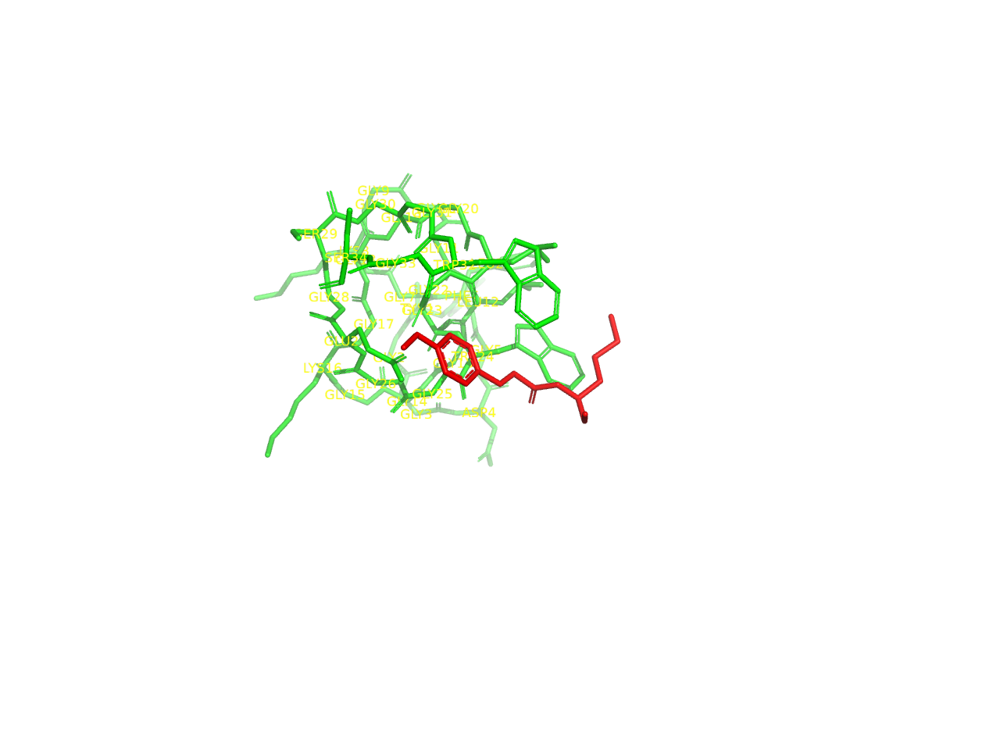 | 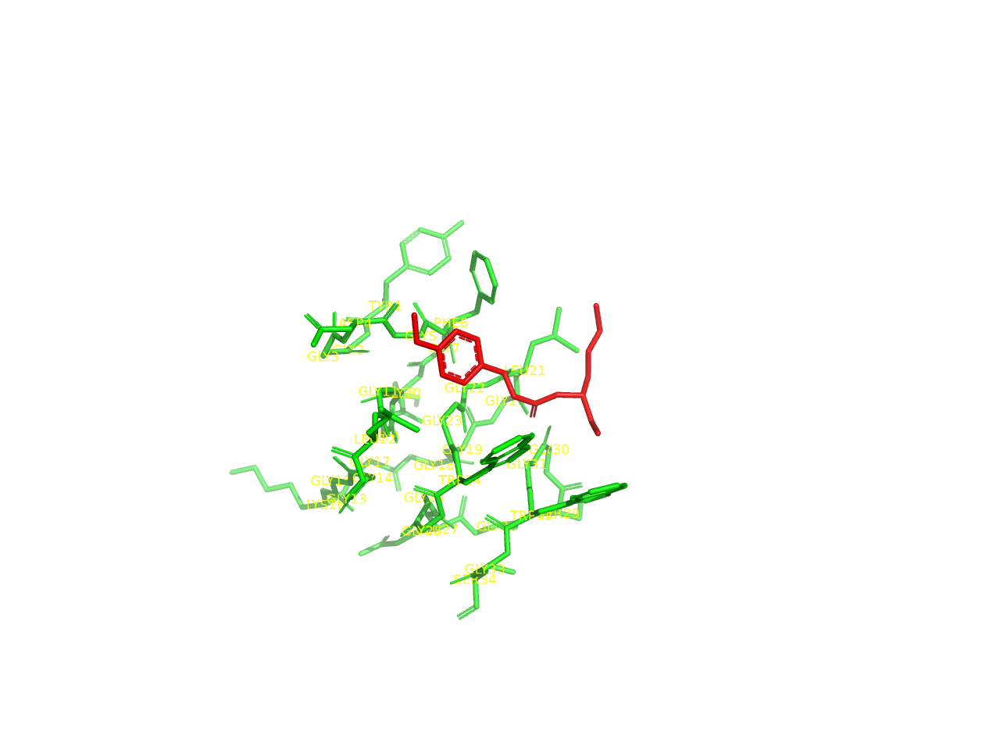 | 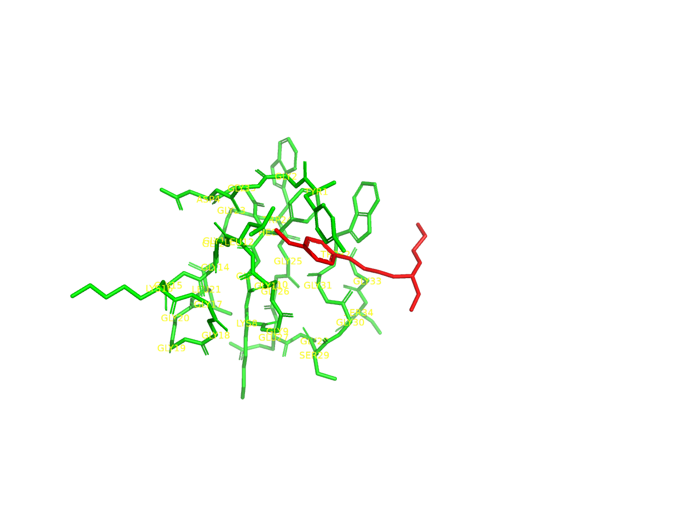 | 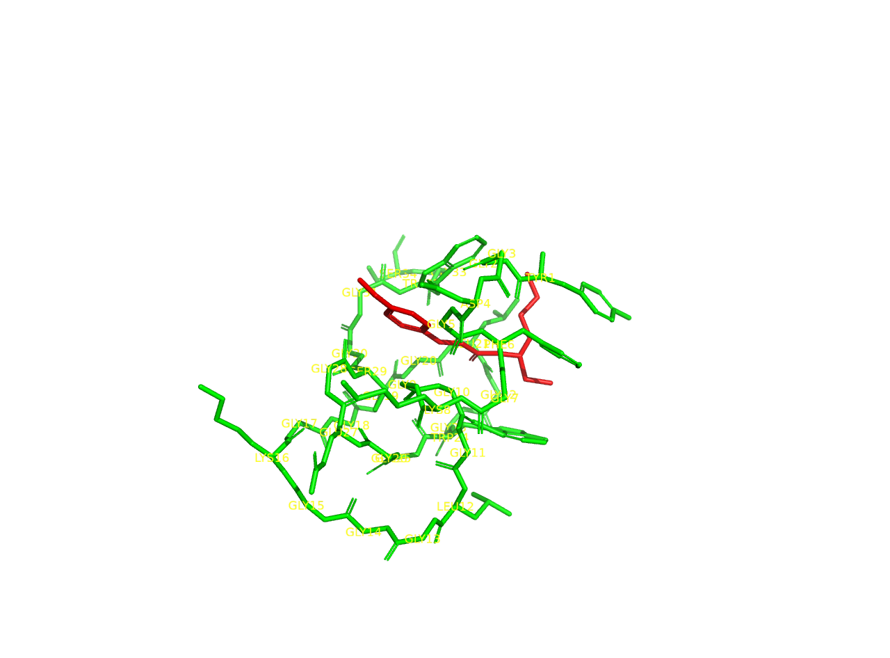 |
| 0.80 / +0.92 | 0.80 / −28.45 | 0.85 / −5.62 | **1.00 / −25.13** |
| 22% helix and 22% β at Rg 7.8 Å; reproduces 2 designed positions, the most of any control | ligand 7.2 Å out, helix collapsed to 3% | 59 contacts but 55.77 kcal/mol of strain, the second worst in the shell | **encapsulates** — 0.965 enclosed, 20/20 engaged, 3.6 Å separation, 67 contacts, no clash; a tighter twin of shell 1's `orig_f12`, at +18.92 net |

**The first ESM2 variant.** Two of the four encapsulate, and they are separated by 50 kcal/mol of ligand
strain — the clearest single illustration that enclosure and energy are independent.

| unconstrained | 4 contacts | 8 contacts | 12 contacts |
|---|---|---|---|
| 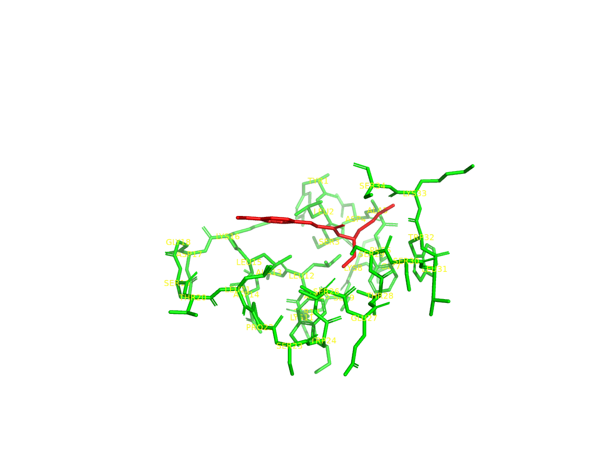 | 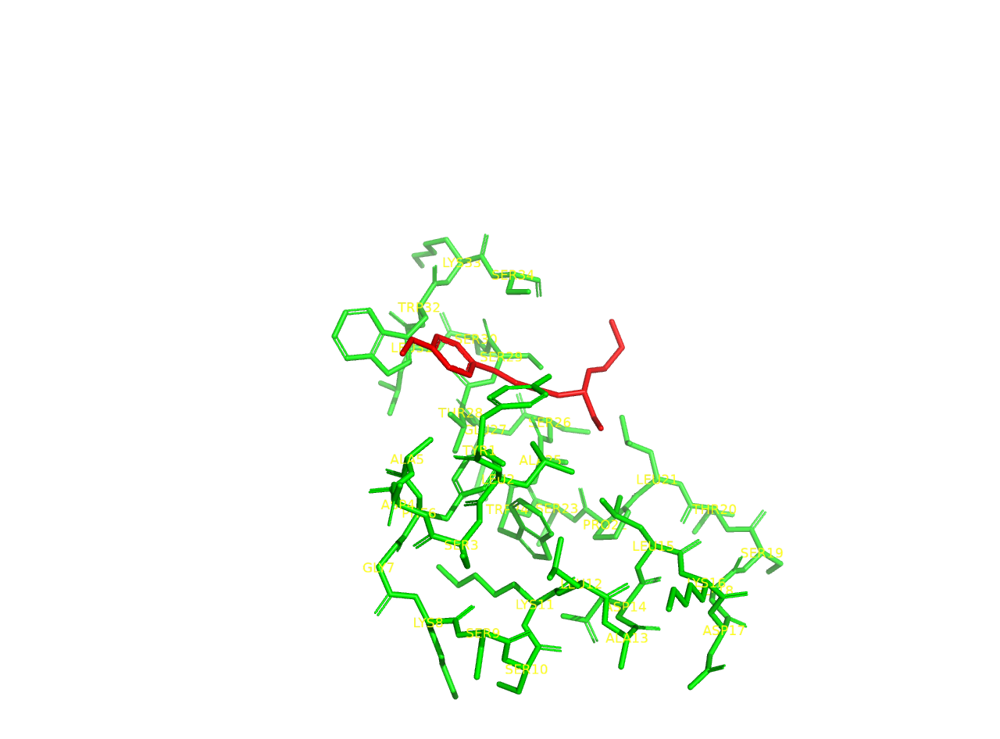 | 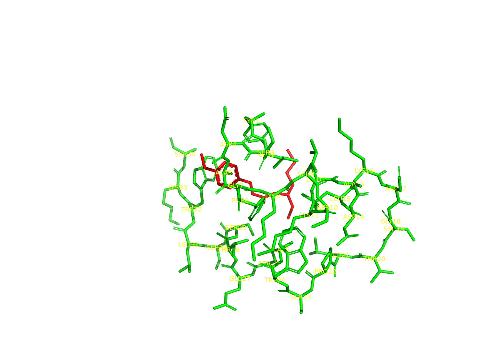 | 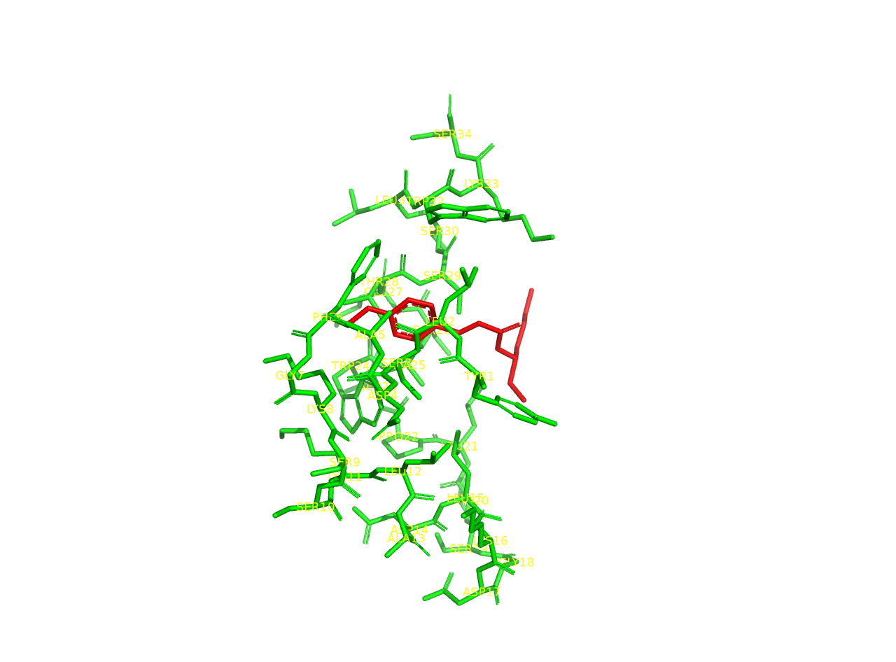 |
| 0.85 / −26.88 | 0.70 / −19.30 | **0.95 / +2.00** | **0.90 / −25.14** |
| 59% helical at Rg 9.4 Å, net −13.21 without any forcing | the only rung that loses ground, 14/20 engaged | **encapsulates** — 0.95 wrapped, 19/20 engaged, 55 contacts, but **61.67 kcal/mol of strain**, the worst in the shell and net +63.67 | **encapsulates** — 0.88 enclosed at 4.3 Å, and only 11.65 kcal/mol of strain: net **−13.50**, the one fold here that is both well enclosed and cheap |

**The second ESM2 variant.** Net charge +4. A folded helix wrapping the ligand: the rod bends double
without breaking, and the two arms close on the ligand.

| unconstrained | 4 contacts | 8 contacts | 12 contacts |
|---|---|---|---|
| 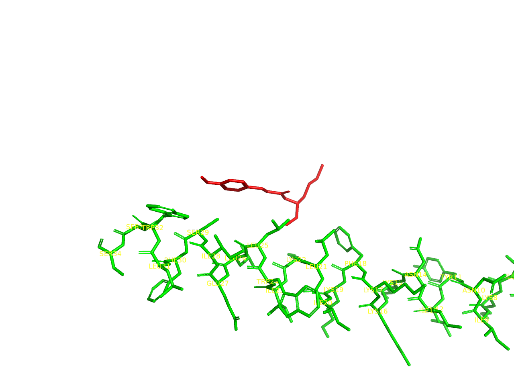 | 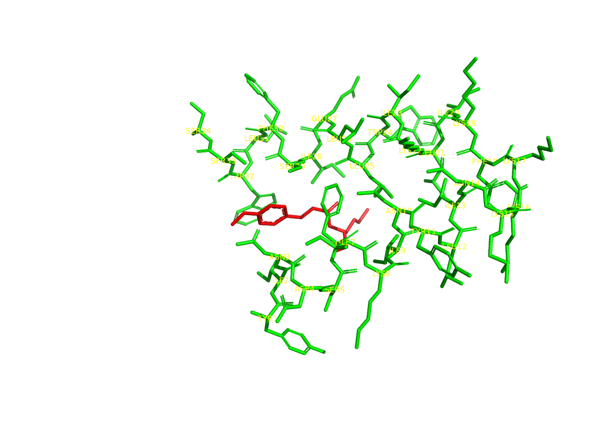 | 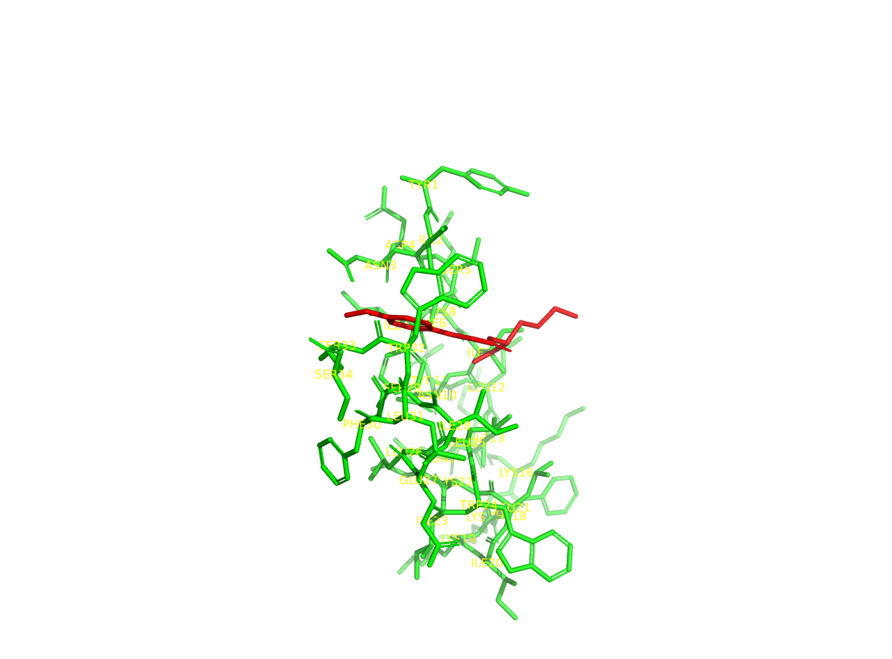 | 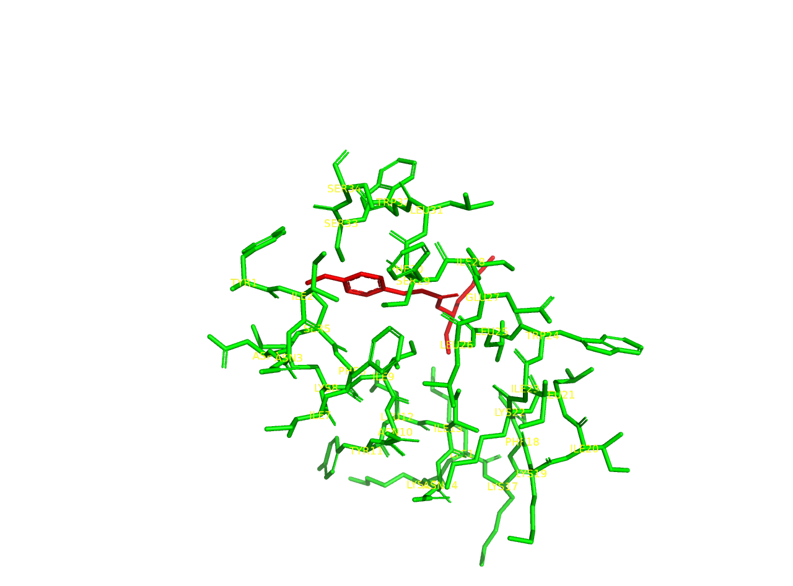 |
| 0.45 / −10.78 | **0.90 / −34.59** | 0.80 / −21.56 | 0.75 / −25.05 |
| 100% helical rod, Rg 15.0 Å, ligand 13.6 Å away with 7 contacts — worst geometry in the shell | **folded helix**, 91% helical at Rg 10.3 Å, end-to-end 49.8 → 17.6 Å, 36 contacts; best sum in the shell at −19.43 | **folded helix**, 91% helical, 33 contacts, net −6.85 | most folded of all, end-to-end 8.5 Å, 88% helical; net −14.22 |

`load_folds.pml` in `figures_shell3/` loads all twelve superposed on the ligand with the designed shell
in marine. It loads and aligns only — run `@style.pml` beside it for the representation used here,
which is what draws the residue labels.

---

## What happens after this pipeline: dynamics and MM/GBSA

Everything above is static. A fold is predicted, its geometry measured and its energy computed at that
one geometry, in the gas phase, with no solvent and no time. That is enough to rank and to reject, and
it is not enough to believe. **This repository is the filter; molecular dynamics is the verdict.**

The distinction matters because the filter's own metrics say so. Enclosure and wrapping are the design
objective, interaction energy is a proxy that has inverted the verdict more than once, and ligand strain
is a gas-phase quantity with no desolvation term. None of those can tell you whether a complex survives
in water. What they can do is choose which two or three structures out of thirty-six are worth an hour
of GPU each.

### The handoff

MD and MM/GBSA live in a separate project, **`~/python_mac/openmm`** (the `omd` CLI), for a hard reason:
GAFF2/OpenFF ligand parameterisation is not pip-installable, so that pipeline needs a conda environment
(`openmm-md`: openmm, openmmforcefields, openff-toolkit, mdtraj, parmed, AmberTools). This repository's
`.venv` has openmm but not the parameterisation stack, and cannot get it. Two environments called at
their boundary, as with Boltz.

`code/cif_to_md.py` is the adapter. Boltz writes one CIF holding peptide and ligand together, heavy
atoms only; `omd` wants a protein PDB and a ligand SDF apart. The ligand needs care: a PDB or CIF
records no bond orders, so the SDF is built by assigning bond orders from the run's own SMILES as a
template, then adding hydrogens with coordinates — the same route `uma_binding.protonate_ligand` takes.
Without the template step the aromatic ring and the ester come out as single bonds and the ligand is
parameterised as something it is not. **Check the printed formula before going further.**

```bash
python code/cif_to_md.py runs/octinoxate --structure orig_f12

OMD=~/miniforge3/envs/openmm-md/bin/omd
M=runs/octinoxate/md/orig_f12
$OMD prep-protein --pdb $M/orig_f12_protein.pdb --out $M/protein_fixed.pdb
$OMD prep-ligand  --sdf $M/orig_f12_ligand.sdf  --out $M/ligand_prepped.sdf
$OMD build --protein $M/protein_fixed.pdb --ligand $M/ligand_prepped.sdf \
           --out-dir $M/system --no-auto-cofactors --box-shape dodecahedron
$OMD run     --system $M/system/system.xml --topology $M/system/complex.pdb \
             --out-dir $M/prod --steps 10000000 --platform OpenCL
$OMD analyze --traj $M/prod/traj.dcd --topology $M/system/complex.pdb --out-dir $M/prod
$OMD mmgbsa  --protein $M/protein_fixed.pdb --ligand $M/ligand_prepped.sdf \
             --traj $M/prod/traj_wrapped.xtc --topology $M/prod/traj_wrapped.pdb \
             --out-dir $M/prod/mmgbsa --no-auto-cofactors --run
```

`analyze` is not optional: it is what writes the wrapped, solute-only `traj_wrapped.xtc` and matching
`traj_wrapped.pdb` that `mmgbsa` requires.

### Where to run the dynamics

Only `run` wants a GPU. Everything either side of it — parameterisation, MM/GBSA — is conda-only and
cheap on CPU, so the split is clean, and `code/modal_md.py` takes just that one leg to a rented A10G.
It imports `openmm_md.dynamics.run` rather than reimplementing the protocol, so a Modal trajectory and a
local one come out of the same tested code: same minimisation, same restrained equilibration, same
integrator, same timestep. That is not a nicety — these trajectories are compared as binding energies,
and a protocol difference would be indistinguishable from a result.

| | local, six-core Apple Silicon | Modal A10G |
|---|---|---|
| platform | OpenCL (FAIRChem has no MPS backend, but OpenMM reaches the GPU this way) | CUDA, passed explicitly |
| rate | 1.72 ms/step at 8,647 particles | 0.376 ms/step at 23,121 particles |
| 20 ns of the 23k system | ~14 hours | **63 minutes, $1.15** |
| equilibration | forced onto CPU — OpenCL in single precision cannot run the restrained phase | fine on CUDA |

Two things are worth knowing before renting anything. `dynamics.py`'s `auto` platform probe does not
list CUDA, so on a GPU host it silently selects CPU — renting a GPU to compute on a processor. Pass
`CUDA` explicitly, which takes the branch that raises rather than degrades. And warm up before timing:
OpenMM's CUDA platform compiles and autotunes lazily, so an un-warmed probe reads 2–5× too slow.

**Box size, not peptide size, sets the cost.** A compact fold and an extended one of the same sequence
length differ enormously: `orig_f12` at radius of gyration 8.0 Å solvates to 8,647 particles, while
`s2_esm2_control` at 15.0 Å — a 100% helical rod — needs 33,045 in a cubic box. Read `peptide_rg` before
estimating a run, and use `--box-shape dodecahedron`: a rhombic dodecahedron holds the same minimum
image distance in ~71% of the volume, which took that system from 33,045 particles to **23,121**, a 30%
saving for no change in physics.

### How long is long enough

`orig_f12`, the best structure in the first worked example, computed on the leading *n* ns of one 20 ns
trajectory:

| window | VDWAALS | EEL | EGB | ESURF | **ΔG bind** |
|---|---|---|---|---|---|
| 40 ps (pilot) | −38.28 | −14.88 | +32.28 | −4.48 | **−25.37 ± 0.50** |
| 5 ns | −31.23 | −10.81 | +24.67 | −4.14 | **−21.52 ± 0.29** |
| 10 ns | −23.46 | −8.17 | +17.89 | −3.12 | **−16.86 ± 0.37** |
| 15 ns | −20.43 | −6.08 | +14.60 | −2.70 | **−14.61 ± 0.38** |
| 20 ns | −19.75 | −5.32 | +14.01 | −2.64 | **−13.71 ± 0.04** |

The successive changes are 3.85, 4.66, 2.25, 0.90 — halving, so 20 ns is converged and anything shorter
is not. **A short window does not give a noisy answer, it gives a confidently wrong one:** the 40 ps
pilot's ±0.50 is the sampling error on forty correlated frames drawn from the starting pose, and it
overstates binding by 11.7 kcal/mol. Every window is tight and every short one is too negative, because
they are all still measuring the Boltz pose rather than the ensemble. **Run 20 ns; do not trust 5.**

What relaxes is the pose itself. Over the run the ligand leaves the cavity it was designed into —
heavy-atom contacts within 4 Å fall 71 → 19 and the centroid separation goes 4.7 → 9.9 Å by 6 ns — sits
on the surface for twelve nanoseconds, then re-inserts in the last two (5.07 Å, 31 contacts). It never
dissociates: 8 frames out of 20,000 have no contact at all. The designed 2.44 Å static clash never
recurs, the closest heavy-atom approach over the whole trajectory being 2.61 Å. So the enclosure was
real but not a minimum — which is exactly the kind of statement no static score can make.

### The charge artifact, tested

The static pipeline's worst known bias is that gas-phase interaction energy rewards net charge: across
36 folds it correlates −0.56 with charged-residue fraction, and charged fragment poses average −10.79
kcal/mol against −4.71 aromatic and −2.94 aliphatic. `EGB` is precisely the term that penalises exposed
charge, so MM/GBSA should take most of that advantage away. That is a falsifiable prediction about a
specific number, and the second 20 ns run was run to test it.

| | `orig_f12` | `s2_esm2_control` |
|---|---|---|
| peptide charge | −1 | **+5** |
| peptide Rg | 8.0 Å (compact) | 15.4 Å (100% helical rod) |
| UMA gas-phase interaction | −45.86 | **−74.89** |
| VDWAALS | −19.75 | −19.12 |
| EEL | −5.32 | −2.62 |
| EGB | +14.01 | +8.17 |
| ESURF | −2.64 | −2.67 |
| **MM/GBSA ΔG bind** | **−13.71 ± 0.04** | **−16.25 ± 0.08** |

**The prediction holds.** A 29.0 kcal/mol gas-phase advantage becomes a 2.5 kcal/mol advantage in
water: 91% of it evaporates. Anyone ranking these two on the static number would have believed the
+5 sequence was in a different class, and it is not.

The mechanism is not the one the artifact's name suggests. The +5 peptide's electrostatic attraction to
the ligand is *weaker*, not stronger (−2.62 against −5.32), which makes sense the moment one remembers
the ligand is neutral — there is no charge for a charge to pull on. What UMA was rewarding is long-range
polarisation of a neutral ligand by a charged rod, and GB screens that almost completely. The +5 peptide
then wins its small margin back through desolvation, not attraction: it buries less (+8.17 against
+14.01) because its ligand lies in a shallow surface groove rather than a closed cavity. The two
structures have essentially the same van der Waals contact (−19.1 against −19.8) reached two different
ways, and van der Waals dominates electrostatics in both — which is what the contact analysis of
`orig_f12` already said, 47 contacts and none of them charged.

That is also the flat answer to whether these two can be reconciled: **in water neither is
remarkable.** −13.7 and −16.3 kcal/mol are ordinary millimolar-to-micromolar affinities, not the −45 to
−75 the gas phase advertised.

### Which metric was right: the designs in water

Two shell-3 structures were then run to 20 ns for the same cost as one of the above, chosen because the
static pipeline ranked them at opposite extremes. Two null controls follow in the next section; this
table is the four designs. `s3_orig_f12` is the tightest fold in the project and
the *worst* static score of the four; `s3_esm2_f4` is the folded helical hairpin.

| structure | ΔG bind | VDWAALS | EEL | EGB | UMA interaction | ligand strain | static sum | enclosed | contacts |
|---|---|---|---|---|---|---|---|---|---|
| **`s3_orig_f12`** | **−24.33 ± 0.08** | −34.41 | −7.99 | +22.74 | −25.13 | 44.05 | **+18.92** | **0.965** | **67** |
| **`s3_esm2_f4`** | **−21.08 ± 0.08** | −23.45 | −2.60 | +8.58 | −34.59 | 15.16 | −19.43 | 0.795 | 36 |
| `s2_esm2_control` | −16.25 ± 0.08 | −19.12 | −2.62 | +8.17 | −74.89 | 9.05 | **−65.84** | 0.510 | 18 |
| `orig_f12` | −13.71 ± 0.04 | −19.75 | −5.32 | +14.01 | −45.86 | 12.80 | −33.07 | 0.960 | 47 |

**The static score ranks these four in close to reverse order.** Spearman against ΔG is −0.80 for the
static sum, −0.80 for UMA interaction alone, +0.40 for enclosed fraction and +0.80 for MM/GBSA's own
van der Waals term. At n = 4 those coefficients are indicative rather than statistical — one swapped
pair moves them a long way — but the endpoints need no statistics: **the best static score is third of
four in water, and the worst static score is first.**

Two of those comparisons are worth isolating.

**`orig_f12` against `s3_orig_f12`: the same fold twice, ranked backwards.** These are geometric
near-twins from shells 47% apart in fragment energy — 0.960 against 0.965 enclosed, both 1.00 wrapped
and 20/20 engaged, Rg 8.0 against 8.1 Å. The static sum separates them by 52 kcal/mol in favour of
`orig_f12`; MM/GBSA separates them by 10.6 in favour of `s3_orig_f12`. **And the inversion is not the
strain term's fault**, which matters because single-trajectory MM/GBSA reports BOND, ANGLE and DIHED as
exactly zero — intramolecular terms cancel by construction, so ΔG contains no ligand strain at all and
comparing it to a static sum that does would be unfair. Comparing interaction alone:

| | `orig_f12` | `s3_orig_f12` | difference |
|---|---|---|---|
| UMA gas-phase interaction | −45.86 | −25.13 | **+20.73**, UMA prefers `orig_f12` |
| MM/GBSA gas-phase, VDW + EEL | −25.08 | −42.41 | **−17.33**, the force field prefers `s3_orig_f12` |
| of which VDWAALS | −19.75 | −34.41 | −14.66 |

The sign inverts on the interaction term by itself: a 38 kcal/mol swing in the difference between two
folds no geometric measure can tell apart. So the charge artifact is not the only problem with the
static energies — the interaction term misranks a pair where charge is not even the variable.

**And the geometry called it.** `s3_orig_f12` has 67 contacts against 47, and its VDWAALS is 14.7
kcal/mol stronger. The force field rewards buried contact area, which is exactly the quantity
`enclosed_fraction` and `contacts_under_cutoff` estimate, and it charges 8.7 more desolvation for the
privilege and still comes out 10.6 ahead. **Read the geometry, not the energy.**

**Does the designed pose survive?** `code/md_contacts.py` profiles a trajectory in windows; the answer
differs per structure and only one of the four decays:

| structure | contacts, first → last decile | centroid separation | frames with no contact |
|---|---|---|---|
| `s3_orig_f12` | 50.7 → **60.8** (mean 56.6) | 5.02 → **3.75 Å**, tightest 2.24 Å at 6–8 ns | **0 / 2000** |
| `s3_esm2_f4` | 19.8 → 20.6 (mean 20.1) | 7.67 → 5.82 Å | **0 / 2000** |
| `s2_esm2_control` | 22.0 → 22.4 (mean 23.4) | 8.61 → 11.38 Å | 1 / 2000 |
| `orig_f12` | 71.0 → 31.4 (mean 34.3) | 4.7 → 5.07 Å, out to **13.6 Å** | 8 / 20,000 |

`s3_orig_f12` is the first structure here whose designed enclosure **improves** in water rather than
merely surviving: it gains ten contacts and closes from 5.0 to 3.8 Å. Its twin does the opposite,
leaving the cavity at 6 ns, sitting on the surface for twelve nanoseconds and re-inserting only in the
last two. Neither ever releases the ligand, and no static clash recurs — closest heavy-atom approaches
over whole trajectories are 2.59 to 2.66 Å, against the 2.44 Å that `orig_f12`'s prediction contained.

**The helical hairpin holds.** `s3_esm2_f4` was the structural question mark: two helical arms clamped
on the ligand by side-chain packing with **zero non-local backbone H-bonds**, which looked like the sort
of thing water would prise open. It does not.

| | Boltz prediction | over 20 ns |
|---|---|---|
| helical fraction | 91% | 81% |
| β fraction | 0% | **0%**, never converts |
| CA end-to-end | 17.6 Å | **18.1 ± 2.9 Å** |
| closest approach of the two arms | 6.4 Å | **6.4 ± 0.5 Å** |
| peptide Rg | 10.3 Å | 10.4–10.8 Å |

End-to-end never drifts back toward the unfolded rod's 49.8 Å, and the arms hold at 6.4 Å with a
standard deviation of 0.5 Å. Side-chain packing alone keeps the hairpin shut for 20 ns at 300 K, which
is the closest this project has come to a designed tertiary arrangement being confirmed rather than
merely predicted.

### Does the design beat a shuffle of itself?

Every result above compares designs with designs. The null model asks what the *arrangement* is worth,
by holding everything else fixed. `code/shuffle_control.py` takes a design and randomises which side
chain occupies which slot, keeping the glycine linker pattern:

```
design   YGGDGFGKGGGLGGGKGGGGLGGWGGEGSGGWGS     side chains YDFKLKLWESWS
control  SGGSGKGLGGGWGGGLGGGGEGGFGGKGWGGDGY     side chains SSKLWLEFKWDY
```

Identical composition, identical length, identical 22 glycines, identical spacer pattern, identical net
charge of 0, and **0 of 12 side chains left in their designed slot**. Boltz even folds it to the same
compactness, Rg 8.2 A against the design's 8.1. The linker pattern is kept deliberately: shuffling the
whole string instead produces 4 to 5 adjacent side-chain pairs with no glycine between them, where the
design has none, so it would randomise spacing as well as ordering and a worse result could not be
attributed to either. This way there is one variable.

There is no scoring, by design -- the control has no placed poses, so it has no fragment interaction
energy, and `sequences.csv` is left untouched rather than given a fabricated one.

| | `s3_orig_f12` (design) | `shuffle_control` (null) |
|---|---|---|
| enclosed / wrapped / engaged | 0.965 / 1.00 / 20-20 | 0.745 / 0.75 / 15-20 |
| static contacts | 67 | 22 |
| **MM/GBSA ΔG** | **−24.33 ± 0.08** | **−15.13 ± 0.13** |

**The designed arrangement is worth 9.2 kcal/mol against its own shuffle.** That is the cleanest
single-variable result here, and it says the ordering and spacer search do something that composition
alone does not.

**But a design can lose to the null.** `shuffle_control` at −15.13 is within noise of
`s2_esm2_control` (−16.25) and better than `orig_f12` (−13.71) -- shell 1's flagship fold, which comes
last of all six. The spread among designs is larger than the gap between the average design and the
null, so "designed" is not sufficient; only the good designs are distinguishable from a shuffle. Taking
both nulls and all four designs together: the two nulls land 4th and 5th of six, so design wins on
average and loses in the particular case.

**The averages hide the real difference, and release exposes it.** On mean behaviour the null and
`orig_f12` are the same trajectory: mean contacts 35.3 against 34.3, mean separation 8.64 against
8.45 A, identical Rg drift 8.5->10.0, identical 2.61 A closest approach. The difference is whether
the ligand is ever actually let go, which has to be measured at matched frame spacing or it is an
artifact of the save interval; the per-leg release record for these and every other leg is in the
residence table under [the headline comparison](#the-table-to-read-first-mmgbsa-by-starting-pose).

Sampled every 1 ps, `orig_f12` shows 8 released frames; at the 10 ps spacing of the others it shows
**zero**, because all eight were isolated single frames -- the ligand flickering past 4 A and returning.
Finer sampling catches more brief excursions, so a 1 ps run cannot be compared with a 10 ps one
directly, which is why `md_contacts.py` resamples to a common spacing. The null is then the only
structure of the five that genuinely lets go, and it does so five times, for up to 70 ps, **entirely in
the second half of the run**: progressive loss rather than thermal noise.

**The release signature replicated across two unrelated architectures, which is what makes it a
signature.** The second null, `shuffle_control_esm0`, is an ESM2 linker-filled variant of the same
shuffle, and Boltz folds it into a 100% helical rod at Rg 15.0 -- the same architecture as the designed
`s2_esm2_control` rather than the compact globule of its own parent. It releases the ligand **5 times,
up to 40 ps, all in the second half**: the same pattern as the compact shuffle, in a completely
different fold. Both designed structures in the matching architectures give zero or one isolated blip.
So release tracks how the side chains are *ordered*, not whether the peptide is a globule or a rod, and
it is the one measure that separates every design here from every null.

**The pair, rendered.** Same twelve residues, same spacer pattern, same length, same net charge, folded
to the same compactness. Medoid frames from 18-20 ns, written by `code/md_frames.py`.

| `s3_orig_f12` — designed, 18.3 ns | `shuffle_control` — shuffled, 19.2 ns |
|---|---|
| 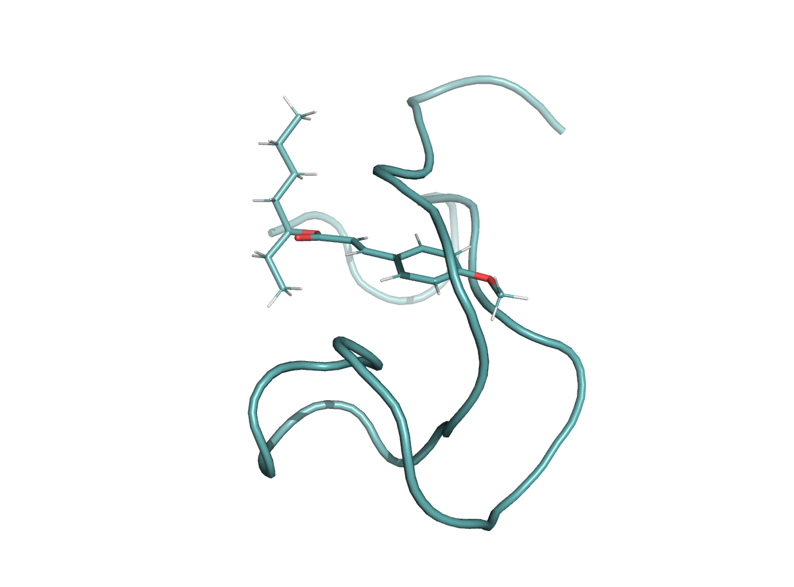 | 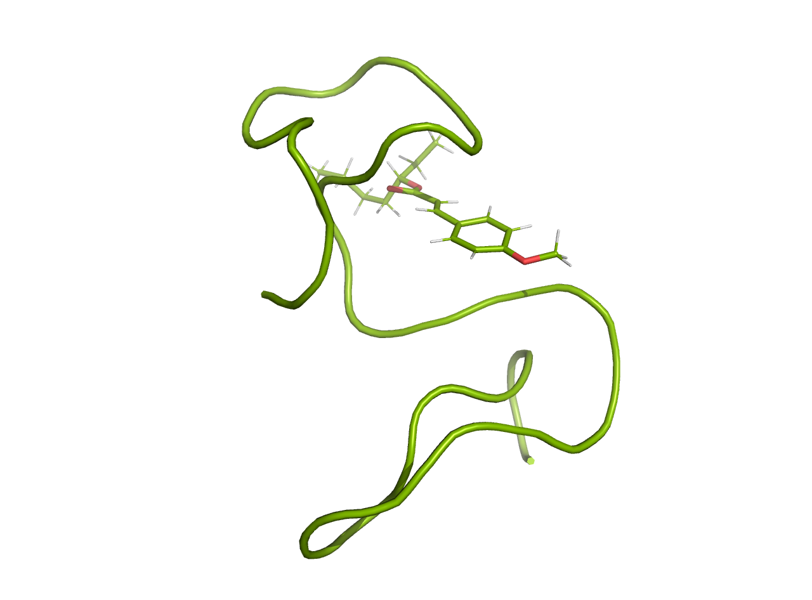 |
| **ΔG −24.33 ± 0.08** | **ΔG −15.13 ± 0.13** |
| ligand held at 3.75 A, 3.82 side chains engaged on average, 53/66 pairs realised, **0 releases in 2000 frames**, residence 100% | ligand at 8.39 A, 1.75 engaged, 18/66 pairs, **5 release episodes up to 70 ps, all in the second half**, residence 75.9% |

And the second null, which Boltz folds into a rod rather than a globule — so the release signature can be
checked against a designed structure of the *same* architecture:

| `s2_esm2_control` — designed rod, 18.9 ns | `shuffle_control_esm0` — shuffled rod, 18.9 ns |
|---|---|
| 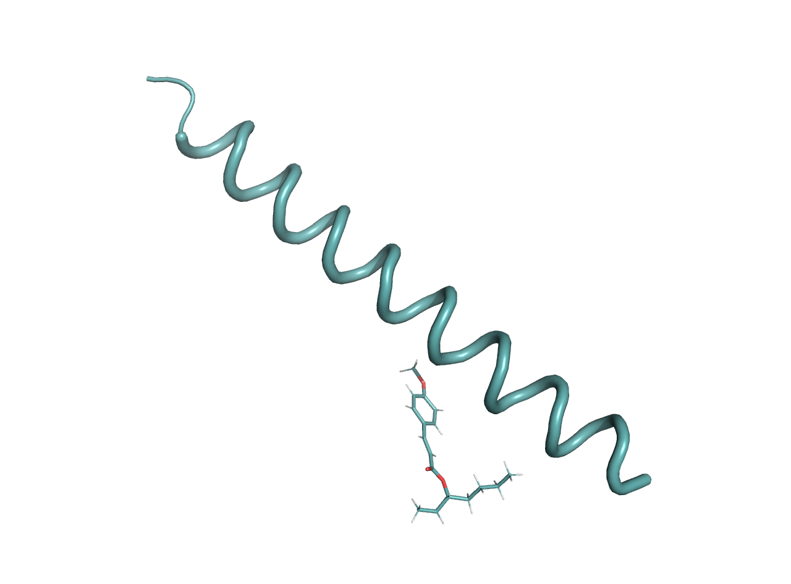 | 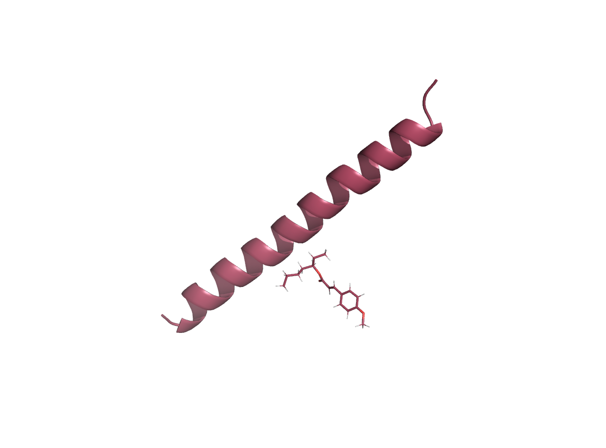 |
| **ΔG −16.25 ± 0.08** | **ΔG −14.32 ± 0.10** |
| 100% helix, Rg 15.0 A, ligand in a surface groove, **1 blip of 10 ps**, 10/66 pairs, 6 dead slots | 100% helix, Rg 15.0 A, **5 episodes up to 40 ps, all in the second half**, 12/66 pairs, 6 dead slots |

The second row is the control on the first. Two rods, near-identical on every pair measure — 10/66 against
12/66, six dead slots each, no long-range pair in either — and the designed one still holds its ligand
while the shuffled one repeatedly lets go. Whatever the pair count is measuring, it is not what
distinguishes these two.

Residence within 10 A separates the two ΔG clusters cleanly -- 99.6 to 100% against 60 to 77%, no
overlap, matching the 4.83 kcal/mol gap between −21.08 and −16.25 -- but it does not rank within either
cluster, where it inverts.

### What the construction actually delivers: pairwise contact options

The pipeline does not deliver a structure, and it is a mistake to judge it as though it did.
`s3_orig_f12` is the strongest binder measured and it reproduces **none of its twelve designed
positions**. Asking how closely a fold matches the designed shell is therefore the wrong question.

What the construction delivers is *n* positions each chosen to contact the ligand, and at *n* positions
that is **n(n−1)/2 pairwise combinations**, each verified reachable by the spacer sweep. Chain
connectivity hands over the n−1 adjacent pairs for free, so the informative band is
**[n−1, n(n−1)/2]** -- for twelve slots, [11, 66] -- and the informative content is the non-adjacent
pairs, which require the fold to bring sequence-distant slots onto the ligand together. A fold that
abandons the designed shell can still cash in whichever of those options it can reach.

`code/pair_contacts.py` measures this over a trajectory. Slots come from the parent design's
non-glycine positions, so shells, ESM variants and shuffles are all handled without being told which is
which.

| structure | ΔG | mean side chains engaged | >=2 engaged | pairs realised | band position | held >=5% | long-range (gap>=7) | dead slots |
|---|---|---|---|---|---|---|---|---|
| **`s3_orig_f12`** | **−24.33** | **3.82** | **99%** | **53/66** | **76%** | **24** | **11/15** | **0** |
| `s3_esm2_f4` | −21.08 | 2.11 | 72% | 32/66 | 38% | 12 | 6/15 | 2 |
| `s2_esm2_control` | −16.25 | 1.45 | 43% | 10/66 | **−2%** | 2 | **0/15** | 6 |
| `shuffle_control` | −15.13 | 1.75 | 62% | 18/66 | 13% | 8 | 1/15 | 3 |
| `shuffle_control_esm0` | −14.32 | 1.73 | 58% | 12/66 | 2% | 7 | **0/15** | 6 |
| `orig_f12` | −13.71 | 1.42 | 40% | 22/66 | 20% | 3 | 3/15 | 4 |

Against its matched shuffle the design realises **53/66 pairs to the null's 18/66**, reaches every gap
out to 11 -- both termini on the ligand at once -- where the null reaches nothing beyond gap 8, and
sustains 24 pairs where the null sustains **8, below the free floor of 11**. The null does not even hold
the adjacent pairs connectivity gives it.

**And this is the best predictor of ΔG found anywhere in this project.** Spearman against binding
strength, one convention, + meaning agreement:

| measure | ρ (n=6) | ρ (n=5) | where it comes from |
|---|---|---|---|
| **mean side chains on the ligand** | **+0.83** | +0.90 | trajectory |
| **% of frames with >=2 engaged** | **+0.83** | +0.90 | trajectory |
| MM/GBSA VDWAALS | **+0.71** | +0.70 | trajectory |
| pairs held >=5% of the run | +0.66 | +0.70 | trajectory |
| dead slots, fewer better | +0.60 | +0.70 | trajectory |
| pairs realised | +0.49 | +0.60 | trajectory |
| `enclosed_fraction` | +0.30 | +0.30 | static, free |
| `contacts_under_cutoff` | +0.30 | +0.30 | static, free |
| **UMA interaction energy** | **−0.80** | −0.80 | static, 45–60 min per fold |
| **UMA interaction + ligand strain** | **−0.80** | −0.80 | static, 45–60 min per fold |

Note which form works: the combinatorial counts are +0.49, **mean simultaneous engagement +0.83**. The
ceiling argument explains why a design has options; what tracks ΔG is how many it is cashing at any
instant. That also explains release without further assumptions -- at 3.82 side chains engaged, losing
one does not detach the ligand, while at 1.75 the ligand is often held by a single contact and is one
fluctuation from release.

**Both columns are shown because the sixth structure degraded the measure**, from +0.90 to +0.83, and it
did so by getting a specific pair backwards: it ranks `shuffle_control_esm0` (1.73 engaged) above
`s2_esm2_control` (1.45), where MM/GBSA has the designed rod ahead by 1.9 kcal/mol. A measure that moves
this much on one added point is a hypothesis, not a validated metric.

**The rod architecture defeats the framing entirely.** Designed and shuffled rods are indistinguishable
on it -- 10/66 and 12/66 pairs, 1.45 and 1.73 engaged, 6 dead slots each, and **0/15 long-range pairs
both** -- yet they score −16.25 and −14.32, mid-pack rather than last. A helical rod holds a ligand in a
surface groove with a handful of side chains and does adequately without realising the designed pair set
at all. So the measure diagnoses how a compact fold binds, and says nothing useful about a rod.

The designed rod's 1.9 kcal/mol margin also cannot be cleanly attributed, because the two rods differ in
net charge (+5 designed against 0 shuffled) as well as in arrangement. The decomposition argues against
charge being the cause -- the designed rod wins on van der Waals (−19.12 against −17.64) and on
desolvation (+8.17 against +11.72) while *losing* on electrostatics (−2.62 against −5.75), which is not
what a charge advantage looks like -- but this pair cannot prove it.

**Caveats.** One design against one shuffle, and five trajectories; a Spearman of +0.90 at n = 5 is one
swapped pair from +1.0 and the pair it swaps (`s2_esm2_control` against `shuffle_control`) differ by
1.1 kcal/mol with standard deviations of 3.45 and 5.85. The slot-pair comparison is only clean because
the control preserves the spacer pattern, which means it tests ordering and not spacing. And every
number here is one ligand.

### Figures: what 20 ns does to a designed pose

Peptide in green, ligand in red, as in the static figures above — but these are frames from a
trajectory, not predictions. Each is the medoid of a representative window: the single frame closest to
that window's mean structure, written by `code/md_frames.py`. **The two on the left are the same
designed fold, arrived at from different shells, and they are the whole argument of this section.**

| `s3_orig_f12` at 18.3 ns | `orig_f12` at 11.0 ns | `s3_esm2_f4` at 19.4 ns | `s2_esm2_control` at 18.9 ns |
|---|---|---|---|
|  | 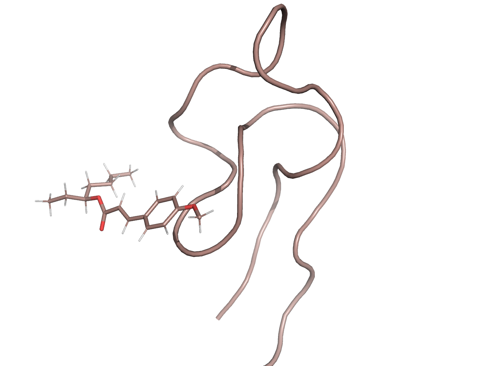 | 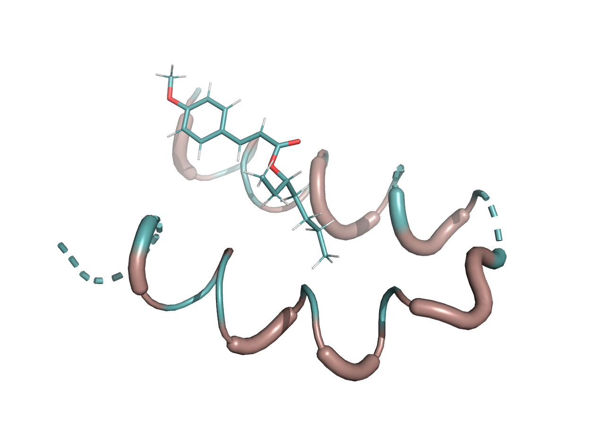 |  |
| **ΔG −24.33** | **ΔG −13.71** | **ΔG −21.08** | **ΔG −16.25** |
| 0.965 enclosed as predicted, and it **closed further** — separation 5.02 → 3.75 Å, contacts 50.7 → 60.8, never released | 0.960 enclosed as predicted, and the ligand **left** at 6 ns; shown on the plateau it held for twelve, at 9–10 Å | the **helical hairpin**, still 81% helical with its arms at 6.4 ± 0.5 Å, holding the ligand on side-chain packing alone | the 100% helical **rod**, ligand in a surface groove, sliding along it 8.6 → 11.4 Å without letting go |

`orig_f12` is shown at 11.0 ns rather than at the end, because its last 2 ns are the only stretch where
the ligand is back in the cavity and a frame from there would imply the enclosure held. It did not.
That is the point of `md_frames.py --window-ns`: the end of a run is usually the settled part, and when
it is not, saying so in the caption is better than picking the flattering frame.

Two predictions at 0.960 and 0.965 enclosed, indistinguishable on every static geometric measure,
ranked 52 kcal/mol apart by the static energies in the wrong direction — and one holds its ligand while
the other does not. **No number computed at a single geometry could have told them apart.**

Results across all legs are in `runs/octinoxate/md/mmgbsa_summary.csv`. `code/md_frames.py` writes the
PDBs these are rendered from — the medoid above, and a ten-model ensemble superposed on the peptide for
showing the spread instead of one frame.

These six are also the six that can be redocked, since the receptor and ligand the MD prep wrote are
exactly what a docking run needs. That check is in [the next
section](#an-independent-check-on-the-pose-redocking), and it is where the release measure above turns
out to have a static predictor.

---

## An independent check on the pose: redocking

Every complex in this repository was produced either by the shell search, which places fragments
around a fixed ligand, or by Boltz co-folding, which places peptide and ligand jointly. Neither is a
pose search. So the ligand's position had never been questioned by anything that could put it
somewhere else, and that is what `vina_redock.py` does: it hands the ligand back to AutoDock Vina and
asks it to find the site again in a rigid copy of the same peptide.

The inputs are the ones the MD prep already wrote — `<structure>_protein.pdb` with the ligand stripped
and `<structure>_ligand.sdf` in the predicted pose — so the structures that can be redocked are the
ones with dynamics, which is also the useful set: each score lands beside an independent MM/GBSA ΔG for
the same geometry. That is six from this repository plus **`bg33_4` and `bg33_3` from
[`boltzgen_local`](../boltzgen_local)**, the two BoltzGen designs taken through this protocol, reached
with `--md-root ~/python_mac/boltzgen_local/md`. Eight structures, 72 poses. The ligand is converted
straight from each structure's own SDF rather than re-embedded from SMILES, because the built-in ligand
is an analogue of octinoxate and a SMILES round trip risks both losing its stereocentre and quietly
docking a different molecule than MD scored.

**Three of the eight folds contain the mirror-image ligand**, and it has to be said before any of the
numbers are read. The source `runs/octinoxate/ligand.xyz` and BoltzGen's `md/inputs/ligand.xyz` are
byte-identical and both have the **S** configuration at the 2-ethylhexyl carbon. Five folds kept it;
`shuffle_control_esm0`, `bg33_3` and `bg33_4` came out **R**. The ligand SDFs carry the fold geometry
unchanged, verified to 0.0005 Å against the `.cif`, so the inversion is in what the folding models
placed rather than in any prep step — and one of the three is from this repository's own Boltz runs, so
it is not a BoltzGen quirk. The MM/GBSA numbers in the table below were computed on whichever enantiomer
that fold contains.

Each structure is docked against its own reference, so every RMSD, wrapping and flip number here is
internally sound; it is the cross-structure comparison of scores that inherits a confound. A branched
aliphatic centre is not where a shape-complementarity score is most sensitive, and commercial octinoxate
is racemic at that carbon, so this is a caveat rather than a disqualification. It matters more for
anything chirality-aware applied later — a CNN rescorer, for instance.

**What this can and cannot establish.** Both folders placed the ligand *inside* the peptide, so the
pocket is the ligand's own imprint and a rigid copy of it should be the easiest possible redocking
target. Agreement is therefore weak evidence and disagreement is strong. It says nothing about whether
the peptide would bind the ligand de novo, and with no `--flex` side chains there is no induced fit.

### One structure out of eight actually redocks

| structure | source | ligand | MM/GBSA ΔG | Vina | pose 1 RMSD | closest pose (rank) |
|---|---|---|---|---|---|---|
| `s3_orig_f12` | this repo | S | −24.33 | **−7.3** | 4.08 | 3.49 (8) |
| `s3_esm2_f4` | this repo | S | −21.08 | −6.0 | 7.41 | 3.21 (9) |
| **`bg33_4`** | BoltzGen | **R** | **−19.66** | −4.7 | 4.07 | **1.30 (6)** |
| `s2_esm2_control` | this repo | S | −16.25 | −5.0 | 9.89 | 5.13 (6) |
| `shuffle_control` (null) | this repo | S | −15.13 | −5.1 | 8.38 | 6.37 (9) |
| `shuffle_control_esm0` (null) | this repo | **R** | −14.32 | −4.5 | 7.02 | 3.90 (9) |
| `orig_f12` | this repo | S | −13.71 | −6.0 | 5.96 | 5.52 (6) |
| `bg33_3` | BoltzGen | **R** | −11.86 | −4.2 | 5.94 | 4.47 (9) |

Across the six from this repository, best-scoring-pose RMSD runs 4.1–9.9 Å against the 2 Å that counts
as a successful redock, and the closest of nine poses never gets below 3.2 Å. **`bg33_4` is the single
exception in the whole set**: its pose 6 sits at **1.30 Å** with a 0.52 Å translation, a 7° rotation and
a 7° head/tail change — the predicted pose, found. Vina ranked it 6th of 9, behind poses 4–9 Å away,
which is the same failure of ranking seen everywhere else; but the pose is there to be found, and in the
other seven structures it is not.

That is worth holding against what `bg33_4` is. It is the BoltzGen design that held its ligand perfectly
in MD — 100% residence, zero releases, contacts *rising* 20.5 → 25.2 over 20 ns — and the only structure
besides `s3_orig_f12` to manage that. Its partner `bg33_3` has the worst residence measured anywhere in
either project (41.0%, 18 release episodes) and does not redock (4.47 Å). The pair that brackets the
retention range also brackets the redocking result.

**The docked poses are still not worse by the design objective.** Measured with `check_fold.py`'s own
cutoffs, they remain as wrapped or better, and packed slightly tighter:

| structure | wrapped, predicted → docked mean | enclosed, predicted → docked mean | mean ligand distance |
|---|---|---|---|
| `orig_f12` | 1.00 → 0.98 | 0.960 → 0.961 | 3.49 → 3.57 |
| `s2_esm2_control` | 0.85 → **0.92** | 0.510 → **0.697** | 4.07 → **3.81** |
| `s3_esm2_f4` | 0.90 → **0.98** | 0.795 → **0.923** | 3.80 → **3.64** |
| `s3_orig_f12` | 1.00 → 0.97 | 0.965 → 0.899 | 3.39 → 3.66 |
| `shuffle_control` | 0.75 → **0.94** | 0.745 → **0.816** | 4.02 → **3.76** |
| `shuffle_control_esm0` | 0.85 → **0.94** | 0.535 → 0.591 | 4.14 → **3.81** |
| `bg33_4` | 0.95 → 0.95 | 0.590 → **0.622** | 3.99 → **3.79** |
| `bg33_3` | 1.00 → 0.94 | 0.480 → **0.545** | 3.76 → 3.79 |

The BoltzGen rows reproduce that project's own `fold_check` values exactly — `bg33_4` at 0.95 wrapped
and 0.590 enclosed, `bg33_3` at 1.00 and 0.480 — which is the check that `check_fold.geometry` means the
same thing across the two repositories. And the comparison is not independent evidence in Vina's favour:
its poses were *selected* for close packing against a rigid receptor, so packing well is what they were
chosen for. What it shows is that a pose 8 Å away can satisfy the design objective just as completely,
so the objective does not pick out one pose.

### The difference is the ligand turning round, in the same pocket

`dock_compare.py` separates the parts. No superposition is involved: a docked pose and its reference
already share a frame, because the receptor Vina was given is the file the reference came from.

The ligand keeps its shape and moves. After the Kabsch transform is removed, the residual RMSD is
0.94–2.99 Å (mean 1.87) against a total of 1.30–11.05 Å (mean 7.49) — internal conformation is a median
24% of the difference, which across nine rotatable torsions is the alkyl tail breathing, not refolding.

Ranking what predicts the RMSD says what the motion is:

| descriptor | ρ vs in-place RMSD | p |
|---|---|---|
| **head→tail angle** | **+0.667** | 1.6 × 10⁻¹⁰ |
| translation | +0.582 | 8.3 × 10⁻⁸ |
| rotation angle | +0.551 | 5.4 × 10⁻⁷ |
| internal RMSD | −0.029 | 0.81 |

Octinoxate is amphiphilic — a methoxyphenyl head, a branched alkyl tail — and **26 of 72 poses are
turned end for end** (head→tail angle above 120°, symmetry-corrected so the para-ring flip is not
miscounted). Internal conformation explains nothing at all.

Yet it is the same site: contact-residue Jaccard runs 0.27–0.89, mean 0.60, and **60 of 72 poses share
at least half** the reference's contact residues. And the decisive number, **flipped poses score −4.85
and unflipped −5.07 kcal/mol** — 0.22 apart, against a 3.1 kcal/mol spread across structures. **The
peptide grips the ligand but does not orient it.** The slot accepts the chromophore head and the alkyl
tail about equally, and neither the RMSD nor the wrapping metric exposes that, because wrapping
saturates whichever way round the ligand lies.

Per structure, contact-set conservation orders the set about as well as anything here does:

| structure | RMSD | internal | translation | rotation | head/tail | flipped | Jaccard |
|---|---|---|---|---|---|---|---|
| `s3_esm2_f4` | 6.16 | 1.88 | 2.83 | 126° | 96° | 4/9 | **0.77** |
| `s3_orig_f12` | 5.76 | 1.84 | 3.17 | 128° | **68°** | **1/9** | 0.70 |
| `orig_f12` | 8.57 | 1.86 | 5.88 | 142° | 94° | 2/9 | 0.61 |
| `s2_esm2_control` | 8.29 | 1.81 | 4.60 | 130° | 105° | 4/9 | 0.61 |
| `bg33_4` | 7.51 | 1.71 | 4.65 | 122° | 96° | 3/9 | 0.59 |
| `shuffle_control_esm0` | 7.40 | 1.75 | 4.78 | 128° | 80° | 1/9 | 0.54 |
| `bg33_3` | 7.99 | **2.31** | 4.14 | 141° | 115° | 5/9 | 0.53 |
| `shuffle_control` (null) | 8.26 | 1.80 | 4.77 | **150°** | **116°** | **6/9** | **0.42** |

The shuffle is still the most promiscuous on every column that measures it, and `bg33_3` is second — the
two structures with the worst retention. Note that `bg33_4`'s mean RMSD of 7.51 Å is unremarkable: its
success is one pose out of nine, not a tighter distribution.

### Rescoring with GNINA: the CNN reorders what Vina could not

Vina failed at the one thing that mattered — in all eight structures it ranked the pose closest to the
prediction 6th to 9th of nine. Recognising near-native poses is what GNINA's CNN is trained for, so the
eight structures were bundled (`code/make_gnina_bundle.py`, `runs/octinoxate/gnina/`) and rescored
elsewhere with GNINA v1.3.3 on CPU: `--score_only`, no search and no minimisation, so the CNN sees
exactly the coordinates Vina produced. Ten ligands per structure — the predicted pose as pose 0, then
Vina's nine in rank order. Results are in `runs/octinoxate/gnina/results_*/gnina_scores.csv`.

**The best static predictor of ΔG this project has produced**, by a wide margin:

| | ρ vs MM/GBSA ΔG | p |
|---|---|---|
| **GNINA `CNNaffinity`, predicted pose** | **−0.857** | **0.007** |
| GNINA `CNNaffinity`, best docked pose | −0.738 | 0.037 |
| Vina score | +0.61 | 0.11 |
| GNINA `CNNscore`, predicted pose | −0.38 | 0.35 |

It strengthens to ρ = −0.900 (p = 0.037) on the five S-configuration structures alone, so the mixed
ligand chirality is not what is driving it. For scale: nesso managed +0.14 and the static UMA
interaction energy ranks structures backwards.

**On pose ranking the improvement is real but partly an artefact of provenance.** GNINA puts the
predicted pose at ranks 1, 2, 3, 3, 3, 3, 4 and 1 by `CNNscore`, against Vina's 6 to 9. But `bg33_4` is
the control that spoils the clean reading:

| rank | pose | RMSD to prediction | `CNNscore` |
|---|---|---|---|
| 1 | 0 | 0.00 | 0.597 |
| 2 | 7 | **9.30** | 0.390 |
| 3 | 6 | **1.30** | 0.378 |

GNINA ranks a pose 9.3 Å from the prediction above the one 1.3 Å from it. Pose 0 is a co-folded
geometry and the CNN was trained on crystal structures, so some of its advantage is that it looks like
a real complex rather than that it is in the right place.

Restricting to the 72 docked poses, which all share one provenance, removes that confound — and a
genuine position signal survives where Vina had none:

| | ρ vs RMSD to prediction | p |
|---|---|---|
| GNINA `CNNaffinity` | −0.400 | 0.0005 |
| GNINA `CNNscore` | −0.328 | 0.005 |
| GNINA `minimizedAffinity` | +0.206 | 0.08 |
| Vina score | +0.164 | 0.17 |

Modest, correctly signed, and cleanly attributable to the CNN rather than the empirical term:
`minimizedAffinity` behaves like Vina's score. **The flip degeneracy survives a second scorer** —
`CNNscore` is 0.348 for flipped poses against 0.386 for unflipped, Mann-Whitney p = 0.283. A
chirality-aware CNN cannot tell the orientations apart either.

Two practical findings. Receptor hydrogens barely matter: the protonated receptor changes `CNNscore`
by at most 0.034 and does not reorder any structure. And `--minimize` does not help — it weakens the ΔG
correlation to −0.786 and the residence one to +0.587 — so `--score_only` on the heavy-atom receptor is
the pass to quote.

**GNINA and Vina never agree on which docked pose is best: 8 structures, 8 disagreements.** Vina's pick
is always its own pose 1 by construction; GNINA's picks are poses 9, 6, 7, 6, 7, 9, 5 and 6.

### Dynamics on a docked pose: the predicted pose binds better

`NEXT_STEPS` asked for the one experiment that could settle which pose is right, since no static measure
can: Vina selected its poses for packing, so their packing is not evidence. `s3_orig_f12`, the best
binder measured here, was run again from Vina's **best-scoring** pose — pose 1, −7.3 kcal/mol, 4.09 Å
from the prediction as a 2.57 Å translation and a 167° rigid-body rotation, though only 64° of head/tail
change. `code/dock_pose_to_sdf.py` wrote the pose for the MD prep, and
`code/run_dock_pose_md.sh` held the protocol identical to the run it is compared with: same
`protein_fixed.pdb`, same `omd` code, same timestep, dodecahedral box, 20 ns and MM/GBSA windows. 5,615
particles, 1.44–1.59 ms/step on OpenCL, 4 h 21 m.

The convergence series (−27.00, −24.04, −21.76, −20.79 over 5-20 ns, steps +2.96, +2.28, +0.97) is the
`Vina p1` row of the window table under [the headline comparison](#the-table-to-read-first-mmgbsa-by-starting-pose),
computed by `code/run_windows_live.sh` as the trajectory passed each mark rather than afterwards.

**Still moving at 20 ns**, monotonically less negative, +6.22 kcal/mol across the range. The steps
decelerate but the last is still 24× the standard error, so −20.79 is an upper bound on how
unfavourable this pose is rather than a converged value.

At matched 20 ns against the predicted pose of the same fold:

| | predicted pose | docked pose 1 |
|---|---|---|
| ΔG | **−24.33 ± 0.08** | **−20.79 ± 0.04** |
| residence within 10 Å | 100.0% | 98.7% |
| release episodes | 0 | 0 |
| mean contacts | 56.6 | 38.9 |
| contacts, start → end | 50.7 → **60.8** | 42.6 → 41.5 |
| separation, start → end | 5.02 → **3.75** Å (max 7.03) | 5.6 → 6.49 Å (max 11.35) |
| closest heavy-atom approach | 2.62 Å | 2.46 Å |

**The docked pose binds 3.55 kcal/mol worse, and the trajectories say why.** The predicted pose
*tightens* over the run — contacts rise 50.7 → 60.8 and the centroids close 5.02 → 3.75 Å — while the
docked pose loosens slightly and holds about eighteen fewer contacts throughout. Both keep the ligand:
no release episodes either way, residence 98.7% against 100%. So this is not the "same energy, different
pose" outcome the static analysis allowed for. The energies differ, in the direction that favours the
folding model's placement.

**Where the ligand ended up is inconclusive, and the control shows why.** The docked run's medoid ligand
sits 4.85 Å from the predicted pose and 4.90 Å from its own starting pose — equidistant within noise,
having moved away from both — with a peptide superposition RMSD of 5.89 Å, larger than either ligand
distance. Running the same analysis on the predicted-pose trajectory puts its ligand **6.57 Å from the
pose it started in**, at 7.49 Å peptide RMSD. When a run's own starting pose reads 6.6 Å away, a
4.85-against-4.90 difference carries no information. Neither genuine degeneracy nor convergence on the
predicted pose is established by this measure, and on this system it probably cannot be: the peptide
moves as much as the poses differ.

Two limits worth stating. Only the 20 ns point is comparable, because the predicted pose's run was a
Modal production leg with no windows, so its own degree of convergence is unknown. And pose 1 is Vina's
best by *score*, not its closest to the prediction — pose 8 is nearer at 3.49 Å with only 27° of
rotation. What was tested is a substantially reoriented binding mode that scores well; how much of the
3.55 kcal/mol penalty comes from reorientation rather than displacement is not separated here.

### Which pose is right, and what docking is a proxy for

**The predicted pose, and now on direct evidence rather than inference.** The dynamics above gives it a
3.55 kcal/mol advantage over Vina's best-scoring pose in the same fold under an identical protocol, and
it is the pose that tightens rather than loosens over 20 ns. `s3_orig_f12` and `bg33_4` both hold 100%
residence with zero releases, and `s3_esm2_f4` is 99.6% with zero.

There is no contradiction between a ligand held for 20 ns and a ligand that sits either way round.
Residence and contact counts do not constrain orientation, and neither Vina nor GNINA can separate the
flipped poses. Both are true: the grip is real, the orientation is unspecified by every score tried, and
the energy nonetheless prefers the predicted placement.

**Docking is not a proxy for the binding energy; GNINA's CNN is the first thing here that is.** Ranked
across the eight structures:

| | vs MM/GBSA ΔG | vs release episodes | vs residence |
|---|---|---|---|
| GNINA `CNNaffinity` (predicted pose) | **−0.857, p = 0.007** | — | +0.719, p = 0.045 |
| Vina score | +0.61, p = 0.11 | **+0.732, p = 0.039** | −0.47, p = 0.24 |
| pose-1 `enclosed_fraction` | −0.38, p = 0.35 | **−0.713, p = 0.047** | +0.31, p = 0.45 |
| GNINA `CNNscore` (predicted pose) | −0.38, p = 0.35 | — | **+0.731, p = 0.040** |
| closest-pose RMSD | +0.60, p = 0.12 | +0.47, p = 0.24 | **−0.743, p = 0.035** |

Release episodes themselves barely track ΔG (ρ = +0.37, p = 0.47), so these are not two routes to one
quantity. Vina's score and the docked pose's enclosure read the **escape** axis, which is what a
rigid-pocket shape-complementarity score should capture. GNINA's `CNNaffinity` reads the **energy** axis.
And how well the closest docked pose reproduces the predicted one reads **retention**.

The caveats compound rather than cancel: n = 8, release episodes are (0, 0, 0, 0, 1, 5, 5, 18) so that
variable is nearly a design/null split, one BoltzGen pair supplies both ends of the retention
correlation, and three of the eight folds carry the mirror-image ligand. Every one of these wants more
structures before it is leaned on.

---

## What the pipelines deliver: MM/GBSA and retention

This is the comparison that matters, and it is the one to read before any of the pose work below.
Eight structures have 20 ns of dynamics and MM/GBSA. Four are peptidebuilder designs, two are
peptidebuilder nulls (a shuffle of a design's own sequence), and two came from BoltzGen, which generates
a binder around the ligand rather than folding a sequence you designed.

| peptide | source | dG (kcal/mol) | retention | releases |
|---|---|---|---|---|
| `s3_orig_f12` | peptidebuilder | **-24.33** | 100.0% | 0 |
| `s3_esm2_f4` | peptidebuilder | -21.08 | 99.6% | 0 |
| `bg33_4` | boltzgen | -19.66 | 100.0% | 0 |
| `s2_esm2_control` | peptidebuilder | -16.25 | 59.6% | 1 |
| `shuffle_control` | peptidebuilder (null) | -15.13 | 75.9% | 5 |
| `shuffle_control_esm0` | peptidebuilder (null) | -14.32 | 80.2% | 5 |
| `orig_f12` | peptidebuilder | -13.71 | 77.3% | 0 |
| `bg33_3` | boltzgen | **-11.86** | **41.0%** | **18** |

| group | n | mean dG | best | worst | mean retention | releases |
|---|---|---|---|---|---|---|
| **peptidebuilder (designs)** | 4 | **-18.84** | **-24.33** | -13.71 | **84.1%** | **1** |
| boltzgen | 2 | -15.76 | -19.66 | -11.86 | 70.5% | 18 |
| peptidebuilder (nulls) | 2 | -14.73 | -15.13 | -14.32 | 78.1% | 10 |

**The designs from this pipeline come out ahead on every measure available.** Best binder by 4.67
kcal/mol, better mean free energy, higher mean retention, and one release episode against eighteen.
`bg33_3` is the worst structure in the project on energy and retention simultaneously -- it holds the
ligand 41% of the time and lets go eighteen times in 2000 frames -- and it is a BoltzGen design.

Two qualifications, neither of which rescues BoltzGen. n is 2 against 4, so nothing here characterises
BoltzGen as a method; and both BoltzGen structures carry the **R** ligand where all the peptidebuilder
designs carry **S**, so pipeline and configuration are confounded. `shuffle_control_esm0` is the only
peptidebuilder structure that came out R, which makes it the one available way to separate the two.

The one measure on which a BoltzGen structure leads is narrow and worth stating precisely so it is not
mistaken for more. `bg33_4`'s co-folded pose is the best-held starting point in the set: its ligand moves
only 1.15 A during minimisation and equilibration, against 2.78 A for `s3_orig_f12` and 7.66 A for
`s3_esm2_f4` (see [the drift table](#what-these-cells-actually-compare-starting-points-not-pose-geometries)).
That is a real property of that structure, plausibly because a peptide generated around the ligand
arrives already compatible with the force field. It does not generalise: BoltzGen's other structure is
the worst here, and a well-held pose is worth nothing if what it holds binds weakly.

Against the nulls, the designs lead by 4.11 kcal/mol on the mean -- but `shuffle_control` at -15.13
outscores the design `orig_f12` at -13.71, so a shuffled sequence still beats a real design outright in
one of four cases. That remains the sharpest standing criticism of the design method and is treated at
length in [does the design beat a shuffle of itself?](#does-the-design-beat-a-shuffle-of-itself).

## A separate and narrower question: which starting pose to simulate

Run 2026-10-01, extended later the same day. Everything in this section is **methodology, not a result
about the designs**. It asks: given a peptide, if you are going to spend 20 ns on it, which starting pose
should you simulate -- the co-folded one, the pose AutoDock Vina ranks first, or the pose GNINA ranks
first? It says nothing about which pipeline produces better binders; that is the section above.

Nine 20 ns legs on Modal with MM/GBSA computed locally, **$10.10** of GPU across 2026-10-01, including
one preempted attempt that restarted from zero (~$0.89) and about $1.30 lost to building cubic boxes where
the baselines are dodecahedral (see the traps in NEXT_STEPS).

The cells, ordered by the co-folded pose's ligand retention, with each one's pre-production ligand drift,
which is how well matched the comparison is:

| peptide | source | retention | co-folded | Vina p1 | GNINA top | drift (cofold / p1 / gnina) |
|---|---|---|---|---|---|---|
| `s3_orig_f12` | peptidebuilder | 100% | **-24.33** | -20.79 | -13.23 (p9) | 2.78 / 2.51 / 4.24 A |
| `bg33_4` | boltzgen | 100% | **-19.66** | -14.81 | -16.53 (p6) | 1.15 / 2.30 / 4.82 A |
| `s3_esm2_f4` | peptidebuilder | 99.6% | -21.08 | *-22.42* | *-19.55* (p6) | 7.66 / **11.05** / **15.11** A |
| `s2_esm2_control` | peptidebuilder | 59.6% | -16.25 | *-15.49* | **-17.09** (p6) | -- / **12.57** / **1.58** A |
| `bg33_3` | boltzgen | 41% | -11.86 | -10.84 | **-13.09** (p6) | 3.76 / 2.42 / 3.52 A |

Four legs are in italics because they lost their starting pose before production began -- all three of
`s3_esm2_f4`'s, by 7.7 to 15.1 A, and `s2_esm2_control`'s Vina cell by 12.6 A. They remain valid
measurements of where those starts led, but they cannot be attributed to the poses that seeded them.

**Discount those and a pattern falls out, ordered by retention.** Where the co-folded pose holds the
ligand completely, co-folding is the better starting point and the docked starts are worse by 3.5 to 11.1
kcal/mol. Where it holds the ligand poorly, a docked start wins:

| co-folded retention | best route | margin over co-folding |
|---|---|---|
| 100% (`s3_orig_f12`) | co-folded | -- |
| 100% (`bg33_4`) | co-folded | -- |
| 59.6% (`s2_esm2_control`) | GNINA p6 | **0.84** kcal/mol |
| 41% (`bg33_3`) | GNINA p6 | **1.23** kcal/mol |

The margin grows as retention falls, which is the shape the hypothesis predicted when it rested on
`bg33_3` alone. `s2_esm2_control` was run to test it and is the strongest cell in the set on its own
terms: 1.58 A of pre-production drift, the best-held docked start anywhere in the project, so its -17.09
is attributable to the pose GNINA chose rather than to wherever that pose wandered.

Two structures each side is still a small sample, and the two co-folded winners are also the two best
binders overall, so retention and binding strength are not separated here. But as a working rule --
**dock only when the co-folded pose is poorly retained** -- it now has four supporting cells and no
counterexample among the legs that held their poses.

Two things this section does establish, both about scoring rather than about designs:

**Vina's score is useless for pose choice; GNINA's is better but not dependable.** Vina ranked the
co-folded pose 6th to 9th of nine in all eight structures, and its pick is always its own pose 1.
GNINA's `CNNaffinity` correlates with MM/GBSA across structures at rho = -0.857 and its pick beats
Vina's in four of the five rows run -- but on `s3_orig_f12`, the project's best binder, its pick lands
7.56 kcal/mol below the pose it ranked 7th of 10, which is the largest gap in the table.

**The protocol does not hold the pose it is given**, which bounds how finely any of this can be read.
Details below.

### What these cells actually compare: starting points, not pose geometries

Equilibration restrains protein heavy atoms only -- `openmm_md/dynamics.py:144` builds the restraint from
`protein_heavy_indices(topology)` -- so the receptor is pinned while the ligand and solvent relax. That is
a deliberate choice and for most purposes the right one: a docked pose is scored by a docking function,
not by this force field, and freezing it would be worse. The consequence for this table is that the pose
as placed does not persist. Measured from each system's input to its production frame 0, superposed on the
peptide:

| run | peptide RMSD | ligand RMSD, input -> production start |
|---|---|---|
| `bg33_4` co-folded | 0.88 A | **1.15 A** |
| `bg33_4_dock1` | 0.85 A | 2.30 A |
| `s3_orig_f12_dock1` | 1.15 A | 2.51 A |
| `s3_orig_f12` co-folded | 1.51 A | 2.78 A |
| `s3_orig_f12_dock9` | 2.12 A | 4.24 A |
| `bg33_4_dock6` | 1.26 A | **4.82 A** |
| `s3_esm2_f4` co-folded | 1.17 A | **7.66 A** |
| `s3_esm2_f4_dock1` | 1.73 A | **11.05 A** |
| `s3_esm2_f4_dock6` | 2.24 A | **15.11 A** |

The peptide barely moves in any of them, so this is the ligand sliding rather than the receptor
refolding, and the minimum ligand-peptide distance stays near 2 A throughout, so nothing unbinds and no
periodic image jumps.

This is not something to correct retrospectively. Every run in this project equilibrated the ligand
freely, and holding it in a new leg would make that leg incomparable with the fifteen already on disk,
whose whole value is being measured the same way. It is something to *record*: input -> production ligand
RMSD costs nothing, changes nothing about how a leg runs, and is what says whether a cell is worth
reading -- `s2_esm2_control_dock1` at 12.57 A is discounted on that basis rather than taken at face value.

Every cell therefore remains a valid measurement of **where a given starting pose leads under 20 ns**,
which is the question a dock-then-MD pipeline actually asks and the one worth answering. What the table
cannot support is attributing a difference to the geometry of the input pose. The flip and the roll are
properties of the inputs; they do not survive to production, so "the flipped pose binds better" is not
something these runs can establish, while "starting from Vina's pose 1 on `s3_esm2_f4` leads to -22.42"
is.

### The replicate: two near-identical starting points diverge

`bg33_4_dock6` was included as a control. GNINA's pick for that structure matches the co-folded pose at
placement -- 0.52 A of centroid offset, 8.0 degrees of head-to-tail, 14.2 degrees of rigid rotation -- so
it should have landed near that structure's -19.66. It read **-16.53**.

The two runs begin production **4.62 A apart**, because each relaxed differently in the first 10 ps: 1.15
A for the co-folded copy, 4.82 A for the docked one. Windows confirm the gap is not a sampling artefact
-- **-16.72, -16.90, -16.36, -16.53**, flat to 0.54 kcal/mol -- so this is a converged measurement of a
different basin, not a run caught mid-drift.

That is the most practically useful number in the section. Two starting points half an angstrom apart
diverge by 3.13 kcal/mol under an identical protocol, which sets how much weight a single dock-then-MD
endpoint can carry on this system. It is not a reproducibility floor in the sense of protocol noise --
the runs genuinely went to different places -- but it is a floor on how finely two starting poses can be
told apart by one run each.

### What the cells show about the scorers

**GNINA's pick beats Vina's in four of five rows.** Vina's pick is simply its own pose 1 in every
structure, which is what ranking by the score the poses were sorted on amounts to, and it loses to
GNINA's pick on `bg33_3` (by 2.25 kcal/mol), `s2_esm2_control` (1.60), `bg33_4` (1.72) and
`s3_esm2_f4` (2.87, discounted for drift). The exception is `s3_orig_f12`, where GNINA's pick is far
worse -- 7.56 kcal/mol below the pose it ranked 7th of 10 -- and it is the largest single gap in the
table.

So GNINA is the better of the two docking scorers for choosing a starting pose, which is the opposite of
what the first two rows suggested, and it is still not reliable: on the project's best binder it chose
the worst start measured anywhere.

That bears on what [the GNINA rescoring](#rescoring-with-gnina-the-cnn-reorders-what-vina-could-not) is
worth. `CNNaffinity` ranks *structures* against MM/GBSA at rho = -0.857, which was the first static
measure here to predict binding energy; it also picks the better of two docked starts four times in five.
Both are real, and neither makes it dependable -- its one failure is on the structure that matters most,
and it is a 7.56 kcal/mol failure.

**The decompositions say the weak endpoints are weak for different reasons.** `bg33_4_dock1` loses its
contacts: van der Waals falls to -17.85 from the co-folded -23.45 and electrostatics collapse to -0.82
from -7.99. `s3_orig_f12_dock9` keeps them -- electrostatics hold at -4.84, gas-phase total -23.36 -- and
is undone by desolvation, +12.90 of EGB inside a +10.14 solvation penalty, burying polar groups the
co-folded pose leaves solvated. A single scalar dG hides that distinction, which is what the
decomposition is for.

### CNNscore vs CNNaffinity: the p7 leg settled it -- 2026-10-04

Tabulated 2026-10-04 against all three GNINA scoring sets (`score_only`, `h_score_only`,
`minimize`). On **7 of 8** structures, the pose that `CNNscore` ranks best of 1–9 is the same pose
`CNNaffinity` ranks best, in all three sets -- so every docked leg run so far is *also* the CNNscore-top
pose, which means the two selectors are indistinguishable on existing data and cannot be compared from
it. The one robust disagreement is `shuffle_control`: pose 7 is CNNscore-top in **all three** sets
(0.460 / 0.461 / 0.485) while ranking near-last on CNNaffinity (3.57), and its affinity-top, p9, was
already measured at **−11.15 / 46.4%**. Note that the minimize set's affinity-top for this structure
is p8 (4.085), neither of the other two; the p9 leg sits on a score-only-set pick. Cross-peptide,
CNNscore correlates with measured ΔG at r = −0.50 (n = 8) -- but that is between peptides (the high
scores are the four designs' poses, 0.67–0.83, the low ones the nulls'), so it weights design
quality, not pose choice.

**The p7 leg has now run (racc, 2026-10-04), and CNNscore's pick loses on every metric.** Pose 7 as a
starting pose: ΔG **−8.40** (windows −12.49 → −9.56 → −8.99, the walk-away-from-the-first-window shape
every wrong pose shows), residence **22.4%** -- the worst of the structure's four starts on both, below
co-folded (−15.13 / 75.9%), Vina p1 (−16.15 / 57.8%) and affinity-top p9 (−11.15 / 46.4%). The ligand
spells 2.42 ns detached in 24 episodes (longest 1.06 ns); the 31/66 pair contacts are made while the
ligand drifts across the peptide surface, which pairs-realised alone would read as a good pose -- one
more instance of a proxy needing the residence column to be read at all. Verdict: on this fold the
CNN dimension is *not* a pose-picker that works where affinity failed, the two heads are not
interchangeable (CNNscore actively worse), and the project's standing practice -- pose per GNINA
CNNaffinity, CNNscore as a cross-check only -- is supported by the one cell that could have broken it.

### Contacts, computed 2026-10-02

`md_contacts.py` and `md_frames.py` are part of the dynamics pipeline and were missed on all nine legs
run 2026-10-01; they were backfilled from the trajectories on disk. The contact traces add an
independent check on the dG ordering, because they measure something a single scalar free energy cannot:
how much of the ligand stays in touch with the peptide, averaged over the run.

| peptide | Vina p1 contacts | GNINA top contacts | better dG |
|---|---|---|---|
| `s3_esm2_f4` | 20.5 | **27.7** | Vina (row excluded for drift) |
| `bg33_4` | 16.5 | **18.1** | GNINA |
| `s2_esm2_control` | 18.8 | **22.2** | GNINA |
| `bg33_3` | 10.9 | **14.7** | GNINA |

**GNINA's pick holds more contacts than Vina's in all four pairs**, and contacts agree with the free
energy in three of the four. The single disagreement is `s3_esm2_f4`, the row already set aside because
all three of its legs lost their starting pose. So the two measures corroborate each other wherever the
geometry was retained, which is the strongest internal consistency check available in this section.

The traces also confirm the exclusions independently of the drift figures. `s2_esm2_control_dock1` has a
mean ligand-peptide separation of **14.6 A** across its run -- the ligand spent 20 ns well off the
peptide, which is why its -15.49 says nothing about the pose Vina chose. `bg33_3_dock1` at 10.9 contacts
and 11.2 A is the loosest leg in the set, consistent with `bg33_3` being the worst-retained structure in
the project.

Mean separations for the full set, in the same order: 9.0 A (`s3_orig_f12_dock9`), 6.5 and 9.9
(`s3_esm2_f4` p1/p6), 9.4 and 7.2 (`bg33_4` p1/p6), 14.6 and 9.4 (`s2_esm2_control` p1/p6), 11.2 and 9.6
(`bg33_3` p1/p6). Per-leg traces are in each leg's `md_contacts.csv`, and `frames_last.pdb` plus
`frame_medoid.pdb` give the end-of-run ensemble and its representative frame for figures.

### What cannot be read off it

Any explanation that invokes the geometry of the input pose. The flip, the roll and the matched
displacements were how the cells were chosen, and they are good reasons for having chosen them, but they
do not describe the trajectories that were run. `s3_esm2_f4` is the clearest case: its three runs moved
7.66, 11.05 and 15.11 A before production, so whatever separates -22.42 from -19.55 there, it is not one
pose being flipped and the other not.

The same caution applies to the September result in the other direction. +3.55 for `s3_orig_f12_dock1` is
measured between runs that moved 2.51 and 2.78 A -- well matched, which is the best case available here,
but still a comparison of two relaxed positions.

### The window series is the more robust signal

The one structure with convergence windows on both a predicted and a docked pose separates them
cleanly, and does so without depending on either absolute value -- the rows are `bg33_4` (co-folded:
−19.18, −18.89, −19.43, −19.66, last-5-ns drift **−0.23**) and `s3_orig_f12` Vina p1 (+0.97) in the
window table under [the headline comparison](#the-table-to-read-first-mmgbsa-by-starting-pose).

A co-folded pose converges on this system at 20 ns, within 0.77 kcal/mol across the whole series. The
docked pose drifts 6.2 kcal/mol monotonically and is still moving when the run stops. So 20 ns is not too
short in general, and the drift is a property of the docked starting pose rather than of the protocol: a
docked pose starts over-contacted and decays toward equilibrium, a co-folded one starts at it.

The shape of that series is a result in its own right, and it is robust to the reproducibility problem in
a way the endpoint is not -- a trajectory that is still walking away from its start after 20 ns was not at
equilibrium, whatever its absolute dG turns out to be when run again. The five new legs were run without
windows, because MM/GBSA on Modal computes the production leg only. Their trajectories are on disk, so
windowing them later costs three more MM/GBSA passes and no new dynamics. That is the cheapest remaining
measurement in this section and it is worth doing before any of these cells is quoted.

### What this means for choosing a starting pose

The honest summary is that pose selection cannot currently be done with a static score. Vina's own score
fails -- it ranked the predicted pose 6th to 9th of nine in all eight structures. GNINA's CNN fails
differently, correlating with affinity across structures while mis-ranking poses within one. The only
measure that has separated poses reliably is 20 ns of dynamics per pose, which at roughly $0.75 a pose
makes exhaustive evaluation impractical. And the question answerable this way is "which starting point
leads somewhere better", not "which pose is better" -- the second would need the ligand held through
equilibration, which no run here does and which is not worth forking the dataset to obtain.

None of which changes the comparison that matters. Pose selection is a question about how to spend GPU
time on a peptide you already have; which peptides are worth having is settled in [what the pipelines
deliver](#what-the-pipelines-deliver-mmgbsa-and-retention), and there the designs from this pipeline lead
on every measure.
